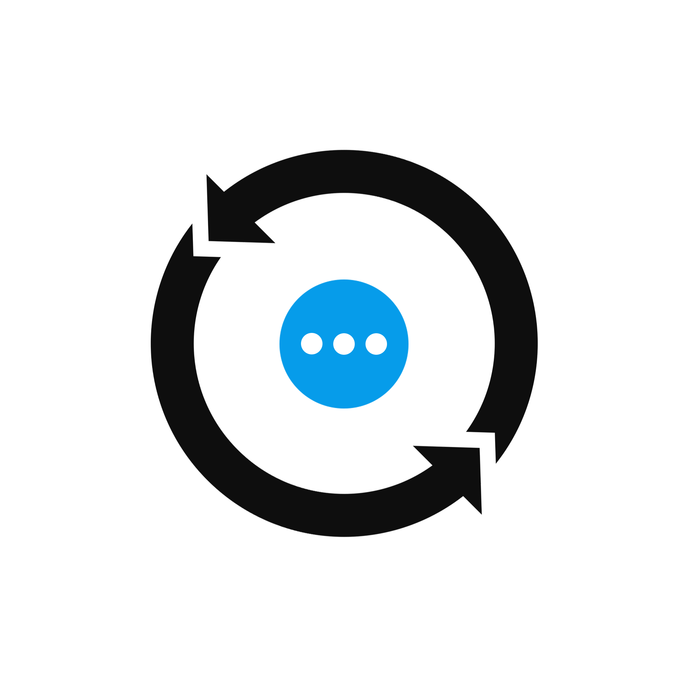

<div align="center">
  
  <h1>NASDK</h1>
  <p>面向长时任务的多应用通信与有限资源工作流运行时</p>
  <span>
  <a href="https://github.com/ChenYFan/NASDK/actions/workflows/test.yml">
    
  </a>
  |
  <a href="https://nasdk.eurekac.cn">
    
  </a>
  </span>

</div>

Nyirusu Application Software Development Kit 是一款全双工通信协议与有限资源流式运行时，专门为长程流水线任务和远程任务执行设计。

## 安装

支持 Node.js 20+；本仓库使用 Bun 安装、构建和测试。物理传输 Provider 需要单独安装并注册。

```bash
bun add @chenyfan/nasdk
```

## 文档

[NASDK 中文文档](https://nasdk.eurekac.cn)

- [开始使用](./docs/napp/hello-world.md)
- [NApp 与请求句柄](./docs/napp/handles-and-errors.md)
- [Event、Ability 与 Signal](./docs/workflow/processor.md)
- [完整文档站](./docs/index.md)
- [设计意图](./docs/design/principles.md)

## 开发

```bash
bun install --frozen-lockfile
bun run build
bun run typecheck
bun run test
bun run test:edge:slow
bun run test:framework
bun run docs:build
```

`bun run test` 会先构建全部独立包，再执行 simple、full、edge；`test:edge:slow` 额外覆盖 10 秒、30 秒和 120 秒的真实超时路径。

Next.js App Router 与 Nuxt/Nitro 的可运行示例位于 [examples/nextjs](./examples/nextjs) 和 [examples/nuxt](./examples/nuxt)。接入方式见[框架 Provider](./docs/transport/nact/frameworks.md)。

## License

MIT License
