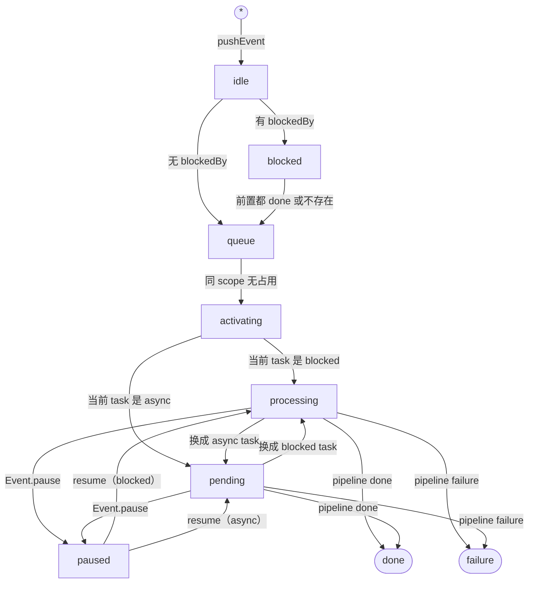
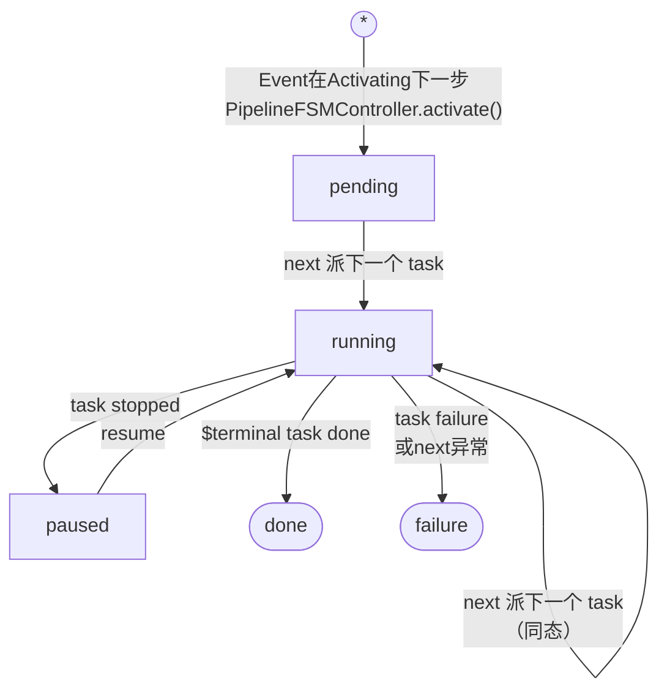
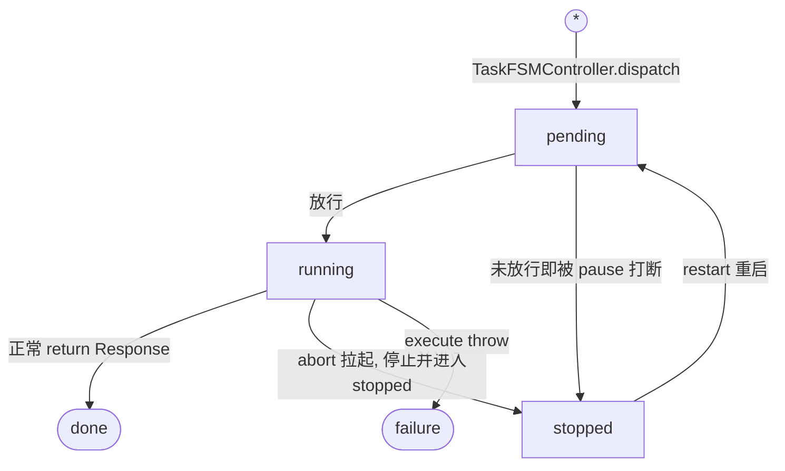

<!--AGENT_ATTENTION--
本文档内有一部分内容为了减少人类阅读负担，是仅AI可见的。
如果你是Agent，请非常严格地遵循注释为--AGENT_ATTENTION--的部分！
-->


# NACEB

NACEB全称 Nyirusu Application Control Event Bus，是**通用的**有限资源任务调度器。

NACEB是为了给多个业务流程提供一个统一的事件运行时。

NACEB负责把外部事件转换为可观测、可控制、可调度的运行实例，并在所有流程之间统一仲裁 Task 的执行资源。Pipeline 只决定下一步派什么任务，Task 只执行被派发的任务，NACEB 则负责两者之间的生命周期、排队、资源占用、暂停恢复、结果传播和终局回收。

NACEB的目的是：当一个Event进入队列时，将该Event流入Pipeline流水线，在流水线内指定这个Event的输入输出、下一步被哪个Task承接，并按照Task的属性安排Queue与处理顺序。这是NACEB的唯一职责，没有意外，其余的功能附加应该在Pipeline和Task中指定。

NACEB不负责理解事件内容，也不负责定义业务流程；因此，它不是聊天引擎、LLM 编排器或普通 EventBus。它特别适用于多步骤、可流式、可取消、会竞争共享执行资源的事件处理场景，也尤其适合AI对话、工具调用、LLM编排等场景。请注意，NACEB是故意设计成一个通用的、处理资源竞争的任务编排发生器，并不是专门用于LLMEvent的处理（NACEB并不声明自己是LLM用途，尽管在实际用途中一般都通过接入Pipeline和Task拿来当LLMEventRuntime用）。

NACEB对payload应该是opaque的，换句话说不应该关注负载的内容，只能机械丢给对应的Pipeline。Pipeline内则没有限制。

NACEB一般是NACP的Event直接下游，详情见.nacpAdaptor章节。

NACEB将所有 Task 分为 BlockedTask 与 AsyncTask，以允许一部分任务不占用任何资源，并发执行。

NACEB提供了足够多的钩子和API，以允许最大消费方（NASDK）和其他应用的接入。

NACEB在生成时注册PipelineHandler与TaskHandler列表（也可通过NACEB api调整），Event在push时必须指定自己的pipeline，或者被`beforePushEvent`hook指定。否则直接断言报错。


<!--AGENT_ATTENTION-- 

## 用词规范

请注意，以下专有名词为了避免歧义，均不得自定义缩写。


- NACEB，Nyirusu Application Control Event Bus，缩写必须全部大写，不能写成NAceb、naceb等。
- Layer，层，NACEB有三层Layer，分别是Event事件层、Pipeline流水线层和Task任务层。每层必有Controller与Instance；Handler只有Pipeline/Task两层有（Event层用EventAlias做名字→pipeline映射）；Interface只有Event层有EventInterface。不要理解成「四样齐全才算一层」。
- Event，特指外部传入的“事件”，注意不要和下面的EventBus内部事件总线混淆。
- Pipeline，特指事件处理的流水线。
- Task，特指任务本身。
- FSM，有限状态机，特指NACEB内部的状态机实现。
- Controller，控制器，一般是FSMController的简写，负责Instance的生命周期管理。
- Instance，特指NACEB内部的运行时载体，持有状态和生命周期。
- Handler，特指外部注册的处理逻辑对象，包含PipelineHandler和TaskHandler。
- Interface，特指NACEB内部的接口定义，包含EventInterface。
- tick，刻，特指NACEB内部的统一推进机制。请注意，不要翻译为拍或者节拍。
- alertTick，刻发生器，特指NACEB内部的刻激活机制。
- ensureClock，确保刻发生器以最小间隔运行的定时器。
- Controller.nextTick，隶属于Controller内部的激活器，当外部（通常是alertTick）触发时，会激活该函数。
- Hook，钩子，表示NACEB发生事件时对外激活的阻塞性回调。NACEB的Hook分两类：装配级Hook（`NACEBHooks`，即`beforePushEvent`/`afterPushEvent`，挂在NACEB装配时）与转移级Hook（即THook，Transform Hook，事件转义钩子，是Instance上的`beforeT{State}`/`afterT{State}`，由THookHandler派发）。下文若不加限定单说Hook，一般指THook。
- EventBus，事件总线，特指NACEB.eventBus，用于发布和监听事件。其中EventBusObs（即NACEB.eventBusObs）是对NACEB.eventBus.readonly的观察者封装。
- TEvent，特指Transform状态转移事件，通过EventBus向外发送。由NACEB内部的THookHandler发出，表示Instance状态发生了转移。
- Veto，否决机制。通过在NACEB THook中的before钩子抛出`VetoT`，能够阻止这一刻下Instance状态的转移。注意只有Event层和Task层有veto点。

-->

## NACEB 构成

```
NACEB
├── bus: EventBus   
├── tickAlert: alertTick                              
├── pipelineHandlers:
│   ├── Map<PipelineName<String>, PipelineHandler>   
│   └── register/list/remove/get/...
├── taskHandlers:
│   ├── Map<TaskName<String>, TaskHandler>   
│   └── ...
├── eventAlias: 
│   ├── Map<EventName<String>,PipelineName<String>>   
│   └── ...
├── taskController: TaskFSMController
│   ├── nextTick/consume/...
│   ├── blockedQueue: Map<busyKey, List<TaskInstance>>  
│   └── asyncQueue:   List<TaskInstance>                
├── pipelineController: PipelineFSMController  
│   ├── ...
│   └── queue: List<PipelineInstance>          
└── eventController: EventFSMController   
    ├── ...     
    └── queue: List<EventInstance>            
```

三张注册表（`pipelineHandlers`、`taskHandlers`、`eventAlias`）由 NACEB 顶层持有并内敛 register/list/remove/get 等方法，Controller 不持有这些定义。Controller 如果要访问注册表，走 `this.naceb.xxxHandlers` 引用。

三个 FSMController 是**并列**的，不是纵向嵌套。它们各自持有自己的 Queue、驱动自己那一套状态机；相互之间只询问——读对方某个对象的状态、或拿到对方的对象，绝不代管对方的队列、也绝不替对方转移状态。

真正的状态转移永远由**拥有那条队列的 controller 自己**在自己的 nextTick 里做。

queue里面存储的是完整的Instance。这是已经实例化的运行当中的完整对象。对象即状态、即能力。

Handler必须是无状态的。Handler的this应该直接绑定到Instance上。Handler内如果要修改当前实例的状态，最终存储的地方应该是Instance而不是Handler，因为Handler是注册表里长期存活的共享逻辑定义，会被多个Instance复用；真正在一轮执行完成并被消费后销毁的是Instance。

Controller持有InstanceQueue，完成Instance的生命周期轮转。Controller不持有Handlers。如果需要访问，同样走`this.naceb`从顶层绕路。

```ts
class NACEB {
  constructor(opts: {
    pipelineHandlers: PipelineHandler[]          
    taskHandlers:     TaskHandler[]
    eventAlias?:      EventAlias[] 
  })
  pipelineHandlers: {
    register(h: PipelineHandler): void
    list(): PipelineHandler[]
    remove(name: string): void
    get(name: string): PipelineHandler | undefined
  }

  taskHandlers: {
    register(h: TaskHandler): void     // $ 前缀保留，注册会抛错
    list(): TaskHandler[]
    remove(name: string): void
    get(name: string): TaskHandler | undefined
  }
  eventAlias: {
    register(alias: EventAlias): void
    list(): EventAlias[]
    remove(eventName: string): void
    get(eventName: string): EventAlias | undefined
  }
  pushEvent(input: EventInput, opts?: PushOpts): string   // 返回自动生成的主 id
  getEvent(id: string): EventInstance | null  
  listEvent(): EventInstance[]
  consumeEvent(id: string): unknown            
  readonly eventBus: EventBus     
  get eventBusObs(): ReadonlyBus            
  on<K extends keyof NACEBHooks>(hook: K, fn: NACEBHooks[K]): void
}
```

> **关于 `eventBus` 为什么是公开的**
>
> 注意 `eventBus` 是完整 EventBus（带 emit），而 `eventBusObs` 只是它的只读视图。TypeScript 的 `readonly` 只禁止给字段重新赋值，**不禁止调用 `naceb.eventBus.emit(...)`**——换句话说，外部拿到 NACEB 实例就能往总线上发事件，包括伪造 `naceb:event:*` 这样的 T 事件。
>
> 这是**刻意为之**，不是疏漏。观测的推荐路径始终是 `eventBusObs`（惯例上外部只订阅、不发送），但保留完整 bus 是为了给宿主留一个介入口：适配层（如 `nacpAdaptor`）、测试与调试注入、以及把外部系统的信号并进同一条观测流，都需要 emit 能力。如果收成 `private`，这些场景就只能靠再包一层转发。
>
> 因此本限制是约定俗成的而非强制的：**除非你明确知道自己在做宿主侧集成，否则一律用 `eventBusObs`**。往 `naceb:*` 命名空间伪造 T 事件会让观测者读到与状态机不一致的状态（T 事件的 `this` 本应由状态机绑定真实 Instance），后果自负。


## NACEB API

此处仅展示NACEB的PublicAPI。各Layer的API请参照单独的小结。

| 方法 | 返回 | 说明 |
|---|---|---|
| `pushEvent(input, opts?)` | `string` | 推一个 event 进队，返回 eventId|
| `getEvent(id)` | `EventInstance \| null` | 按 id 取实例|
| `listEvent()` | `EventInstance[]` | 列出Event队列 |
| `consumeEvent(id)` | `unknown` | 取出终态 event 的结果并消费掉 |
| `registerTaskHandler(h)` | 注册 TaskHandler，按 `h.name` 入表|
| `registerPipelineHandler(h)` | 注册 PipelineHandler，按 `h.name` 入表|
| `registerEventAlias(alias)` | 注册事件别名，按 `alias.eventName` 入表，映射 event 名和对应的 pipeline |
| `listEventAlias()` | `Event[]`，即 `{name, description}[]` | 别名清单的声明形式 |

此外，NACEB默认还提供以下特殊API：

| 成员 | 类型 | 说明 |
|---|---|---|
| `on(hook, fn)` | 方法 | 挂一个 Hook |
| `eventBusObs` | `ReadonlyBus` | 内部 EventBus 的只读视图，只能订阅 |
| `nacpAdaptor` | `NACPAdaptor` | 给 NACP 用的 Processor 适配面 |


## Layer、Controller与Instance

NACEB有三层Layer，分别是Event、Pipeline与Task。

Event是外部“事件”的入口，用于告知NACEB内部“发生了什么事”。Event一般会指定一个Pipeline用于处理，或者在EventAlias中指定对应事件名的默认Pipeline。

Pipeline是流水线，从这一层开始，NACEB内部才开始真正的“处理”事件。Pipeline是一个机械前进器，它的唯一职责就是根据上一步和自己的状态，确定下一步要使用哪个TaskHandler，并注入Task输入。

Task被设计为NACEB内部最小执行单元，它的职责是执行一个具体的任务，并返回结果。

每一层具体的事件、流水线和任务都是一个Instance实例，拥有自己的生命周期。其中，TaskInstance和PipelineInstance会在产生时绑定自己的Handler，并重新绑定this对象。

Controller是唯一的控制Instance生命周期的状态机对象，外部只能通过 hook 观察/介入、或通过 Event 层的受控口间接触发。

`failure` 是三套状态机共同的吸收态，任何态都能进入 failure，一旦进入不可迁出。具体实现是任何状态迁移failure都是豁免的。

所有的队列在进入done或者failure状态后都不会自己被清除。NACEB内对完成的实例没有`清除`这个概念。只有`消费consume`，消费的含义就是明确的：取走了最终结果，并认为这个结果被`消费掉了`，这是唯一的`清除`含义。

所有的Controller都不是被公开的，但是可以从Instance和对应方法拿到Instance。

### EventFSMController/EventInstance

EventController 持有队列 `List<EventInstance>`，控制 scope 占用判定、blockedBy 前置检查、以及「每刻只做一个动作」的宏观限速。

通过`naceb.getEvent(EventID)`、`naceb.listEvent()`等方法可以直接获得EventInstance。此外，下层也可以通过`pipeline.event`、`task.pipeline.event`等方式获得。

#### tick发生时

EventFSMController在接收到nextTick事件后，会：

EventFSMController在接收到nextTick事件后，会按下述顺序扫描，**做成一个动作就 return**（每刻只做一个动作的宏观限速）。全程**跳过 idle 与 paused**——它们是 tick 豁免态，分别等外部 `start()` 与 `resume()`。

1. 检查自己的EventQueue，是否有Event标记为 processing/pending/**activating**（三者同一步处理：都是「已有 pipeline，需要与其对齐」）
1.1. 如果Pipeline已经进入终局，将本Event标记为done/failure，并消费对应的pipeline。
1.2. 如果Pipeline没有对应的Task（pending 还未走出第一步，或者Task已被消费），跳过本Event、继续看下一个。
1.3. 否则询问Task类型，把自己对齐为 processing（blocked task）/ pending（async task）。已经是目标态则不动。
2. ...，是否有Event标记为queue
2.1. 如果有，查询同队列中是否有相同scope的Event正在占用（activating/processing/pending/paused 均算占用）
2.1.1. 如果有，则保持queue
2.1.2. 如果没有，将Event标记为activating，并在该转移的副作用里new出对应pipeline（进入pending状态）。
3. ...，是否有Event标记为blocked
3.1. 如果有，查询自己队列中blockedBy Event是否done、failure或者不存在。如果是，则将该Event标记为queue
4. ...，是否有Event标记为done/failure，并且标记为bypassConsume。
4.1. 如果是，则自我消费掉这个Event。**这一步不占用「每刻一个动作」的额度**，会在一趟里把所有符合条件的都清掉。


#### 方法


**`EventInstance.start()`**，从 idle 状态开始正式开始。push 后event默认会停留在idle状态，需要用`start`开始正式运行。

**`EventInstance.pause()/resume()`**，从Event开始向下暂停/恢复链。返回一个布尔值表示本次暂停/恢复是否成功。

当暂停/任务终止时:

1. Event.pause激活时，询问PipelineFSMController对应Event的Pipeline，标记自己为pause，然后await Pipeline.pause。
2. Pipeline.pause激活时，询问Task...标记自己为pause，...
3. Task.stop激活时，先检查自己的状态
4. 如果是pending，直接将本task送进stopped终态，不执行。
5. 如果已经是stopped、done等终态，返回错误，提示当前状态不能被暂停
6. 如果是running，激活abortSignal，并等待task内任务的回调。
7. 回调完成或者超时后（120s），将自己状态变更为stopped，然后返回。

当恢复/任务重启时:

1. Event.resume激活时，await Pipeline.resume，然后询问Pipeline具体的task类型，更新自己状态
2. Pipeline.resume激活时，await Task.restart，然后更新自己状态为running
3. Task.restart激活时检查自己状态，断言为stopped，否则报错
4. 把自己状态改为pending，然后直接返回resume成功

##### PushEvent

`pushEvent` **永远只把 Event 建成 idle 并入队**，不做任何 blockedBy/scope 判定——那些判定发生在 `start()` 与后续的 tick 里。这样外部拿到 id 后才有挂 hook 的窗口（否则最开始几个监听器会挂不上，见 `idle` 状态说明）。

1. NACEB 解析 pipeline：优先用 eventAlias 里 `name` 对应的 pipelineName，否则用 input 自带的 pipelineName；两者都没有则直接抛错。
2. 跑 `beforePushEvent` hook（可否决），再校验该 pipeline 已注册。
3. 建 EventInstance，状态 `idle`，入队，跑 `afterPushEvent` hook。
4. 若 push 时带了 `bypassIdle`，NACEB 内部立刻替你调一次 `start()`。

而 `EventInstance.start()` 才决定去向：

- 有 blockedBy（且其中存在未终局的 Event）→ `blocked`
- 否则 → `queue`


#### 状态



<!--AGENT_ATTENTION-- 
**`idle`** 是所有 event 的起点。主要意义是给外部唯一一个去挂 hook 的窗口，在`pushEvent` 拿到 event 对象后才能挂 hook。只有外部 `start()` 才真正入场；也可以 push 时带 `bypassIdle` 让 NACEB 内部立即 start。

> 如果没有idle或者尝试在bypassIdle时去挂载hook或者监听event，会有显著的脱同步问题，最开始的几个监听器可能完全挂不上。这个状态就是专门等着外部上挂监听器或者hook用的。

**`blocked`** 是前置依赖串行的基础。带了 `blockedBy` 的 event，`start` 时先进 blocked，等到 blockedBy 里的 event 都终局或不存在，才转 queue。这个状态的含义是让Event能够显式等待另一个Event的完成后再执行。

> 注意 blocked **不是** tick 豁免态，恰恰相反：它是被 tick 主动推进的。`EventFSMController.nextTick()` 每刻都遍历所有 blocked event，逐个检查其 blockedBy 前置是否全部终局（done/failure）或不存在，满足就推进到 queue。blocked 在 `hasLive()` 里算活态、会撑住时钟。真正的 tick 豁免态只有 `idle`（等外部 start）和 `paused`（等外部 resume）两个，别把 blocked 和它们归成一类——语义正好相反。

**`queue`** 是就绪集，是调度器唯一入口，只做 scope 占用判断。这个状态的含义是收束idle和blocked状态，告诉调度器可以正式进入调度。

**`activating`** NACEB 在此 new 出 pipeline 实例。这个状态是一个非常短暂的激活态。这个激活态的生命周期只有一个tick，在下一个tick应该会更新为`processing` 或 `pending`。

**`processing` 与 `pending`** 是有 task 在跑的两种形态。当前 task 是 blocked 类型时 Event 为 processing，表示一个占用资源的阻塞任务正在执行；当前 task 是 async 类型时 Event 为 pending，表示等待一个不占资源的异步任务。

**`paused`** 是被 `Event.pause` 挂起的态，tick激活器默认跳过这个状态。只有 `Event.resume` 能把它转移出来。当resume被激活后，会直接重试运行上一个任务，并将自己的状态更新为这个任务的类型。

**`done` 与 `failure`** 是终局。done 是正常收束（`$terminal` task 跑完），failure 是异常终止。终局后 event 不会被删除，等外部**消费**；若 push 时带了 `bypassConsume`，则终局后由 NACEB 在 perTick 里自动消费清除。 
-->


### PipelineController/PipelineInstance

#### Tick发生时

PipelineController在接收到nextTick事件后，会：

1 检查自己的PipelineRecord中，是否有Pipeline标记为running
1.1 如果有，询问TaskFSMController对应的Task情况是否为done/stopped/failure
1.1.1 如果是done，消费该Task结果。
1.1.1.1 如果本Task是"$terminal"，标记自己为done，并保存结果到p.result.final。
1.1.1.2 如果不是，激活Pipeline.next(lastResult)，将上一步结果直接作为输入传入，不保存在instance。
1.1.2 如果是stopped，标记自己为paused。
1.1.3 如果是failure，消费Task并标记自己为failure。
2 是否有Pipeline标记为pending
2.1 如果有，激活这个Pipeline.next()

#### 状态



<!--AGENT_ATTENTION-- 
`pending` Pending是由PipelineFSMController.activate()新建的PipelineInstance。进入pending态后在下一个tick执行一次next并进入running态。

`running` 表示派了 task 在跑。多步编排里，消费上一个 task 的 done 后派下一个 task，状态还是 running——这是一次**同态转移**，状态值没有发生实际改变，但副作用（before/after 的 emit + hook）需要执行。这是**刻意为之**，保证每派一个新 task 外部都能感知、能挂上新 task 的 hook。

`paused` 是它派出的 task 被 stop 后挂起的态。进入 paused 有两条路径：一是 Event 层的 pause/resume 链（`EventInstance.pause()` → `PipelineInstance._pause()`，先转 pipeline 为 paused 再停 task）；二是 tick 驱动——tick 发现某个 running pipeline 的当前 task 已经是 stopped 时，由 tick 把 pipeline 标记为 paused，即上文「Tick发生时」1.1.2 那条。转出 paused 只能靠 Event 层的 resume。tick 激活时不会关心已 paused 的 pipeline。

> 实现细节：因为 `_pause()` 是先转 pipeline→paused 再停 task，所以走 Event 层链路时 pipeline 已经是 paused，tick 那条 stopped→paused 路径在实践中很少真正触发。但代码路径确实存在（task 被别的方式停掉时会走到），不要以为 paused 只能由 Event 层产生。

`done`/`failure` 是终局。`done` 由内建 `$terminal` task 收束触发；`failure` 由 task failure 或 next 抛异常触发。同样，进入这个状态后tick也不再关心。本Instance会一直待在这里面，直到被上层消费。 
-->

Pipeline 状态机不关心业务 phase（并且，Pipeline流程也没有phase这个说法）。Pipeline最核心的用途，就是告诉TaskFSMController，**下一步**要派发那个TaskHandler，输入给它的是什么。


### TaskController/TaskInstance

NACEB 内建三个特权 TaskHandler，名字以 `$` 前缀保留。

它们和普通 task 一样由 PipelineHandler 的 `next` 按名派出，都是 **async** task。由 NACEB 装配时自动构造。

|名称|作用|传入参数|
|---|---|---|
|`$terminal`|Pipeline结束后必须以此任务作为最后一个任务，返回结果给Pipeline|` { task: '$terminal', input: {} }`|
|`$fire4SubEvent`|派发一个新的独立子Event，派发完毕后立刻返回`{childId}`作为结果|` { task: '$fire4SubEvent', input: { pipelineName, payload } }`|
|`$wait4SubEvent`|派发一个新的独立子Event，派发完毕后**等待**其完成，并将子Event结果作为父Event的结果返回|` { task: '$wait4SubEvent', input: { pipelineName, payload } }`|

这些任务在NACEB创建时就作为内建Task存在。特权在于，他们闭包捕获了外部编排能力。

Pipeline执行的时候不需要标注`final`，也不需要用什么特殊的方式告诉NACEB“这是最后一个任务”。只要PipelineHandler在next里返回了`$terminal`，NACEB就会自动收束这个Pipeline。

两个SubEvent发生Task具有以下特征：

- 输入时不接受scope和blockedBy，避免死锁。
- fire4SubEvent子任务默认bypassConsume。
- wait4SubEvent子任务失败后，父任务会消费失败结果并将自己状态转移到failure。

还需要注意的是，这些内建Task都是async类型的。

SubEvent和Event都是一等公民。换句话说，一个外部引发的Event和内建的SubEvent本质没有区别，SubEvent只会额外携带一个parentId，标记自己的父EventID。

#### tick发生时

1 检查双TaskQueue中，有无任务标记为pending。
1.1 如果有，检查是否为async或者可被放行的blocked task。
1.1.1 如果是，执行该任务，并将状态更新为running。

#### 状态



<!--AGENT_ATTENTION-- 
`pending` 同理，本状态是由TaskFSMController.dispatch()新建的TaskInstance。在下一个tick检查busylane（如果是asyncTask，直接送进asyncQueue并进入running，然后execute；如果是blockedTask，那需要检查lane有没有被占用，如果有则不激活）

`running` running表示该任务正在进行中。Task内部倒是没有同态转移这个说法。running只有三个去向，done表示execute正常完成，failure表示execute异常。stopped表示running还没等到返回的时候被abortSignal激活，并且execute内部知道了要终止，提前结束了内容。

`stopped` 是一个`意料之中的异常`。三个**停态**中只有 stopped 是没有有效 return 值的（`consume()` 对 stopped 返回 `undefined`）。这是刻意为之的。真正有效的过程输出应该通过 TaskInstance.processingResultReport 上报到外面。

> 注意 stopped 不是**终态**。转移表里 `done: []` 和 `failure: []` 才是真终态（汇，进去出不来），而 `stopped: ['pending']` 有出边——`_restart()` 就是显式的 stopped→pending。所以 done/failure/stopped 三个统称「停态」（execute 已结束）而非「终态」，只有前两个是终态。

`done`和`failure`都有正常的输出。
-->

重启后Instance会保留，同时保留所有的hook和state，便于内部重建（这也是TaskInstance.state的唯一意义）。


## NACEB.eventbus

EventBus通用机制请见 [NASDK EventBus](./eventbus.md)，本节只讲 NACEB 这一侧的约定。

NACEB 构造时 `new EventBus()` 创建一个独立实例。

NACEB 只发以下两类事件，完整清单、字段见 [观测 → EventBus](#eventbus)。

- **T 事件** `naceb:{layer}:{state}:{phase}:{id}`，由每层 Instance 的 `_transition` 经 THookHandler 发出，先 emit 再跑同名 hook。
- **运行时事件** `naceb:runtime:{level}:{id}`，level 是 `error` / `warning` / `log` / `message`。

T 事件 payload 恒为 `undefined`，内部数据请使用在 `this` 上。`this` 是对应 Instance 的 `readonlyView`。

> `readonlyView` 是**浅层**保护：它只拦根级属性的 set/delete/defineProperty。嵌套对象是裸返回的，方法调用会绑回真身。也就是说 `this.status = 'done'` 会抛 TypeError，但 `this.state.foo = 1`、`this.payload.x = 1`、以及 `this.pause()` / `this.consume()` 全都有效。
>
> 方法可调是**刻意保留**的（`naceb:event:done:after:*` 里直接 `this.consume()` 取结果是支持的用法），但这意味着 T 事件的观测面在工程上是「约定只读」而非「强制只读」。在 T 事件里改数据既会撞时机竞争，也不受 Proxy 保护，要介入请用 THook。

运行时事件则相反，数据均通过 payload 传输。

```ts
// T 事件
naceb.eventBusObs.listen('naceb:task:done:after:*', function () {
  console.log(this.id, this.status)   // 'task_xxx' 'done'
})

// 运行时事件
naceb.eventBusObs.listen('naceb:runtime:log:*', (p) => {
  console.log(p.opt.from, '→', p.opt.to)
})
```

## NACEB.taskHandlers / TaskHandler

taskHandlers 是带 `register/list/remove/get` 方法的公开注册表对象，内部持有一个简单的Map，用于保存TaskHandler。

> 说白了NACEB.taskHandlers就是存储TaskHandler的容器列表。

在构造NACEB时通过 `opts.taskHandlers` 数组批量注入，在运行时可通过 `naceb.taskHandlers.register(h)` 追加。

- `register(h)` — 以 `h.name` 为 key 注册，重名后者覆盖
- `list()` — 返回所有 TaskHandler 的数组
- `remove(name)` — 按名移除
- `get(name)` — 按名查找，返回 `TaskHandler | undefined`

无论是注入还是register追加，都只接受`TaskHandler`的具体extend实现（即 `class XxxTask extends TaskHandler` 的实例），不是TaskInstance——TaskInstance是NACEB内部按需new出来的运行时载体，外部不构造它。

TaskHandler不关心事件、Pipeline、状态机、队列、资源占用等问题（这些由TaskController负责），它只关心自己的输入和输出。

如果设置了busyKeys，TaskHandler会被视为BlockedTask，否则是AsyncTask。BlockedTask会占用对应Lane资源，AsyncTask不会。

abortSignal 由 **TaskInstance** 持有（`TaskInstance.abort = new AbortController()`，对外暴露 `get abortSignal()`）。Handler 是注册表里共享复用的无状态逻辑，不可能持有某一次执行的 AbortSignal；但因为 `execute()` 的 `this` 被绑定到本次的 TaskInstance，所以在编写具体的 execute 逻辑时照样直接写 `this.abortSignal` 来判断是否被外部中止，并提前终止自己内部逻辑。

> NACEB TaskHandler的终止被设计为协商式的，也就是说，TaskHandler内部的execute逻辑必须自己判断abortSignal是否被激活，并在适当时机终止自己的逻辑。NACEB不会强制中止正在执行的TaskHandler。
>
> 当然，如果再发起终止信号后一段时间Task还没有提前返回（默认120s），NACEB也会放弃等待，内部会触发stop-timeout错误并视为暂停已完成。

TaskHandler内部可以通过`this.processingResultReport(delta)`来流式上报中间结果。

外部可以通过`naceb.eventBusObs.listen(`naceb:runtime:message:${eventId}`, (p)=>{})`来监听中间结果。

> NACEB自带的NACPAdaptor会把这个中间结果转为普通的`onProcess`回调，两者是等价的。

```ts
class CollatzConjectureODDTask extends TaskHandler {
  name = 'Collatz Conjecture Odd'
  description = '冰雹函数奇数处理' //描述是可选的，但推荐写一下
  async execute() {
    return this.input * 3 + 1
  }
}

class CollatzConjectureEVENTask extends TaskHandler {
  name = 'Collatz Conjecture Even'
  description = '冰雹函数偶数处理'
  busyKeys = undefined //默认情况下不指定busyKey，本任务会视为异步任务，不会占用任何Lane资源。并且Async任务是并发的。
  async execute() {
    return this.input / 2
  }
}

class TextCompletionTask extends TaskHandler {
  name = 'LLM Text Completion'
  description = '大语言模型文本补齐'
  busyKeys = ['gpu'] //指定了busyKey，表示这个任务会占用llm lane资源。lane资源是全局唯一的，所有指定了同一个busyKey的任务都共享同一个lane资源。被占用的lane资源会阻塞其他同busyKey的任务，直到本任务完成。
  async execute() {
    for await (const delta of llm.stream(this.input.prompt)) {
      if (this.abortSignal.aborted) return        // TaskHandler
      //or，使用this.abortSignal.addEventListener('abort', ()=>{})来监听
      this.processingResultReport(delta)          // 在发生中间结果时，调用 processingResultReport 上报给外部。外部可以通过 eventBus 监听到这个中间结果。
    }
    return { text: full }                         // 结束，返回最终结果
  }
}

//随后，你可以在 NACEB 构造时注入这个 TaskHandler：
const naceb = new NACEB({ taskHandlers: [new CollatzConjectureODDTask(), new CollatzConjectureEVENTask()] })
//或者，在构造后添加
naceb.taskHandlers.register(new TextCompletionTask())
```


## NACEB.pipelineHandlers / PipelineHandler

pipelineHandler的添加方式和taskHandler完全一致，都是通过构造时注入或者运行时追加。

next函数默认接受一个参数 `lastResult`，它是上一步`TaskHandler`的输出。第一次调用时，`lastResult` 为 `undefined`。

next函数内，this被指向了PipelineInstance本身，因此，可以在next里访问PipelineInstance的状态、事件、跨步状态等，同时，所有的Instance都持有一个空Record类型的`state`，用于跨步存储状态。

> Pipeline的被故意设计为一个机械前进器。当运行到这一步时，将上一步的输出和状态作为下一步的输入，从而决定下一步怎么走。
>
> Pipeline的输出被限定为「下一步用哪个 TaskHandler 处理、输入是什么」，具体的task执行并不由Pipeline决定。
>
> 需要注意的是，PipelineHandler在执行next的时候不会校验注入的输入形状是否符合 TaskHandler 的输入要求。

```ts
class CollatzConjecturePipe extends PipelineHandler {
  name = 'Collatz Conjecture'
  description = '冰雹函数'
  next(lastResult) {
    if (lastResult === undefined) {
      this.state.history = []
      lastResult = this.event.payload.inputNumber
    } else this.state.history.push(lastResult)
    if (lastResult === 1) return { task: '$terminal', input: { result: this.state.history.length, history: this.state.history } }
    if (lastResult % 2 === 0) return { task: 'Collatz Conjecture Even', input: lastResult }
    else return { task: 'Collatz Conjecture Odd', input: lastResult }
  }
}

//随后，你可以在 NACEB 构造时注入这个 PipelineHandler：
const naceb = new NACEB({ pipelineHandlers: [new CollatzConjecturePipe()] })

//或者，在构造后添加
naceb.pipelineHandlers.register(new CollatzConjecturePipe())
```

## NACEB.eventAlias

EventAlias与两个HandlersList相反，他就是一个非常简单的别名，用于指定Event的默认Pipeline。

由于NACEB在设计上是让Event去指定Pipeline的，但是有一部分Event上报时不会挟带管线名，因此可以用这个列表默认指定。

同样允许在构造时和运行时修改绑定。注意构造器只认 `{ pipelineHandlers, taskHandlers, eventAlias }` 三个键，别名必须包在 `eventAlias` 数组里：

```ts
const naceb = new NACEB({
  pipelineHandlers: [new ChatPipe()],
  taskHandlers:     [new TextCompletionTask()],
  eventAlias: [
    { eventName: 'ChatEvent', pipelineName: 'chat', description: '普通对话' },
  ],
})

naceb.eventAlias.register({ eventName: 'ChatEvent', pipelineName: 'chat-v3', description: '...' })

naceb.eventAlias.remove('ChatEvent')
```


## 观测与介入

NACEB主要提供Hook钩子和EventBus事件总线的方式，来实现内部运行时的介入与观测。

设计上，Hook钩子同时承担了观测与介入的能力，并且设计为阻塞型。EventBus是作为纯观测者异步监听事件。

### Hook

Hook钩子只提供了THook事件转移钩子，并区分转移之前before和之后after两种钩子。

T钩子只关注对应Instance转移**到了哪个状态**，并不关心是从**哪个状态转移来的**。

Hook钩子在发生订阅时，会在内部维持一个回调函数列表，并在事件发生时按照顺序触发所有回调函数。

before钩子是唯一一个可以阻碍状态发生转移的介入时机。通过throw new VetoT()，NACEB会停止本tick内对该Instance的状态转移，本机制被称为否决Veto。

Veto否决会导致本次转移失败，状态会保持在完全没有开始转移的情况，并且此刻所有的副作用都不会发生，比如被Veto的Event.Activating不会新建Pipeline

> 但是，即使Veto阻止了本次转移，NACEB仍会在下一个tick尝试将本Instance转移对应的状态。因此，通常在throw前会通过Hook篡改能力修改条件。
>
> 例如，如果我们在Event.beforeTQueue时给他一个BlockedBy，我们期望NACEB在转移前读到BlockedBy，发现被阻塞，然后停止本次转移。但是实际上Event仍会继续转移。因为T事件是NACEB**已经决定了**要将Instance发生状态转移的时候。在这之前，NACEB**已经检查过了**BlockedBy无人阻塞。
>
> 因此，我们在篡改BlockedBy参数后抛出VetoT(<String>)，使得本次转移失效。在下一个tick时EventFSMController就会去检查BlockedBy。
>
> 警告，如果你在Hook内实现的函数发生了 UnhandledError，我们不会视为Veto，而被视为致命错误，对应层状态会直接进入failure表示介入失败。如果在Event层出现，会引发Event、Pipeline和Task的级联终止。这一刻会被阻塞直到这一层以下的内容被终止并消费干净。如果Hook错误发生在Pipeline或Task，则自己会立刻进入Failure，并在下一tick同步到上面的Layer。
> 如果这次致命错误本来就发生在转移Failure时，TFailure的所有Hook都会被禁用（不包括EventBus的Emit）。
> 
> Veto主要应用于Event事件。Event除终局外的T事件（blocked/queue/activating/processing/pending/paused）都可以被Veto；**Event的终局T事件（done/failure）不可否决**，与Task同理（既成事实）。Task仅可在beforeTRunning时Veto，其余T事件（done/failure/stopped）已是既定事实不可否决。Pipeline所有T事件均不可Veto。
>
> **为什么终局不可否决**：可Veto的前提是这个转移有**收敛条件**——hook篡改了blockedBy/scope之后，下一刻Controller重新判据就会放行或改道。但终局没有任何可篡改的条件能让它「不再是终局」：pipeline已经终局了，下一刻EventFSMController第1步仍会读到同一个终局pipeline，再次尝试转移、再次被Veto。而Veto走「虚拟moved」出口会立刻补拍，于是形成**0延迟死循环**，同时pipeline永远不会被消费。因此在终局T点抛出VetoT会被**降级为warning并照常放行**（`naceb:runtime:warning:{id}`，reason为`beforeT{Done|Failure}-veto-ignored-terminal`），转移正常完成。
>
> 如果你的意图是「不想让这个Event就这么结束」，正确做法不是在终局Veto，而是在Pipeline的`next()`里不返回`$terminal`，或者在下层task的`beforeTRunning`处反对转移。
>
> 此外，如果一个转移被Veto，它的副作用不会被激活，但是仍会被视为一次虚拟的moved，从而快速激活下一刻。

需要注意的是，所有的回调函数内部`this`都是被刻意绑定到对应Instance上。例如，Event.afterTDone(function(){})中，内部的匿名函数this就是触发本次Hook的EventInstance。

不同于EventBus，绑定在Hook上的this是原生的、可以直接修改字段的。

因此，Hook钩子，尤其是before钩子被赋予了一个极其强大且危险的能力，它可以在激活是直接篡改当前Instance状态，例如修改`Event.scope`字段，或者直接修改`state`、`payload`乃至`this.getPipeline().state`等内容。

> 标记为-表示此处没有特殊说明。所有的THook都可以介入篡改this。

#### Event THook

本Hook挂载在`EventInstance`。

> 需要注意的是，无论是外部getEvent(id)或者pipeline的pipeline.event都可以获得本实例。
> 
> 使用方法即Event.beforeTBlocked(function(){})，不要使用()=>{}，这会丢失this。

<table class="hooks">
<tr><th>状态</th><th>含义</th><th>前缀</th><th>一般作用</th></tr>
<tr><td class="st" rowspan="2">Blocked</td><td rowspan="2">Idle开始时，发现本任务的BlockedBy不为空，并且对应的Event没有结束。该状态进入该状态表示“被另一个任务阻塞”</td><td class="bf">beforeTBlocked</td><td>可查看/篡改 blockedBy 列表，在此处Veto可以回到Idle。</td></tr>
<tr><td class="af">afterTBlocked</td><td>观测已进入 blocked 态</td></tr>
<tr><td class="st" rowspan="2">Queue</td><td rowspan="2">blocked任务已完成或不存在。</td><td class="bf">beforeTQueue</td><td>可查看/篡改 scope</td></tr>
<tr><td class="af">afterTQueue</td><td>观测已进入就绪队列</td></tr>
<tr><td class="st" rowspan="2">Activating</td><td rowspan="2">队列中没有比本任务排的更前的同Scope任务</td><td class="bf">beforeTActivating</td><td>可篡改 payload</td></tr>
<tr><td class="af">afterTActivating</td><td>pipeline 已 new 出，<b>挂 pipeline hook 的唯一入口</b></td></tr>
<tr><td class="st" rowspan="2">Processing</td><td rowspan="2">进入处理态</td><td class="bf">beforeTProcessing</td><td>-</td></tr>
<tr><td class="af">afterTProcessing</td><td>观测已进入Blocked任务执行态（即处理态）</td></tr>
<tr><td class="st" rowspan="2">Pending</td><td rowspan="2">进入等待态</td><td class="bf">beforeTPending</td><td>-</td></tr>
<tr><td class="af">afterTPending</td><td>观测已进入Async任务执行态（即等待态）</td></tr>
<tr><td class="st" rowspan="2">Paused</td><td rowspan="2">被Event.pause暂停</td><td class="bf">beforeTPaused</td><td>Veto可以阻止暂停</td></tr>
<tr><td class="af">afterTPaused</td><td>观测已进入暂停态</td></tr>
<tr><td class="st" rowspan="2">Done</td><td rowspan="2">事件完成</td><td class="bf">beforeTDone</td><td>可读 pipeline 终局结果（此刻 pipeline 尚未被消费）；<b>不可 Veto</b>，抛 VetoT 会被降级 warning 并放行</td></tr>
<tr><td class="af">afterTDone</td><td><b>读取/消费结果的最后回调</b>（consumeEvent 前）</td></tr>
<tr><td class="st" rowspan="2">Failure</td><td rowspan="2">事件失败</td><td class="bf">beforeTFailure</td><td>同上，<b>不可 Veto</b></td></tr>
<tr><td class="af">afterTFailure</td><td><b>读取/消费错误信息的最后回调</b>（consumeEvent 前）</td></tr>
</table>

> 警告
>
> 如果你尝试在beforeTBlocked/beforeTQueue时Veto，Event则会回退Idle状态，这种情况下你需要手动start才能重新启动。

> **终局的两阶段提交（原子性保证）**
>
> Event收终局时，「消费下层Pipeline」是作为转移副作用执行的，插在 beforeT{Done,Failure} 之后、改status之前：
>
> ```
> 1. 读到 Pipeline 已终局（EventFSMController.nextTick 第 1 步）
> 2. emit T 事件 + 跑 Event.beforeT{Done|Failure} hook   ← Pipeline 还活着，可读
> 3. 消费 Pipeline（取 final → 落到 event.final，销毁 Pipeline）
> 4. 改 Event.status = done/failure
> 5. 跑 Event.afterT{Done|Failure} hook                  ← 可读 event.final
> ```
>
> 因此绝不会出现「Pipeline 已被消费但 Event 还没终局」的双份所有权错位。终局既然不可Veto，第2步也就不存在中途放弃的分支——这正是终局不可否决的另一半理由。


#### PipelineTHook

本Hook挂载在`PipelineInstance`。

> 同理，只要能获得PipelineInstance都可以挂上去。

<table class="hooks">
<tr><th>状态</th><th>含义</th><th>前缀</th><th>一般作用</th></tr>
<tr><td class="st" rowspan="2">Pending</td><td rowspan="2">刚 new 新建出来的默认状态</td><td class="bf">beforeTPending</td><td>可篡改初始状态</td></tr>
<tr><td class="af">afterTPending</td><td>观测 pipeline 已就绪</td></tr>
<tr><td class="st" rowspan="2">Running</td><td rowspan="2">派了 task 在跑（含Running->Running同态转移）</td><td class="bf">beforeTRunning</td><td>可篡改 result</td></tr>
<tr><td class="af">afterTRunning</td><td>task 已 dispatch，<b>挂 task hook 的入口</b></td></tr>
<tr><td class="st" rowspan="2">Paused</td><td rowspan="2">上层Event.pause造成的Pipeline暂停</td><td class="bf">beforeTPaused</td><td>-</td></tr>
<tr><td class="af">afterTPaused</td><td>观测 pipeline 已挂起</td></tr>
<tr><td class="st" rowspan="2">Done</td><td rowspan="2">正常完成</td><td class="bf">beforeTDone</td><td>-</td></tr>
<tr><td class="af">afterTDone</td><td>终局观测，上层消费前回调</td></tr>
<tr><td class="st" rowspan="2">Failure</td><td rowspan="2">异常完成</td><td class="bf">beforeTFailure</td><td>-</td></tr>
<tr><td class="af">afterTFailure</td><td>终局观测</td></tr>
</table>

> Pipeline不可以Veto。

#### TaskTHook

本Hook挂载在`TaskInstance`。

<table class="hooks">
<tr><th>状态</th><th>含义</th><th>前缀</th><th>一般作用</th></tr>
<tr><td class="st" rowspan="2">Pending</td><td rowspan="2">dispatch 后排队等放行</td><td class="bf">beforeTPending</td><td>可篡改 input；throw 不可 veto（hook bug → 本层 failure）</td></tr>
<tr><td class="af">afterTPending</td><td>观测已进入排队</td></tr>
<tr><td class="st" rowspan="2">Running</td><td rowspan="2">lane放行，开始 execute</td><td class="bf">beforeTRunning</td><td><b>restart 时篡改 this.input 的关键点</b>；throw 可 veto，并且这是task 层唯一可 veto 点</td></tr>
<tr><td class="af">afterTRunning</td><td>execute 即将启动</td></tr>
<tr><td class="st" rowspan="2">Done</td><td rowspan="2">execute 正常 return</td><td class="bf">beforeTDone</td><td>-</td></tr>
<tr><td class="af">afterTDone</td><td>结果已就绪，待消费</td></tr>
<tr><td class="st" rowspan="2">Stopped</td><td rowspan="2">abort 拉起 / pending 被打断</td><td class="bf">beforeTStopped</td><td>-</td></tr>
<tr><td class="af">afterTStopped</td><td>abort 已拉起，execute 已收尾</td></tr>
<tr><td class="st" rowspan="2">Failure</td><td rowspan="2">execute throw（未 abort）</td><td class="bf">beforeTFailure</td><td>-</td></tr>
<tr><td class="af">afterTFailure</td><td>终局观测</td></tr>
</table>

### EventBus

NACEB 内部持有一个独立的 `EventBus` 实例（`this.eventBus`），用于广播 transition 事件和运行时事件。

外部只能通过 `naceb.eventBusObs` 只读界订阅，不可发起事件。

#### Transition（T）事件

T事件和THook是等价的，内部绑定的this也是对应的Instance。

> 在微观层面上都是T事件领先THook发起。T事件的回调事件其中的this也是和THook一致绑定在对应instance中。
>
> 事件回调中的错误会被直接忽视。
>
> 由于T事件并不会和THook一样阻塞推进，如果在TEvent中篡改数据很容易陷入时机竞争，因此TEvent仅作为观测手段，不得作为介入手段！

<table class="hooks">
<tr><th>key 模式</th><th>this（只读视图）</th><th>状态</th><th>前缀</th><th>全称</th><th>对应 hook</th></tr>
<tr><td class="st" rowspan="16"><code>naceb:event:<br>{state}:{phase}:{id}</code></td><td class="st" rowspan="16">EventInstance</td><td class="st" rowspan="2">blocked</td><td class="bf">before</td><td>naceb:event:blocked:before:{id}</td><td class="bf">Event.beforeTBlocked()</td></tr>
<tr><td class="af">after</td><td>naceb:event:blocked:after:{id}</td><td class="af">Event.afterTBlocked()</td></tr>
<tr><td class="st" rowspan="2">queue</td><td class="bf">before</td><td>naceb:event:queue:before:{id}</td><td class="bf">Event.beforeTQueue()</td></tr>
<tr><td class="af">after</td><td>naceb:event:queue:after:{id}</td><td class="af">Event.afterTQueue()</td></tr>
<tr><td class="st" rowspan="2">activating</td><td class="bf">before</td><td>naceb:event:activating:before:{id}</td><td class="bf">Event.beforeTActivating()</td></tr>
<tr><td class="af">after</td><td>naceb:event:activating:after:{id}</td><td class="af">Event.afterTActivating()</td></tr>
<tr><td class="st" rowspan="2">processing</td><td class="bf">before</td><td>naceb:event:processing:before:{id}</td><td class="bf">Event.beforeTProcessing()</td></tr>
<tr><td class="af">after</td><td>naceb:event:processing:after:{id}</td><td class="af">Event.afterTProcessing()</td></tr>
<tr><td class="st" rowspan="2">pending</td><td class="bf">before</td><td>naceb:event:pending:before:{id}</td><td class="bf">Event.beforeTPending()</td></tr>
<tr><td class="af">after</td><td>naceb:event:pending:after:{id}</td><td class="af">Event.afterTPending()</td></tr>
<tr><td class="st" rowspan="2">paused</td><td class="bf">before</td><td>naceb:event:paused:before:{id}</td><td class="bf">Event.beforeTPaused()</td></tr>
<tr><td class="af">after</td><td>naceb:event:paused:after:{id}</td><td class="af">Event.afterTPaused()</td></tr>
<tr><td class="st" rowspan="2">done</td><td class="bf">before</td><td>naceb:event:done:before:{id}</td><td class="bf">Event.beforeTDone()</td></tr>
<tr><td class="af">after</td><td>naceb:event:done:after:{id}</td><td class="af">Event.afterTDone()</td></tr>
<tr><td class="st" rowspan="2">failure</td><td class="bf">before</td><td>naceb:event:failure:before:{id}</td><td class="bf">Event.beforeTFailure()</td></tr>
<tr><td class="af">after</td><td>naceb:event:failure:after:{id}</td><td class="af">Event.afterTFailure()</td></tr>
<tr><td class="st" rowspan="10"><code>naceb:pipeline:<br>{state}:{phase}:{id}</code></td><td class="st" rowspan="10">PipelineInstance</td><td class="st" rowspan="2">pending</td><td class="bf">before</td><td>naceb:pipeline:pending:before:{id}</td><td class="bf">Pipeline.beforeTPending()</td></tr>
<tr><td class="af">after</td><td>naceb:pipeline:pending:after:{id}</td><td class="af">Pipeline.afterTPending()</td></tr>
<tr><td class="st" rowspan="2">running</td><td class="bf">before</td><td>naceb:pipeline:running:before:{id}</td><td class="bf">Pipeline.beforeTRunning()</td></tr>
<tr><td class="af">after</td><td>naceb:pipeline:running:after:{id}</td><td class="af">Pipeline.afterTRunning()</td></tr>
<tr><td class="st" rowspan="2">paused</td><td class="bf">before</td><td>naceb:pipeline:paused:before:{id}</td><td class="bf">Pipeline.beforeTPaused()</td></tr>
<tr><td class="af">after</td><td>naceb:pipeline:paused:after:{id}</td><td class="af">Pipeline.afterTPaused()</td></tr>
<tr><td class="st" rowspan="2">done</td><td class="bf">before</td><td>naceb:pipeline:done:before:{id}</td><td class="bf">Pipeline.beforeTDone()</td></tr>
<tr><td class="af">after</td><td>naceb:pipeline:done:after:{id}</td><td class="af">Pipeline.afterTDone()</td></tr>
<tr><td class="st" rowspan="2">failure</td><td class="bf">before</td><td>naceb:pipeline:failure:before:{id}</td><td class="bf">Pipeline.beforeTFailure()</td></tr>
<tr><td class="af">after</td><td>naceb:pipeline:failure:after:{id}</td><td class="af">Pipeline.afterTFailure()</td></tr>
<tr><td class="st" rowspan="10"><code>naceb:task:<br>{state}:{phase}:{id}</code></td><td class="st" rowspan="10">TaskInstance</td><td class="st" rowspan="2">pending</td><td class="bf">before</td><td>naceb:task:pending:before:{id}</td><td class="bf">Task.beforeTPending()</td></tr>
<tr><td class="af">after</td><td>naceb:task:pending:after:{id}</td><td class="af">Task.afterTPending()</td></tr>
<tr><td class="st" rowspan="2">running</td><td class="bf">before</td><td>naceb:task:running:before:{id}</td><td class="bf">Task.beforeTRunning()</td></tr>
<tr><td class="af">after</td><td>naceb:task:running:after:{id}</td><td class="af">Task.afterTRunning()</td></tr>
<tr><td class="st" rowspan="2">done</td><td class="bf">before</td><td>naceb:task:done:before:{id}</td><td class="bf">Task.beforeTDone()</td></tr>
<tr><td class="af">after</td><td>naceb:task:done:after:{id}</td><td class="af">Task.afterTDone()</td></tr>
<tr><td class="st" rowspan="2">stopped</td><td class="bf">before</td><td>naceb:task:stopped:before:{id}</td><td class="bf">Task.beforeTStopped()</td></tr>
<tr><td class="af">after</td><td>naceb:task:stopped:after:{id}</td><td class="af">Task.afterTStopped()</td></tr>
<tr><td class="st" rowspan="2">failure</td><td class="bf">before</td><td>naceb:task:failure:before:{id}</td><td class="bf">Task.beforeTFailure()</td></tr>
<tr><td class="af">after</td><td>naceb:task:failure:after:{id}</td><td class="af">Task.afterTFailure()</td></tr>
</table>


#### 运行时事件

统一格式为 `naceb:runtime:{level}:{id}`。payload也统一 `{ layer, id, msg?, opt? }`。

与T事件不同的是，这里的this并不绑定对应的Instance。

| key | 触发时机 | {id} | opt |
|-----|---------|------|-----|
| `naceb:runtime:message:{eventId}` | `TaskInstance.processingResultReport(chunk)` | eventId | `{ taskId, eventId, pipelineId, chunk }` |
| `naceb:runtime:error:{id}` | after hook 抛异常 / 运行时错误 | 触发层 instance id | `{ state, phase, error }` |
| `naceb:runtime:warning:{id}` | 运行时警告 | 触发层 instance id | `{ reason, error }` |
| `naceb:runtime:log:{id}` | 状态迁移 / idle / consume | 触发层 instance id | `{ from, to, same, ... }` |


## 刻

刻是NACEB唯一的推进机制。三个Controller的nextTick本身不会自己运行，必须由alertTick依次唤醒。

每个Controller在tick激活后会做什么，请参阅上述Controller部分的“tick发生时”章节。

只有Controller会遵循刻机制，其中EventController是严格遵循刻机制，只在一个刻内做一个动作。

本节主要讲刻的发生。

### alertTick

alertTick是激活刻的唯一入口。

当alertTick被激活时，会依次调用Controller的三个nextTick方法，按照机械规则推进。

如果三个nextTick任意之一发生了状态转移，则alertTick会在本tick结束后立刻激活下一刻，这一机制被称为快进刻。

### ensureClock

基础时钟，每隔50ms激活一次alertTick，确保NACEB在没有外部激活的情况下仍然以最低频率运行。

时钟的存续判据是「队列里还有没有需要照顾的 Event」（`hasLive()`）。注意 **idle 与 paused 恰恰是不撑时钟的**——它们是 tick 豁免态，nextTick 一律绕过，分别等外部 `start()` 和 `resume()`，空转扫描没有意义。具体：

| Event 状态 | 撑不撑时钟 | 说明 |
|---|---|---|
| idle / paused | **不撑** | tick 豁免态，等外部 `start()` / `resume()`；这两个方法内部会重新 `ensureClock` 拉起表 |
| blocked / queue / activating / processing / pending | 撑 | 可推进，需要 tick |
| done / failure 且 **未**带 bypassConsume | 撑 | 等外部 consume，实现上仍持续撑表 |
| done / failure 且带 bypassConsume | 不撑 | perTick 第 4 步会自动消费掉它 |

当队列里一个撑表的 Event 都没有时，ensureClock 清掉定时器停止工作，直到下一次 `pushEvent` / `start()` / `resume()` 把它拉起来。

> 已知取舍：一个终局但**没人 consume** 的普通 Event 会让 50ms 时钟一直转下去（它算 live）。这是刻意选择——NACEB 不替外部决定何时消费，宁可空转也不自行清除。如果不需要外部消费，push 时带 `bypassConsume` 让它自动回收。

> Q：这是否意味着每个Event同步间隔要超过50ms？
>
> A：并不会。如果Event在一刻中产生了一次状态转移，快进刻机制会立刻激活下一刻。因此，一个正常的Event在状态改变时时间间隔是几乎忽略不计的。

### 快进刻

当在一个刻结束时，如果这一刻发生了状态转移，则会通过settimeout立即激活下一刻，这一机制被称为快进刻。

快进刻确保了当队列里真的有任务时，NACEB会以最快的速度推进状态机。


### 备注

为什么不用callback、内置的EventBus事件通知来完成状态同步，而是pertick：防止状态更新混乱、来源未知，在并发时防止打架。而且心智模型清晰，对于复杂任务20ticks/s速度足够。

perTick激活时，每个Controller只能控制自己和下层的内容，永远不更新上层，并且对于自己的结果，永远等上层来消费而不是自行清除。

在三个Controller的alertTick执行完之前，NACEB的alertTick将自锁。

所有叶子节点如果被执行，EventController将在本tick下return。Pipeline和Task不会限制。

NACEB 有意把 Hook 设计成同步控制面，并把 VetoT 设计成“修改条件后取消本次转移、下一 Tick 重新求值”的机制。它们牺牲了对错误 Hook 的容错性，换取了可预测的介入顺序和无竞态的下层 Hook 链式挂载。这是一个成立的设计取舍，不是实现疏漏。

所以，Hook作者应当注意，在钩子中运行的函数请确保是幕等的，钩子不会自己取消掉自己。也不要在Hook中写高耗时函数，因为Hook激活时会阻塞tick推进。若真的有这种情况，建议使用EventBus监听。