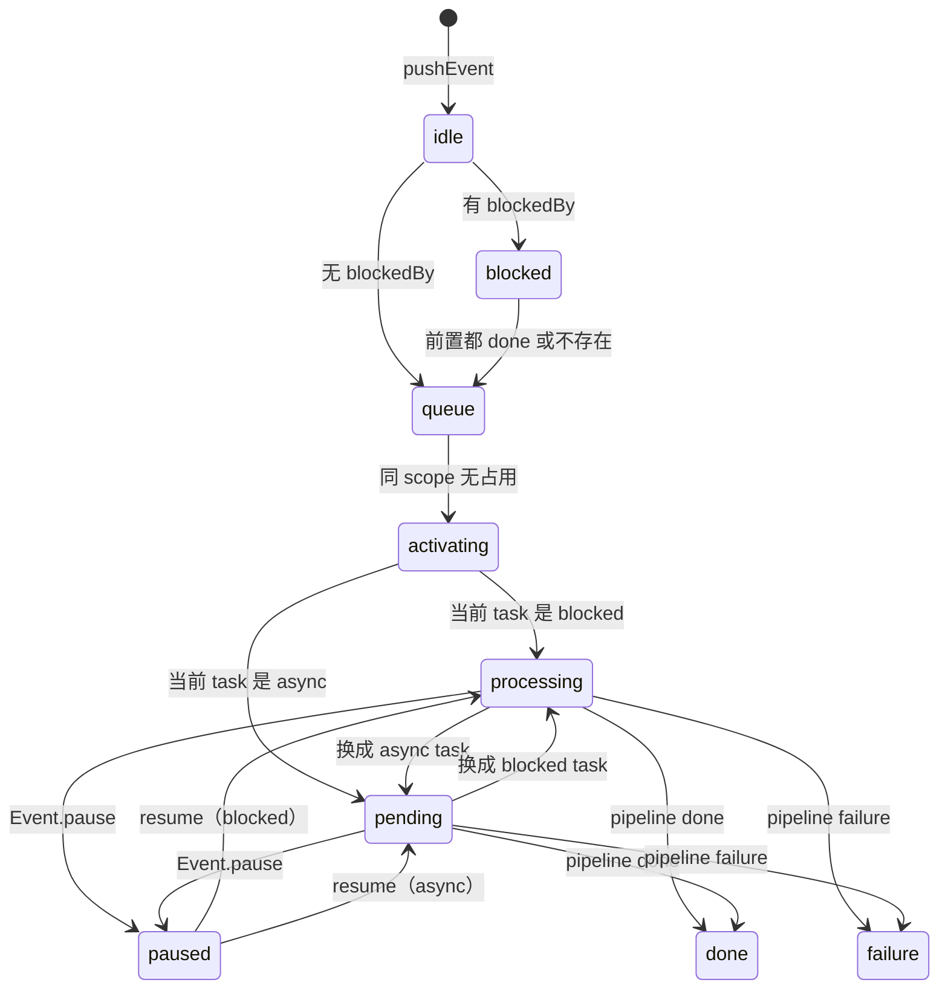
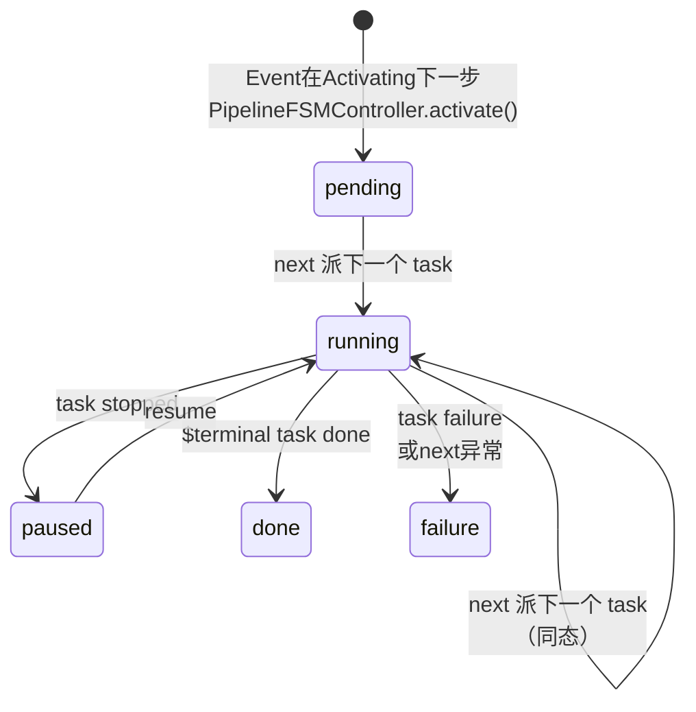
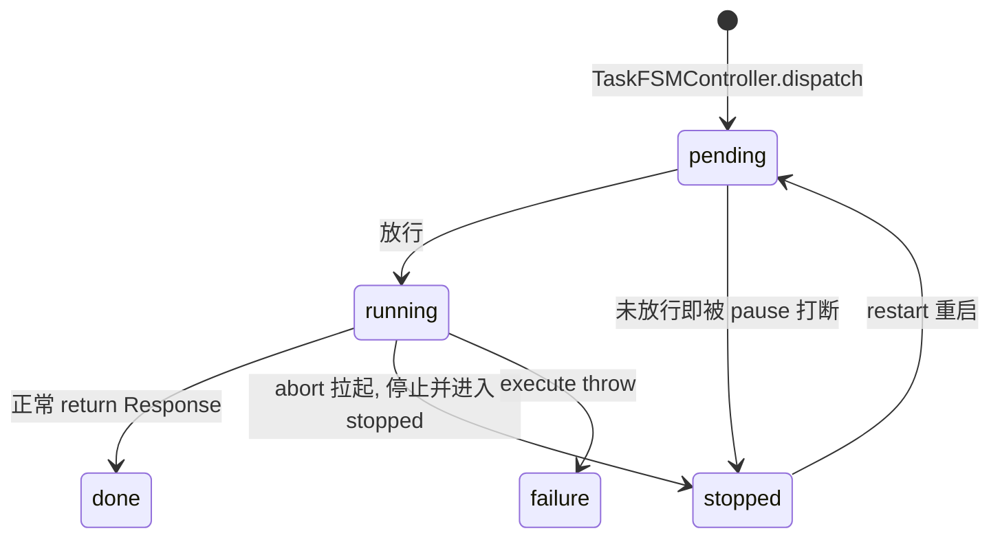

<style>
.hooks { border-collapse: collapse; width: 100%; font-size: 14px; }
.hooks th { background: #2d2d2d; color: #e0e0e0; padding: 6px 10px; text-align: left; }
.hooks td { padding: 5px 10px; border-bottom: 1px solid #444; vertical-align: top; }
.hooks .bf { color: #f0a060; font-weight: bold; }
.hooks .af { color: #60b0f0; font-weight: bold; }
.hooks .st { color: #c0c0c0; background: #1e1e1e; text-align: center; width: 80px; }
</style>


[$] NACEB是新的抽象层。
[$] 注意从NyirusuProject第二次重构开始，使用TypeScript开始编写Share库

# NACEB

NACEB全称 Nyirusu Application Control Event Bus，是**通用的**有限资源任务调度器。

NACEB 是为了给多个业务流程提供一个统一的事件运行时。它负责把外部事件转换为可观测、可控制、可调度的运行实例，并在所有流程之间统一仲裁 Task 的执行资源。Pipeline 只决定下一步派什么任务，Task 只执行被派发的任务，NACEB 则负责两者之间的生命周期、排队、资源占用、暂停恢复、结果传播和终局回收。

NACEB的目的是：当一个Event进入队列时，将该Event流入Pipeline流水线，在流水线内指定这个Event的输入输出、下一步被哪个Task承接，并按照Task的属性安排Queue与处理顺序。这是NACEB的唯一职责，没有意外，其余的功能附加应该在Pipeline和Task中指定。

NACEB 不负责理解事件内容，也不负责定义业务流程；因此，它不是聊天引擎、LLM 编排器或普通 EventBus。它特别适用于多步骤、可流式、可取消、会竞争共享执行资源的事件处理场景，也尤其适合AI对话、工具调用、LLM编排等场景。请注意，NACEB是故意设计成一个通用的、处理资源竞争的任务编排发生器，并不是专门用于LLMEvent的处理（NACEB并不声明自己是LLM用途，尽管在实际用途中一般都通过接入Pipeline和Task拿来当LLMEventRuntime用）。

NACEB对payload应该是opaque的，换句话说不应该关注负载的内容，只能机械丢给对应的Pipeline。Pipeline内则没有限制。

NACEB一般是NACP的Event直接下游，详情见.nacpAdapator章节。

NACEB 将所有 Task 分为 BlockedTask 与 AsyncTask，以允许一部分任务不占用任何资源，

NACEB提供了足够多的钩子和API，以允许最大消费方（NACP）和其他应用的接入。

NACEB在生成时注册PipelineHandler与TaskHandler列表（也可通过NACEB api调整），Event在push时必须指定自己的pipeline，或者被`beforePushEvent`hook指定。否则直接断言报错。

## 用词规范

请注意，以下专有名词为了避免歧义，均不得自定义缩写。

- NACEB，Nyirusu Application Control Event Bus，缩写必须全部大写，不能写成NAceb、naceb等。
- Event，指外部传入的“事件”。它的接口名字叫做EventInterface，构建出来的叫做EventInstance。
- Pipeline，指事件处理的流水线。外部注册的处理逻辑对象叫做PipelineHandler，它是无状态的，`next()` 的 `this` 是 PipelineInstance 本身。NACEB 内部构建的运行时载体叫做 PipelineInstance，持有流水线的执行状态（当前步骤、lastResult 等）。
- Task，指任务本身。外部注册的执行逻辑对象叫做 TaskHandler，它是无状态的，`execute()` 的 `this` 是 TaskInstance 本身。NACEB 内部构建的运行时载体叫做 TaskInstance，持有任务的执行状态。
- Layer/三层Layer，NACEB通过Event、Pipeline和Task三层Layer控制和推进内容。需要注意的是，这三个名字并不在 NACEB 内部直接定义，我们在外部说明的时候可以把整套内容称为 Pipeline 流水线、Task 任务和 Event 事件。但在 NACEB 内部，必须使用准确的后缀以区分职责：Event 用 Interface/Instance，Pipeline 和 Task 用 Handler/Instance。Controller也是同理，并且要强调是FSMController。
- Handler，外部控制器。Handler是外部导入的，尤其特指TaskHandler和PipelineHandler，是NACEB真正要处理的逻辑导入口。NACEB内部的TaskInstance和PipelineInstance会绑定唯一的Handler，**并将.next()和.execute()**内部的this指向Instance自己。这会提供给Handler一个能力：Handler里的具体逻辑可以直接用this读取到Instance的逻辑或者进行修改。
- Interface，接口。本项目唯一的接口是EventInterface，用于外部pushEvent时提供唯一的形状校准。EventInstance是EventInterface的唯一实现。
- Instance，实例。实例不是一个模糊的类或者形状，它是被确定的，拥有自己的id和状态。Handler和Interface的状态都应该存储在Instance上，前者通过this绑定，后者是实现。Instance都被Controller保存在不同的Queue中，生命周期完全由Controller控制。
- Controller控制器。Controller用于控制Instance的生命周期，通过注入NACEB和NACEB内部函数引用Ref来实现对其他Controller和handler的访问。NACEB内部的Controller都是FSMController，也同时掌管Instance的状态转移。
- tick：刻。翻译成拍或者节拍都不太合适。可能部分遗留文档会翻译成拍。NACEB内部只有Controller是遵循刻的，其中EventController是严格遵循刻。刻的作用是激活每个Controller内部的刻激活器，提醒控制器向前进一步。NACEB的大部分状态更新不是依赖回调或者事件通知的（pause/resume除外），是由刻统一推进。
- alertTick：刻发生器。默认刻发生器间隔50ms激活一次。如果在一个刻之内，任意一个Controller发生了状态迁移，则这一刻结束后立刻发起下一刻。同态迁移同样被视为有效的状态迁移。刻发生器最大的作用不是强迫向前推进，更多的作用是“提醒”可以往前进一步。换句话说，如果一个tick没有发生状态更新，或者EventQueue中不存在（除了【done、failure或idle】的之外）的事件，发生器会停止。
- Controller.nextTick：刻激活器。隶属于Controller的tick事件入口。tickAlert本质上就是按照Task->Pipeline->Event从下往上挨个激活本函数。理论上来说刻的作用是提醒Controller往前推一步。Task和Pipeline会把自己队列里所有的状态一起更新掉，Event则在每变更一次状态就会退出，等待下一个刻激活。具体的激活内容参见[^事件与同步]节。
- hook，钩子。NACEB的钩子主要特指THook，即状态转移钩子，能够在Event/Pipeline/Task发生状态转移时激活钩子回调。钩子默认没有payload，但是绑定this到对应的Instance上。钩子是唯一能够控制时序、介入修改的入口，通常before钩子用于预读取/篡改输入、阻止状态转移，after钩子可以挂上其他钩子、读取输出。
- eventBus，事件总线。需要严格注意，这里的EventBus不是NACEB三层Layer中的Event，而是NASDK通用的事件总线与监听器。详情可见观测-EventBus。主要包含T事件、运行中事件和错误事件。
- T事件，特指Transform状态转移事件。和hook一一对齐，本质上是THook中的[before/after]+T+[state]对应钩子默认事件之一的emit。同样回调函数内的this被绑定到对应Instance，但是这里的this是只读的，不可修改。
- Veto，否决机制。特指THook中的before钩子，能够在其中抛出错误以阻止状态转移。


## NACEB 构成

```
NACEB
├── bus: EventBus   
├── tickAlert: alertTick                              
├── pipelineHandlers:
│   ├── Map<PipeineName<String>, PipelineHandler>   
│   └── register/list/remove/get/...
├── taskHandlers:
│   ├── Map<TaskName<String>, TaskHandler>   
│   └── ...
├── eventAlias: 
│   ├── Map<EventName<String>,PipelineName<String>>   
│   └── ...
├── taskController: TaskFSMController
│   ├── nextTick/consume/...
│   ├── blockedQueue: Map<busyKey, List<TaskInstance>>  
│   └── asyncQueue:   List<TaskInstance>                
├── pipelineController: PipelineFSMController  
│   ├── ...
│   └── queue: List<PipelineInstance>          
└── eventController: EventFSMController   
    ├── ...     
    └── queue: List<EventInstance>            
```

三张注册表（`pipelineHandlers`、`taskHandlers`、`eventAlias`）由 NACEB 顶层持有并内敛 register/list/remove/get 等方法，Controller 不持有这些定义。Controller 如果要访问注册表，走 `this.naceb.xxxHandlers` 引用。

三个 FSMController 是**并列**的，不是纵向嵌套。它们各自持有自己的 Queue、驱动自己那一套状态机；相互之间只询问——读对方某个对象的状态、或拿到对方的对象，绝不代管对方的队列、也绝不替对方转移状态。

真正的状态转移永远由**拥有那条队列的 controller 自己**在自己的 nextTick 里做。

queue里面存储的是完整的Instance。这是已经实例化的运行当中的完整对象。对象即状态、即能力。

Handler必须是无状态的。Handler的this应该直接绑定到Instance上。Handler内如果要修改当前实例的状态，最终存储的地方应该是Instance而不是Handler，因为Handler在一轮任务完成后会被销毁。

Controller持有InstanceQueue，完成Instance的生命周期轮转。Controller不持有Handlers。如果需要访问，同样走`this.naceb`从顶层绕路。


## 实例状态流转

需要注意的是，这里指的是Instance实例的状态流转。

NACEB 内置三套正交的状态机，Event、Task、Pipeline 各一套。

状态转移全部由 NACEB 内部控制，外部只能通过 hook 观察/介入、或通过 Event 层的受控口间接触发。

`failure` 是三套状态机共同的吸收态，任何态都能进入 failure，一旦进入不可迁出。具体实现是任何状态迁移failure都是豁免的。

所有的队列在进入done或者failure状态后都不会自己被清除。NACEB内对完成的实例没有`清除`这个概念。只有`消费consume`，消费的含义就是明确的：取走了最终结果，并认为这个结果被`消费掉了`，这是唯一的`清除`含义。

### Event



**`idle`** 是所有 event 的起点。push 进来默认 idle。它没有 hook、不发事件，并且被tick激活器完全无视。idle 的主要意义是给外部唯一一个去挂 hook 的窗口，在`pushEvent` 拿到 event 对象后才能挂 hook。只有外部 `start()` 才真正入场；也可以 push 时带 `bypassIdle` 让 NACEB 内部立即 start。

> 如果没有idle或者尝试在bypassIdle时去挂载hook或者监听event，会有显著的脱同步问题，最开始的几个监听器可能完全挂不上。这个状态就是专门等着外部上挂监听器或者hook用的。

**`blocked`** 是前置依赖串行的基础。带了 `blockedBy` 的 event，`start` 时先进 blocked，等到 blockedBy 里的 event 都终局或不存在，才转 queue。这个状态的含义是让Event能够显式等待另一个Event的完成后再执行。这个状态也被激活器无视

**`queue`** 是就绪集，是调度器唯一入口，只做 scope 占用判断。这个状态的含义是收束idle和blocked状态，告诉调度器可以正式进入调度。

**`activating`** NACEB 在此 new 出 pipeline 实例。这个状态是一个非常短暂的激活态。这个激活态的生命周期只有一个tick，在下一个tick应该会更新为`processing` 或 `pending`。

**`processing` 与 `pending`** 是有 task 在跑的两种形态。processing的含义表示当前Event对应的Pipeline对应的Task（以下统称为Event对应的Task）是async还是blocked类型。async则对应pending，表示等待一个异步任务。processing表示执行中，表示一个blocked资源阻塞任务。

**`paused`** 是被 `Event.pause` 挂起的态，tick激活器默认跳过这个状态。只有 `Event.resume` 能把它转移出来。当resume被激活后，会直接重试运行上一个任务，并将自己的状态更新为这个任务的类型。

**`done` 与 `failure`** 是终局。done 是正常收束（`$terminal` task 跑完），failure 是异常终止。终局后 event 不会被删除，等外部**消费**；若 push 时带了 `bypassConsume`，则终局后由 NACEB 在 perTick 里自动消费清除。

### Pipeline



`pending` Pending是由PipelineFSMController.activate()新建的PipelineInstance。进入pending态后在下一个tick执行一次next并进入running态。

`running` 表示派了 task 在跑。多步编排里，消费上一个 task 的 done 后派下一个 task，状态还是 running——这是一次**同态转移**，状态值没有发生实际改变，但副作用（before/after 的 emit + hook）需要执行。这是**刻意为之**，保证每派一个新 task 外部都能感知、能挂上新 task 的 hook。

`paused` 是它派出的 task 被 stop 后挂起的态。只由 Event 层的 pause/resume 链驱动，tick激活时不会关心已paused的pipeline。

`done`/`failure` 是终局。`done` 由内建 `$terminal` task 收束触发；`failure` 由 task failure 或 next 抛异常触发。同样，进入这个状态后tick也不再关心。本Instance会一直待在这里面，直到被上层消费。

Pipeline 状态机不关心业务 phase（并且，Pipeline流程也没有phase这个说法）。Pipeline最核心的用途，就是告诉TaskFSMController，**下一步**要派发那个TaskHandler，输入给它的是什么。

### Task



`pending` 同理，本状态是由TaskFSMController.dispatch()新建的TaskInstance。在下一个tick检查busylane（如果是asyncTask，直接送进asyncQueue并进入running，然后execute；如果是blockedTask，那需要检查lane有没有被占用，如果有则不激活）

`running` running表示该任务正在进行中。Task内部倒是没有同态转移这个说法。running只有三个去向，done表示execute正常完成，failure表示execute异常。stopped表示running还没等到返回的时候被abortSignal激活，并且execute内部知道了要终止，提前结束了内容。

`stopped` 是一个`意料之中的异常`。三个终态中只有stopped是没有有效return值的。这是刻意为之的。真正有效的过程输出应该通过TaskInstance.processingResultReport上报到外面。

`done`和`failure`都有正常的输出。

重启后Instance会保留，同时保留所有的hook和state，便于内部重建（这也是TaskInstance.state的唯一意义）。

## NACEB.eventbus


## NACEB.pipelineHandlers

## NACEB.taskHandlers

## NACEB.eventAlias

## TaskController

## PipelineController

## EventController


## 观测与介入

NACEB主要提供Hook钩子和EventBus事件总线的方式，来实现内部运行时的介入与观测。

设计上，Hook钩子同时承担了观测与介入的能力，并且设计为阻塞型。EventBus是作为纯观测者异步监听事件。

### Hook

Hook钩子只提供了THook事件转移钩子，并区分转移之前before和之后after两种钩子。

T钩子只关注对应Instance转移**到了哪个状态**，并不关心是从**哪个状态转移来的**。

Hook钩子在发生订阅时，会在内部维持一个回调函数列表，并在事件发生时按照顺序触发所有回调函数。

before钩子是唯一一个可以阻碍状态发生转移的介入时机。通过throw Error，NACEB会停止本tick内对该Instance的状态转移，本机制被称为否决Veto。

Veto否决会导致本次转移失败，状态会保持在完全没有开始转移的情况，并且此刻所有的副作用都不会发生，比如被Veto的Event.Activating不会新建Pipeline

> 但是，即使Veto阻止了本次转移，NACEB仍会在下一个tick尝试将本Instance转移对应的状态。因此，通常在throw前会通过Hook篡改能力修改条件。
>
> 例如，如果我们在Event.beforeTQueue时给他一个BlockedBy，我们期望NACEB在转移前读到BlockedBy，发现被阻塞，然后停止本次转移。但是实际上Event仍会继续转移。因为T事件是NACEB**已经决定了**要将Instance发生状态转移的时候。在这之前，NACEB**已经检查过了**BlockedBy无人阻塞。
>
> 因此，我们在篡改BlockedBy参数后抛出VetoT(<String>)，使得本次转移失效。在下一个tick时EventFSMController就会去检查BlockedBy。
>
> 警告，如果你在Hook内实现的函数发生了了UnhandledError，我们不会视为Veto，而被视为致命错误，对应层状态会直接进入failure表示介入失败。如果在Event层出现，会引发Event、Pipeline和Task的级联终止。这一刻会被阻塞直到这一层以下的内容被终止并消费干净。如果Hook错误发生在Pipeline或Task，则自己回立刻进入Failure，并在下一tick同步到上面的Layer。
> 如果这次致命错误本来就发生在转移Failure时，TFailure的所有Hook都会被禁用（不包括EventBus的Emit）。
> 
> Veto主要应用于Event事件，Event全部T事件都可以被Veto。Task可以在TRunning时Veto。Pipeline和Task其他T事件则完全不允许。
>
> Pipeline的所有事件驱动是既定事实，如果要修改，应该介入更底层的Task。而Task本身开始运行后事件驱动也是既定事实，无法被Veto。
> 
> 并且，Task.beforeTStopped和Pipeline.beforeTPause也是不允许Veto的！如果需要Veto暂停链，请在Event.beforeTPaused抛出拒绝，此时，Event.pause会返回false。
>
> 此外，如果一个转移被Veto，它的副作用不会被激活，但是仍会被视为一次虚拟的moved，从而快速激活下一刻。

需要注意的是，所有的回调函数内部`this`都是被刻意绑定到对应Instance上。例如，Event.afterTDone(fucntion(){})中，内部的匿名函数this就是触发本次Hook的EventInstance。

不同于EventBus，绑定在Hook上的this是原生的、可以直接修改字段的。

因此，Hook钩子，尤其是before钩子被赋予了一个极其强大且危险的能力，它可以在激活是直接篡改当前Instance状态，例如修改`Event.scope`字段，或者直接修改`state`、`payload`乃至`this.getPipeline().state`等内容。

> 标记为-表示此处没有特殊说明。所有的THook都可以介入篡改this。

#### Event THook

本Hook挂载在`EventInstance`。

> 需要注意的是，无论是外部getEvent(id)或者pipeline的pipeline.event都可以获得本实例。
> 
> 使用方法即Event.beforeTBlocked(function(){})，不要使用()=>{}，这会丢失this。

<table class="hooks">
<tr><th>状态</th><th>含义</th><th>前缀</th><th>一般作用</th></tr>
<tr><td class="st" rowspan="2">Blocked</td><td rowspan="2">Idle开始时，发现本任务的BlockedBy不为空，并且对应的Event没有结束。该状态进入该状态表示“被另一个任务阻塞”</td><td class="bf">beforeTBlocked</td><td>可查看/篡改 blockedBy 列表，在此处Veto可以回到Idle。</td></tr>
<tr><td class="af">afterTBlocked</td><td>观测已进入 blocked 态</td></tr>
<tr><td class="st" rowspan="2">Queue</td><td rowspan="2">blocked任务已完成或不存在。</td><td class="bf">beforeTQueue</td><td>可查看/篡改 scope</td></tr>
<tr><td class="af">afterTQueue</td><td>观测已进入就绪队列</td></tr>
<tr><td class="st" rowspan="2">Activating</td><td rowspan="2">队列中没有比本任务排的更前的同Scope任务</td><td class="bf">beforeTActivating</td><td>可篡改 payload</td></tr>
<tr><td class="af">afterTActivating</td><td>pipeline 已 new 出，<b>挂 pipeline hook 的唯一入口</b></td></tr>
<tr><td class="st" rowspan="2">Processing</td><td rowspan="2">进入处理态</td><td class="bf">beforeTProcessing</td><td>-</td></tr>
<tr><td class="af">afterTProcessing</td><td>观测已进入Blocked任务执行态（即处理态）</td></tr>
<tr><td class="st" rowspan="2">Pending</td><td rowspan="2">进入等待态</td><td class="bf">beforeTPending</td><td>-</td></tr>
<tr><td class="af">afterTPending</td><td>观测已进入Async任务执行态（即等待态）</td></tr>
<tr><td class="st" rowspan="2">Paused</td><td rowspan="2">被Event.pause暂停</td><td class="bf">beforeTPaused</td><td>Veto可以阻止暂停</td></tr>
<tr><td class="af">afterTPaused</td><td>观测已进入暂停态</td></tr>
<tr><td class="st" rowspan="2">Done</td><td rowspan="2">事件完成</td><td class="bf">beforeTDone</td><td>-</td></tr>
<tr><td class="af">afterTDone</td><td><b>读取/消费结果的最后回调</b>（consumeEvent 前）</td></tr>
<tr><td class="st" rowspan="2">Failure</td><td rowspan="2">事件失败</td><td class="bf">beforeTFailure</td><td>-</td></tr>
<tr><td class="af">afterTFailure</td><td><b>读取/消费错误信息的最后回调</b>（consumeEvent 前）</td></tr>
</table>

> 警告
>
> 如果你尝试在beforeTBlocked/beforeTQueue时Veto，Event则会回退Idle状态，这种情况下你需要手动start才能重新启动。


#### PipelineTHook

本Hook挂载在`PipelineInstance`。

> 同理，只要能获得PipelineInstance都可以挂在上。

<table class="hooks">
<tr><th>状态</th><th>含义</th><th>前缀</th><th>一般作用</th></tr>
<tr><td class="st" rowspan="2">Pending</td><td rowspan="2">刚 new 新建出来的默认状态</td><td class="bf">beforeTPending</td><td>可篡改初始状态</td></tr>
<tr><td class="af">afterTPending</td><td>观测 pipeline 已就绪</td></tr>
<tr><td class="st" rowspan="2">Running</td><td rowspan="2">派了 task 在跑（含Running->Running同态转移）</td><td class="bf">beforeTRunning</td><td>可篡改 result</td></tr>
<tr><td class="af">afterTRunning</td><td>task 已 dispatch，<b>挂 task hook 的入口</b></td></tr>
<tr><td class="st" rowspan="2">Paused</td><td rowspan="2">上层Event.pause造成的Pipeline暂停</td><td class="bf">beforeTPaused</td><td>-</td></tr>
<tr><td class="af">afterTPaused</td><td>观测 pipeline 已挂起</td></tr>
<tr><td class="st" rowspan="2">Done</td><td rowspan="2">正常完成</td><td class="bf">beforeTDone</td><td>-</td></tr>
<tr><td class="af">afterTDone</td><td>终局观测，上层消费前回调</td></tr>
<tr><td class="st" rowspan="2">Failure</td><td rowspan="2">异常完成</td><td class="bf">beforeTFailure</td><td>-</td></tr>
<tr><td class="af">afterTFailure</td><td>终局观测</td></tr>
</table>

> Pipeline不可以Veto。

#### TaskTHook

本Hook挂载在`TaskInstance`。

<table class="hooks">
<tr><th>状态</th><th>含义</th><th>前缀</th><th>一般作用</th></tr>
<tr><td class="st" rowspan="2">Pending</td><td rowspan="2">dispatch 后排队等放行</td><td class="bf">beforeTPending</td><td>可篡改 input；throw 不可 veto（hook bug → 本层 failure）</td></tr>
<tr><td class="af">afterTPending</td><td>观测已进入排队</td></tr>
<tr><td class="st" rowspan="2">Running</td><td rowspan="2">lane放行，开始 execute</td><td class="bf">beforeTRunning</td><td><b>restart 时篡改 this.input 的关键点</b>；throw 可 veto，并且这是task 层唯一可 veto 点</td></tr>
<tr><td class="af">afterTRunning</td><td>execute 即将启动</td></tr>
<tr><td class="st" rowspan="2">Done</td><td rowspan="2">execute 正常 return</td><td class="bf">beforeTDone</td><td>-</td></tr>
<tr><td class="af">afterTDone</td><td>结果已就绪，待消费</td></tr>
<tr><td class="st" rowspan="2">Stopped</td><td rowspan="2">abort 拉起 / pending 被打断</td><td class="bf">beforeTStopped</td><td>-</td></tr>
<tr><td class="af">afterTStopped</td><td>abort 已拉起，execute 已收尾</td></tr>
<tr><td class="st" rowspan="2">Failure</td><td rowspan="2">execute throw（未 abort）</td><td class="bf">beforeTFailure</td><td>-</td></tr>
<tr><td class="af">afterTFailure</td><td>终局观测</td></tr>
</table>

### EventBus

NACEB 内部持有一个独立的 `EventBus` 实例（`this.eventBus`），用于广播 transition 事件和运行时事件。

外部只能通过 `naceb.eventBusObs` 只读界订阅，不可发起事件。

#### Transition（T）事件

T事件和THook是等价的，内部绑定的this也是对应的Instance。

> 在微观层面上都是T事件领先THook发起。T事件的回调事件其中的this也是和THook一致绑定在对应instance中。
>
> 事件回调中的错误会被直接忽视。
>
> 由于T事件并不会和THook一样阻塞推进，如果在TEvent中篡改数据很容易陷入时机竞争，因此TEvent仅作为观测手段，不得作为介入手段！

<table class="hooks">
<tr><th>key 模式</th><th>this（只读视图）</th><th>状态</th><th>前缀</th><th>全称</th><th>对应 hook</th></tr>
<tr><td class="st" rowspan="16"><code>naceb:event:<br>{state}:{phase}:{id}</code></td><td class="st" rowspan="16">EventInstance</td><td class="st" rowspan="2">blocked</td><td class="bf">before</td><td>naceb:event:blocked:before:{id}</td><td class="bf">Event.beforeTBlocked()</td></tr>
<tr><td class="af">after</td><td>naceb:event:blocked:after:{id}</td><td class="af">Event.afterTBlocked()</td></tr>
<tr><td class="st" rowspan="2">queue</td><td class="bf">before</td><td>naceb:event:queue:before:{id}</td><td class="bf">Event.beforeTQueue()</td></tr>
<tr><td class="af">after</td><td>naceb:event:queue:after:{id}</td><td class="af">Event.afterTQueue()</td></tr>
<tr><td class="st" rowspan="2">activating</td><td class="bf">before</td><td>naceb:event:activating:before:{id}</td><td class="bf">Event.beforeTActivating()</td></tr>
<tr><td class="af">after</td><td>naceb:event:activating:after:{id}</td><td class="af">Event.afterTActivating()</td></tr>
<tr><td class="st" rowspan="2">processing</td><td class="bf">before</td><td>naceb:event:processing:before:{id}</td><td class="bf">Event.beforeTProcessing()</td></tr>
<tr><td class="af">after</td><td>naceb:event:processing:after:{id}</td><td class="af">Event.afterTProcessing()</td></tr>
<tr><td class="st" rowspan="2">pending</td><td class="bf">before</td><td>naceb:event:pending:before:{id}</td><td class="bf">Event.beforeTPending()</td></tr>
<tr><td class="af">after</td><td>naceb:event:pending:after:{id}</td><td class="af">Event.afterTPending()</td></tr>
<tr><td class="st" rowspan="2">paused</td><td class="bf">before</td><td>naceb:event:paused:before:{id}</td><td class="bf">Event.beforeTPaused()</td></tr>
<tr><td class="af">after</td><td>naceb:event:paused:after:{id}</td><td class="af">Event.afterTPaused()</td></tr>
<tr><td class="st" rowspan="2">done</td><td class="bf">before</td><td>naceb:event:done:before:{id}</td><td class="bf">Event.beforeTDone()</td></tr>
<tr><td class="af">after</td><td>naceb:event:done:after:{id}</td><td class="af">Event.afterTDone()</td></tr>
<tr><td class="st" rowspan="2">failure</td><td class="bf">before</td><td>naceb:event:failure:before:{id}</td><td class="bf">Event.beforeTFailure()</td></tr>
<tr><td class="af">after</td><td>naceb:event:failure:after:{id}</td><td class="af">Event.afterTFailure()</td></tr>
<tr><td class="st" rowspan="10"><code>naceb:pipeline:<br>{state}:{phase}:{id}</code></td><td class="st" rowspan="10">PipelineInstance</td><td class="st" rowspan="2">pending</td><td class="bf">before</td><td>naceb:pipeline:pending:before:{id}</td><td class="bf">Pipeline.beforeTPending()</td></tr>
<tr><td class="af">after</td><td>naceb:pipeline:pending:after:{id}</td><td class="af">Pipeline.afterTPending()</td></tr>
<tr><td class="st" rowspan="2">running</td><td class="bf">before</td><td>naceb:pipeline:running:before:{id}</td><td class="bf">Pipeline.beforeTRunning()</td></tr>
<tr><td class="af">after</td><td>naceb:pipeline:running:after:{id}</td><td class="af">Pipeline.afterTRunning()</td></tr>
<tr><td class="st" rowspan="2">paused</td><td class="bf">before</td><td>naceb:pipeline:paused:before:{id}</td><td class="bf">Pipeline.beforeTPaused()</td></tr>
<tr><td class="af">after</td><td>naceb:pipeline:paused:after:{id}</td><td class="af">Pipeline.afterTPaused()</td></tr>
<tr><td class="st" rowspan="2">done</td><td class="bf">before</td><td>naceb:pipeline:done:before:{id}</td><td class="bf">Pipeline.beforeTDone()</td></tr>
<tr><td class="af">after</td><td>naceb:pipeline:done:after:{id}</td><td class="af">Pipeline.afterTDone()</td></tr>
<tr><td class="st" rowspan="2">failure</td><td class="bf">before</td><td>naceb:pipeline:failure:before:{id}</td><td class="bf">Pipeline.beforeTFailure()</td></tr>
<tr><td class="af">after</td><td>naceb:pipeline:failure:after:{id}</td><td class="af">Pipeline.afterTFailure()</td></tr>
<tr><td class="st" rowspan="10"><code>naceb:task:<br>{state}:{phase}:{id}</code></td><td class="st" rowspan="10">TaskInstance</td><td class="st" rowspan="2">pending</td><td class="bf">before</td><td>naceb:task:pending:before:{id}</td><td class="bf">Task.beforeTPending()</td></tr>
<tr><td class="af">after</td><td>naceb:task:pending:after:{id}</td><td class="af">Task.afterTPending()</td></tr>
<tr><td class="st" rowspan="2">running</td><td class="bf">before</td><td>naceb:task:running:before:{id}</td><td class="bf">Task.beforeTRunning()</td></tr>
<tr><td class="af">after</td><td>naceb:task:running:after:{id}</td><td class="af">Task.afterTRunning()</td></tr>
<tr><td class="st" rowspan="2">done</td><td class="bf">before</td><td>naceb:task:done:before:{id}</td><td class="bf">Task.beforeTDone()</td></tr>
<tr><td class="af">after</td><td>naceb:task:done:after:{id}</td><td class="af">Task.afterTDone()</td></tr>
<tr><td class="st" rowspan="2">stopped</td><td class="bf">before</td><td>naceb:task:stopped:before:{id}</td><td class="bf">Task.beforeTStopped()</td></tr>
<tr><td class="af">after</td><td>naceb:task:stopped:after:{id}</td><td class="af">Task.afterTStopped()</td></tr>
<tr><td class="st" rowspan="2">failure</td><td class="bf">before</td><td>naceb:task:failure:before:{id}</td><td class="bf">Task.beforeTFailure()</td></tr>
<tr><td class="af">after</td><td>naceb:task:failure:after:{id}</td><td class="af">Task.afterTFailure()</td></tr>
</table>


#### 运行时事件


## 事件与同步

内部NACEB事件只有三种可能

1. 来自外部的pushEvent 
2. 来自外部的Event.pause/Event.resume 
3. 来自内部的Ticker

其中，内部的Ticker同时收束了定时发生器和事件完成后的催促，具体见下章。

### TickAlert机制

### pause/resume机制

### 外部pushEvent


---

# Draft

## API 


## 内部事件来源

内部NACEB事件只有三种可能：1. 来自外部的pushEvent 2.来自外部的Event.pause Pipeline.pause Task.stop/Event.resume Pipeline.resume Task.restart 3.来自内部的Ticker

### Ticker

NACEB的alertTick被激活时，每个Tick需要执行三个Controller的alertTick。


1.TaskFSMController
1.1 检查双TaskQueue中，有无任务标记为pending。
1.1.1 如果有，检查是否为async或者busykey都是空闲的blocked task。
1.1.1.1 如果是，在TaskRunner中execute该任务。期间可以用tCtx的processingResultReport广播中间结果。

2.PipelineFSMController
2.1 检查自己的PipelineRecord中，是否有Pipeline标记为running
2.1.1 如果有，询问TaskFSMController对应的Task情况是否为done/stopped
2.1.1.1 如果是done，消费该Task结果（获取Task Result保存到PipelineRecord、告知TaskFSMController移除该Task）
2.1.1.1.2 读取TaskResult。如果是Finally，激活pCtx的finalResultReport广播最终结果并标记自己为done。如果不是，激活Pipeline.next()
2.1.1.2 如果是stopped，标记自己为paused。
2.1.1.3 如果是failure，移除Task并标记自己为failure，并激活pCtx的finalResultReport。
2.2 检查自己的PipelineRecord中，是否有Pipeline标记为pending
2.2.1 如果有，激活这个Pipeline.next()

3.EventFSMController
3.1 检查自己的EventQueue，是否有Event标记为processing/pending
3.1.1 询问PipelineFSMController本Event的执行情况，是否为done/failure
3.1.1.1 如果是done，将本Event标记为done，并告知PipelineFSMController移除对应的pipeline。
3.1.1.2 如果是failure，将本Event标记为failure，并告知PipelineFSMController移除对应的pipeline。
3.1.1.3 否则根据PipelineFSMController获得的Task类型，转换自己的processing/pending
3.2 检查自己的EventQueue，是否有Event标记为activating
3.2.1 询问PipelineFSMController当前Event对应的Pipeline对应的Task的类型，并更新自己的状态。如果pipeline还在pending状态，不更新。
3.3 检查自己的EventQueue，是否有Event标记为queue
3.3.1 如果有，查询同队列中是否有相同scope的Event
3.3.1.1 如果有，则保持queue
3.3.1.2 如果没有，将Event标记为activating，并激活对应pipeline，将其进入pending状态。
3.4 检查自己的EventQueue，是否有Event标记为blocked
3.4.1 如果有，查询自己队列中blockedBy Event是否done或者不存在
3.4.2 如果done或者不存在，则将该Event标记为queue

（注意回收本Event是外部信号告知 EventFSMController 移除。EventFSMController是不能在perTick里移除自己队列里的内容的，因为不知道自己的结果有没有被消费掉）

### PushEvent

当外部通过NACEB的pushEvent接口发送时，会发生以下事情：

1. NACEB检查本Event是否有合法的Pipeline
2. NACEB检查本Event是否有blockedBy字段
3. 如果2为真，那么无论这个blockedBy的原event是否存活，都直接进入队列并标记为blocked。否则进入队列并标记为queue。

### 暂停与继续

NACEB允许外部直接控制对应的Event、Pipeline和Task的暂停。

其中，Event.pause Pipeline.pause Task.stop三者均是等效Task.stop，resume/restart也是。

当暂停/任务终止时:

1. Event.pause激活时，询问PipelineFSMController对应Event的Pipeline，标记自己为pause，然后await Pipeline.pause。
2. Pipeline.pause激活时，询问Task...标记自己为pause，...
3. Task.stop激活时，先检查自己的状态
4. 如果是pending，直接将本task送进stopped终态，不执行。
5. 如果已经是stopped、done终态要，返回错误，提示当前状态不能被暂停
6. 如果是running，激活abortSignal，并等待task内任务的回调。
7. 回调完成或者超时后（120s），将自己状态变更为stopped，然后返回。

当恢复/任务重启时。

1. Event.resume激活时，await Pipeline.resume，然后询问Pipeline具体的task类型，更新自己状态
2. Pipeline.resume激活时，await Task.restart，然后更新自己状态为running
3. Task.restart激活时检查自己状态，断言为stopped，否则报错
4. 把自己状态改为pending，然后直接返回resume成功

### 备注

为什么不用callback、内置的EventBus事件通知来完成状态同步，而是pertick：防止状态更新混乱、来源未知，在并发时防止打架。而且心智模型清晰，对于复杂任务20ticks/s速度足够。

perTick激活时，每个Controller只能控制自己和下层的内容，永远不更新上层，并且对于自己的结果，永远等上层来消费而不是自行清除。

在三个Controller的alertTick执行完之前，NACEB的alertTick将自锁。

所有叶子节点如果被执行，EventController将在本tick下return。Pipeline和Task不会限制。