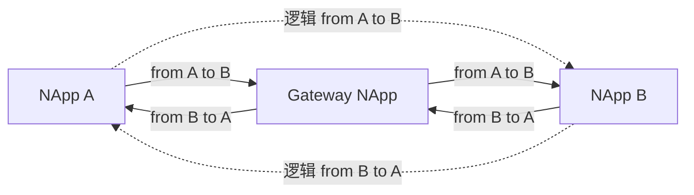

# NApp as Gateway

一个NApp可以通过声明自己是Gateway来转发消息。

普通NApp可以通过Gateway NApp和另一个NApp通讯，不需要在两者之间构建直接连接。



:::tip
A 和 B 没有直接连接，消息实际经过 Gateway 转发。

需要注意的是，NApp目前对于一个网络，只允许一个Gateway，暂时不允许在一个网络中包含多个Gateway。

此外，这并不是NAT，详情见下文，因为在传输过程中并没有发生地址转换。
:::

## 启动 Gateway

在 NApp 的 `opt` 中设置 `isGateway: true`，并为其他 NApp 提供一个传输入口：

```js
const gateway = new NApp({
  id: "gateway",
  server: [{ type: "ws", opt: { ip: "127.0.0.1", port: 18900 } }],
  opt: { isGateway: true }, // [!code focus]
})

await gateway.start()
```

`isGateway` 是 NApp 的固定属性，启动后不能切换。

:::tip
Gateway 仍然是一个 NApp，也可以拥有自己的 Event、Ability 和订阅。

转发只是它额外承担的职责。
:::

## 将 NApp 接入 Gateway

A 和 B 分别启动，然后使用 Gateway 的 App ID 和传输地址建立连接：

```js
const gatewayTransport = {
  type: "ws",
  opt: { ip: "127.0.0.1", port: 18900 },
}

await appA.start()
await appB.start()

await appA.connect("gateway", gatewayTransport) // [!code focus]
await appB.connect("gateway", gatewayTransport) // [!code focus]
```

连接成功后，Gateway 会记录 A、B 的 App ID。

A 和 B 不需要互相调用 `connect()` 连接到对方。

:::warning
目标 NApp 必须已经连接并注册到 Gateway。

Gateway 不负责发现尚未注册的 NApp，也不会为未知目标创建连接。
:::

## 通过 Gateway 通信

调用方式与直连完全相同，A 仍然直接把 B 的 App ID 传给 `request()`：

```js
// [!code focus:5]
const call = appA.request("B", {
  kind: "ability",
  target: "hello",
  payload: { name: "Nyirusu" },
})

const response = await call.response
console.log(response.payload)
```

不需要将目标写成 Gateway，也不需要在 payload 中描述转发路径。NApp相关能力都可以直接使用目标NApp ID而不是Gateway ID。

:::info
如果 A 与 B 同时存在直连和 Gateway 连接，NApp 会优先使用到 B 的直连。只有没有直连时才将消息交给 Gateway。

换句话说，Gateway就是兜底连接。
:::

## 消息如何转发

Gateway 只转发 Package，不转换地址。请求经过 Gateway 时，Package 始终保持：

```text
A → Gateway → B    { from: "A", to: "B" }
```

B 返回的 Response、Notify 或其他消息则保持：

```text
B → Gateway → A    { from: "B", to: "A" }
```

Gateway 只读取当前 Package 的 `to` 来选择下一跳，不改写 `from` 和 `to`，也不代替 B 返回 Response。

:::tip
这就是为什么它不是 NAT，Gateway 也不需要保存 A 与 B 之间的请求映射。
:::

## 多 Gateway

一个 NApp 同一时间只能采用一个 Gateway。连接到第二个声明自己为 Gateway 的 NApp 时，默认会因路由冲突而拒绝。

如果确实需要同时保留与第二个 Gateway NApp 的连接，可以设置：

```js
const app = new NApp({
  id: "A",
  opt: { autoMultiGatewayDowngrade: true }, // [!code focus]
})
```

此时后连接的 Gateway 会被当作普通直连 NApp，不会承担本 NApp 的兜底路由。

_截止**v1.0.3**版本_，两个 `isGateway: true` 的 NApp 不能互相注册，即使降级为普通节点。尝试连接会产生`dual-gateway`错误。

:::details 关于Gateway NAT
未来计划可能会涉及到类似NAT的地址转换，但目前暂时不考虑支持。

NAT的支持可能会引发消息传递的混乱，并且需要维护映射、修改来源和地址。

此外，如何广播路由的变动也是一个难题。

:::

底层转发规则见 NACP 的[入站处理](/transport/nacp/inbound)和[出站路由](/transport/nacp/outbound#出站路由)。
