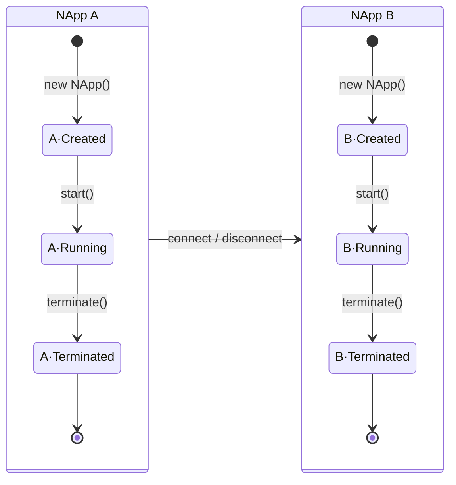

# NApp 生命周期



## start

`start()` 将启动整个 NApp。

```js
const app = new NApp({
  id: "client",
})

await app.start()
```

即使没有配置 `server`，只主动连接其他 NApp，也必须先调用 `start()`。Client-only NApp 同样需要处理注册握手与自身能力。

:::warning
需要自定义 Processor 时，应在 `start()` 之前完成 [`bindProcessor()`](../construction)。

如果在启动时没有绑定Ability/EventProcessor，NApp将会默认用NASDK内建的NACAB和NACEB代替。
:::

## connect

`connect()` 建立到一个 NApp 的连接，并完成握手。

```js
await app.connect("core", {
  type: "tcp",
  opt: { ip: "127.0.0.1", port: 46666 },
})
```

第一个参数是预期的远端 NApp `id`。如果握手返回的身份与预期不一致，发起方的连接会失败。

`connect()` 必须在 `start()` 之后调用。

连接成功后，两端都可以主动发起 Request、Subscribe 或其他 NACP 消息，不再区分 Client 与 Server。

## disconnect

`disconnect(appId)` 断开和另一个NApp的链接。

```js
const disconnected = await app.disconnect("core")
```

NApp 会先尝试向对端注销，再关闭连接。即使对端已经失去响应，也会继续完成本地断开。

断开后，仍可以再次 `connect()`。

## terminate

`terminate()` 结束整个 NApp。

```js
await app.terminate()
```

NApp 会依次：

1. 停止接受新的出站操作。
2. 尝试向已连接的对端注销。
3. 清理协议状态与等待中的请求。
4. 关闭连接和所有 Server 入口。

默认只向当前在线的对端发送注销，避免等待已经离线的目标：

```js
await app.terminate()
```

需要连仍处于离线宽限期的对端也一起处理时，可关闭该过滤：

```js
await app.terminate({ isOnlineOnly: false })
```

`terminate()` 是不可逆的。调用后不应继续使用或重新启动该实例；需要重新运行时，应创建新的 NApp。

## 查询连接

`listConnectedApp()` 返回当前在线的对端 NApp ID：

```js
const appIds = app.listConnectedApp()
```

传入 `isOnlineOnly: false` 时，也包含仍处于离线宽限期、尚未被清理的对端：

```js
const heldAppIds = app.listConnectedApp({ isOnlineOnly: false })
```
