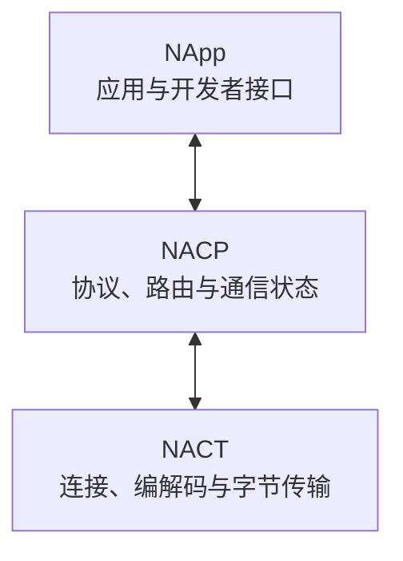

# 传输与协议

NASDK 将 NApp 之间的通信分为 NACP 和 NACT 两层。

```mermaid
flowchart TB
    NApp["NApp<br/>应用与开发者接口"]
    NACP["NACP<br/>协议、路由与通信状态"]
    NACT["NACT<br/>连接、编解码与字节传输"]

    NApp <--> NACP
    NACP <--> NACT
```

[NACP](./nacp) 是协议层，负责定义 NApp 之间如何通信，包括注册、请求、响应、订阅、通知、信号、确认与路由。

[NACT](./nact) 是传输层，负责建立和维护物理连接，并统一 WebSocket、TCP 与 Unix Socket 的收发、编解码、分片和重组。
