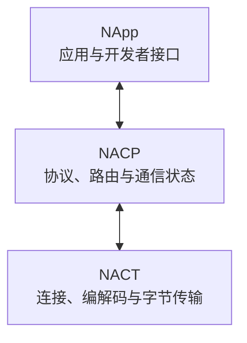

# 传输与协议

NASDK 将 NApp 之间的通信分为 NACP 和 NACT 两层。

[NACP](./nacp) 是协议层，负责定义 NApp 之间如何通信，包括注册、请求、响应、订阅、通知、信号、确认与路由。

[NACT](./nact) 是传输层 core，负责维护 Peer、编解码、分帧与重组。物理连接由按需安装的 Transport Provider 建立；连接建立后，各 Provider 都以 NACT 帧为单位与 NACT 双向交换数据。
