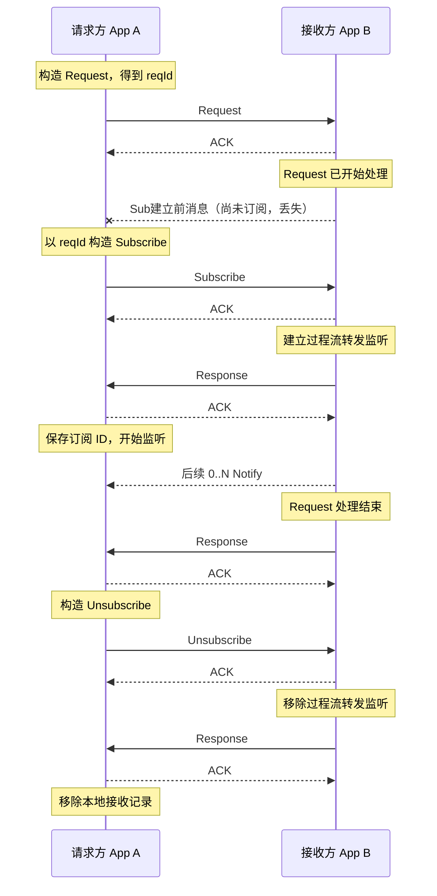
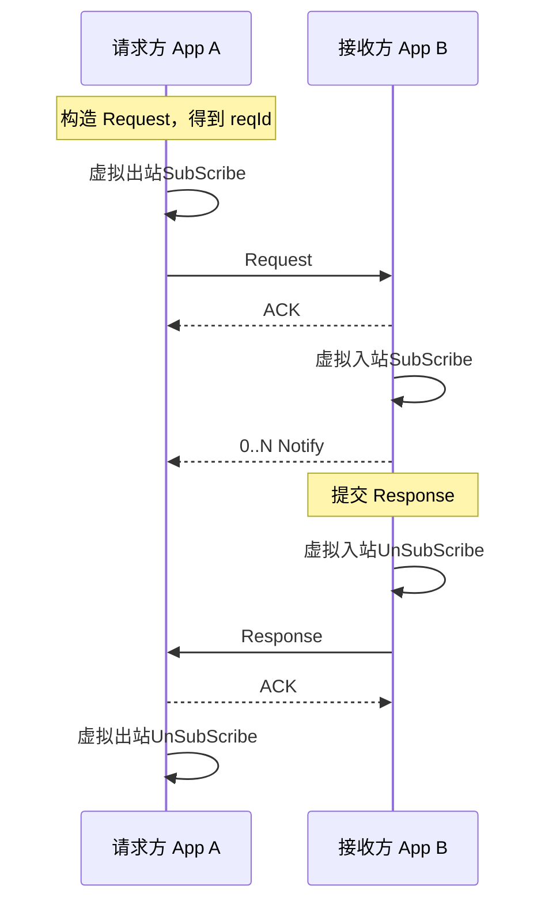

# AutoSubscribe

NACP将在发起Event Request时自动订阅过程流，并在结束后自动退订。

这一机制被称为`AutoSubscribe`

## 为什么需要 AutoSubscribe

NACP 不只传输`一发一收`的消息，还需要承载具有生命周期的 Event，任务开始后可以持续产生过程数据，最后再给出唯一的终局结果。

[NASDK Processor](/workflow/processor) 将任务处理统一为 `onProcess` 与 `onResponse`，AutoSubscribe 则把这两个出口映射到 NACP。

两者共同把任务处理生命周期与传输协议连接起来，Processor 不需要管理远端订阅，NACP 也不需要理解任务内部状态，只通过 `reqId` 关联过程流与最终结果。

如果没有 AutoSubscribe，一次完整的 Event Request 只能先发送 Request，取得并围绕这次请求建立过程流订阅，最后再主动退订：

这套流水线有两个问题：

- Request 先开始工作，Subscribe 后建立，在这段时间内产生的过程消息没有转发监听，会直接丢失。
- 每次 Event Request 都会额外产生一组 Subscribe / Ack / Response 和 Unsubscribe / Ack / Response 往返。

## EventRequest自动监听

AutoSubscribe 将订阅的建立和清理并入 Request / Response 生命周期：

:::tip
“虚拟”的含义表示NACP**复用了**既有的监听和取消流程，但不发送消息到出入站接口，也不等待ACK和Response。

这会导致少量副作用：

- `nacp:outbound|inbound:subscribe|unsubscribe` 事件将不会被广播
- SubId将不再自动生成，而是被设置为`ReqID`

:::

## Request 构建与发送

### 请求方

请求方先构造 RequestMessage，取得 `reqId`，再虚拟出站 Subscribe。

虚拟出站 Subscribe 复用 [`subscribe()`](./outbound/subscribe) 建立请求方的 ListenTable 记录，但不会发送 SubscribeMessage。

该记录在 Request 真正出站前已经存在，可以立即接收以 `reqId` 为 `parentId` 的 Notify。

### 接收方

接收方收到 Event Request 后，会先在移交 Processor 之前虚拟入站 Subscribe，最后才会移交给Processor。

虚拟入站 Subscribe 复用 [`onSubscribe()`](./inbound/on-subscribe)，但不会接收真实 SubscribeMessage，也不会发送 Subscribe Response。

:::tip
由于监听先于 Processor 建立，Processor 一开始产生的过程消息也不会丢失。
:::

## Response 提交与接收

### 接收方

Processor 结束后，接收方提交 `Response(parentId = reqId, kind = "event")`，随后虚拟入站 Unsubscribe，移除监听器。

该过程复用 [`onUnsubscribe()`](./inbound/on-unsubscribe)，但不会接收真实 UnsubscribeMessage，也不会发送 Unsubscribe Response。

### 请求方

请求方收到 Event Response 后，会虚拟出站 Unsubscribe，移除本地接收器。

该过程复用 [`unsubscribe()`](./outbound/unsubscribe)，但不会发送真实 UnsubscribeMessage，也不会等待 Unsubscribe Response。

## 异常清理

AutoSubscribe正常的异常情况和普通Subscribe无异，详情见[生命周期](/transport/nacp/lifecycle)。

相关流程见 [`request()`](./outbound/request)、[`onRequest()`](./inbound/on-request) 和 [`onResponse()`](./inbound/on-response)。
