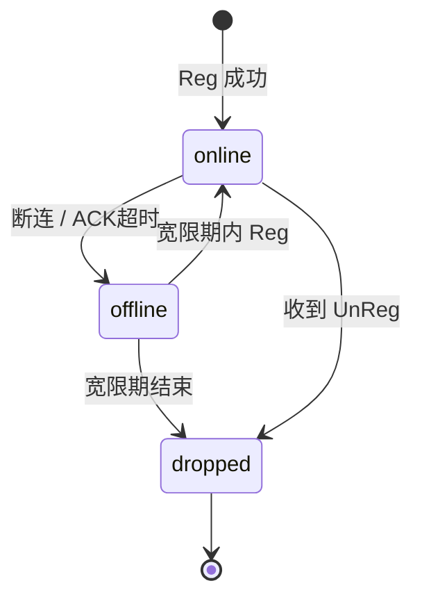
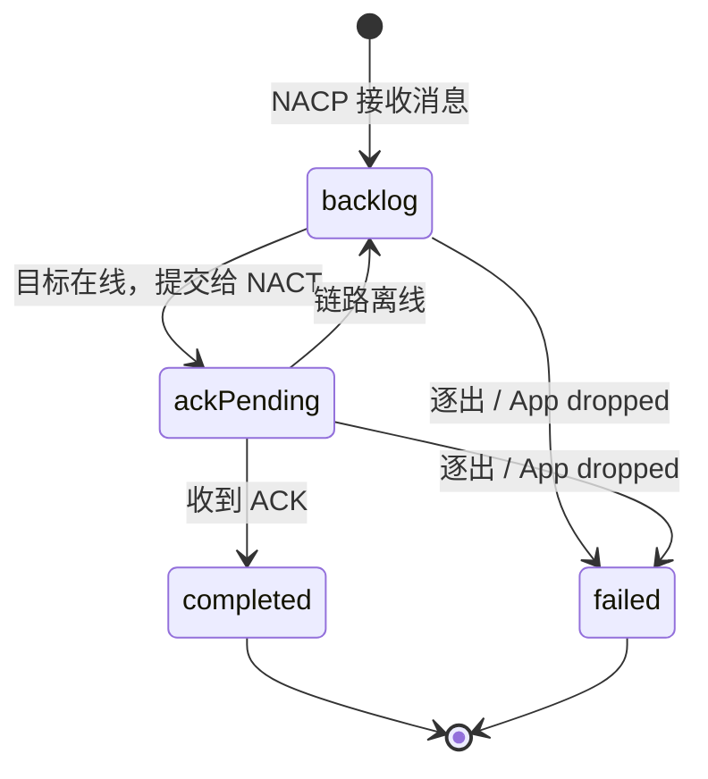
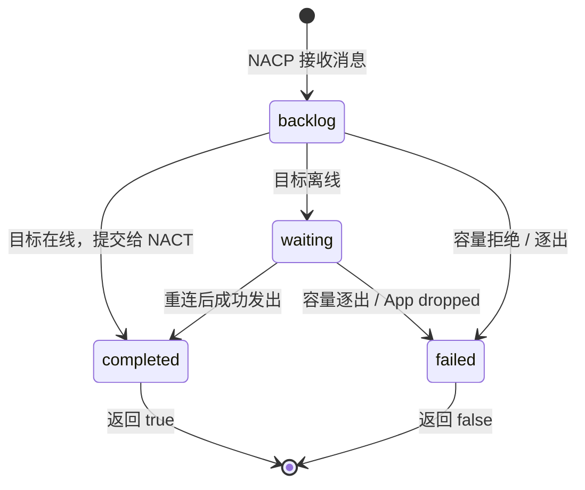

# NACP 生命周期

NACP 生命周期分为 `NApp 链路生命周期`和`消息生命周期`。

前者维护了一个NApp链接情况，后者用于维护一个消息的情况。

## App 链路生命周期

每个已完成 Register 的 App ID 都处于以下状态之一：

| 状态      | 含义                         | 出站消息             |
| --------- | ---------------------------- | -------------------- |
| `online`  | App 已绑定且当前可达         | 立即尝试发送         |
| `offline` | App 暂时不可达，等待重新连接 | 进入 积压表 暂存     |
| `dropped` | App 已被彻底遗忘             | 放弃并结算相关等待方 |

### online

Register 握手成功后，NACP 建立 App ID 与 NACT Peer 的绑定，App 进入 `online`。

发往该 App 的消息会先进入 `积压表Backlog`，再立即尝试提交给对应 Peer。

:::tip
正常情况下 Backlog 只是出站通道，不会长期持有消息。
:::

### offline

当出现以下情况，会把 NApp 标记为 `offline`：

- 承载该 NApp 的 NACT Peer 断开。
- 发往该 NApp 的可靠消息超过 `ackTimeoutMs` 仍未收到 ACK。

进入 `offline` 时，NACP 会：

- 保留 App ID、请求等待方和订阅记录，包括 AutoSubscribe。
- 将已经发出但尚未收到 ACK 的消息移回 Backlog 队首。
- 启动 `reconnectGraceMs` 宽限计时。
- 将后续出站消息继续加入 Backlog。

:::tip
注意区分 ACK 超时和 Req 超时。前者用于判断链路可达性，不是 Request 的业务处理时限。
:::

### Re-online

同一 App ID 在宽限期内重新完成 Register 后，NACP 会取消宽限计时，并按 Backlog 中的原始顺序补发消息。

:::warning
可靠消息可能因此被重复发送，接收方会再次回复 ACK，但在去重记录有效期间不会重复处理。
:::

### dropped

以下情况会使 App 进入 `dropped`：

- `offline` 超过重连宽限期。
- 对端主动发送 Unregister。

进入 `dropped` 后，NACP 会彻底清理该 App 的协议状态：

- 放弃 Backlog 和 ACK 等待表中的消息，并以 `false` 结算对应发送等待方。
- reject 仍在等待 Response 的调用。
- 移除 SubscribeTable 与 ListenTable 中属于该 App 的记录。
- 结束显式订阅与 AutoSubscribe 的本地监听。
- 删除该 App 的入站去重记录和链路绑定。

Unregister 表示对端明确离开，因此不会经过 `offline` 或等待宽限期。

## 消息生命周期

### 需要 ACK 的消息

Request、Response、Signal、Register、Unregister、Subscribe 和 Unsubscribe 使用两段出站队列：

`BacklogTable 积压表` 保存尚未出线或等待重发的消息，`AckPendingTable确认表` 保存已经提交给 NACT、正在等待 ACK 的消息。

### Notify与AckMessage

Notify 和 Ack 不等待 ACK，也不进入 AckPendingTable：

消息停留在离线 Backlog 中时，对应 Promise 保持 pending。

:::warning
Notify 是过程消息，最终结果由 Response 保证。

因此容量不足时会优先放弃 Notify，避免过程流挤占最终消息。

如果所有Notify都被放弃了，则按照FIFO顺序移除最早的消息。
:::

## Response 等待

NACP区分`消息已接收`和`消息已处理`两个行为。

对于消息接收限时，默认为10s，超时则认为对端NApp离线。

对于消息处理限时，则区分：

| 操作                        | Response 等待时间 |
| --------------------------- | ----------------- |
| `request`                   | 不设置业务超时    |
| `register` / `unregister`   | 10 秒             |
| `subscribe` / `unsubscribe` | 10 秒             |

只要 App 仍在 `online` 或重连宽限期内，Response 等待方和 [AutoSubscribe](/transport/nacp/auto-subscribe) 都会保留。

## 容量限制

BacklogTable 与 AckPendingTable 默认各自最多保存 1024 条、4 GiB。

两个队列分别执行容量限制，容量限制由[`queueMaxBytes`](/napp/construction)和[`queueMaxCount`](/napp/construction)决定

Backlog 溢出时按以下顺序处理：

1. 新消息是 Notify：拒绝该 Notify，`notify()` 返回 `false`。
2. 新消息是其他类型：先逐出最早的 Notify。
3. 仍然超限：按 FIFO 逐出最早的其他消息。

AckPendingTable 不包含 Notify，溢出时按 FIFO 逐出等待 ACK 的消息，并以 `false` 结算对应 ACK 等待方。

具体告警可以通过 `nacp:internal:backlog:warning` 与 `nacp:internal:ack:warning` 观察。详见[可观测](/transport/nacp/observability)

## NACP 终止

`nacp.terminate()` 会立即结束全部 NACP 状态：

- reject 所有 Response 等待方。
- 移除全部 EventBus 转发监听和本地订阅记录。
- 清空链路、Backlog、ACK、去重记录与计时器。
- 以 `false` 结算尚未完成的发送等待方。

各阶段使用的数据结构见[内部记录表](/transport/nacp/tables)，生命周期事件见[可观测](/transport/nacp/observability)。
