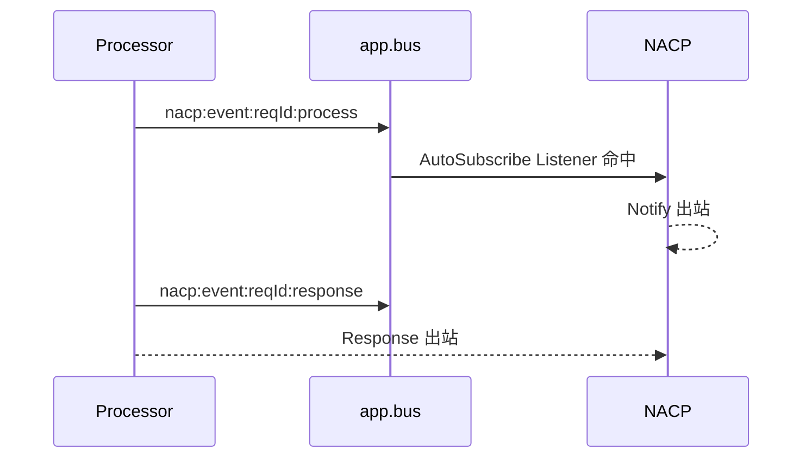

# NACP 可观测

NACP 不持有独立 [EventBus](/napp/eventbus)，所有观测事件都发布到所属 NApp 的 `app.bus`。

```js
const listenerId = app.bus.listen("nacp:*:*:*", (payload, hitKey) => {
  console.log(hitKey, payload)
})

app.bus.off(listenerId)
```

NACP 事件分为三族：

| 事件名模式                              | 记录内容                      |
| --------------------------------------- | ----------------------------- |
| `nacp:inbound:{type}`                   | NACPMessage 进入本端 NACP     |
| `nacp:outbound:{type}`                  | NACPMessage 尝试离开本端 NACP |
| `nacp:{event\|ability}:{reqId}:{stage}` | 一次 Request 的处理过程与终局 |
| `nacp:internal:{subject}:{level}`       | 路由、链路、队列和协议异常    |

`type` 是九种 [NACPMessage](/transport/nacp/message) 类型之一。

内部事件的具体原因统一放在 `payload.reason`，事件名只表达主题与级别。

## 出入站事件

### 入站

```js
nacp:inbound:{type}
```

payload：

```ts
interface InboundPayload {
  fromPeerId: NACTPeerId
  msg: NACPMessage
}
```

:::tip
消息一旦进入 [`inbound()`](/transport/nacp/inbound) 就会触发入站事件，早于地址检查、Gateway 转发、ACK、去重和具体的 `onXxx()` 处理。

因此以下消息也可以被观察到：

- 发给其他 NApp、随后被转发的消息。
- 地址错误、随后被丢弃的消息。
- 已经处理过、随后被去重的可靠消息副本。

:::

### 出站

```js
nacp:outbound:{type}
```

payload：

```ts
interface OutboundPayload {
  toPeerId: NACTPeerId | undefined
  msg: NACPMessage
}
```

:::tip
出站事件在消息尝试提交给 [NACT](/transport/nact/inbound-outbound) 前触发。

它表示一次出站尝试，不保证 NACT 已接纳、对端已收到或业务已经完成。

| 场景                                                             | 是否立即产生出站事件                                     |
| ---------------------------------------------------------------- | -------------------------------------------------------- |
| 目标在线                                                         | 是                                                       |
| 目标离线，消息进入 Backlog                                       | 否；重连后真正尝试出线时才产生                           |
| 未知目标且没有 [Gateway](/napp/advanced/gateway)                 | 是，`toPeerId` 为 `undefined`，随后报告 `no-route`       |
| 消息发给自己                                                     | 是，`toPeerId` 为 `undefined`，随后报告 `self-addressed` |
| Gateway 转发                                                     | 是，同时产生 `nacp:internal:gateway:success`             |
| [AutoSubscribe](/transport/nacp/auto-subscribe) 的虚拟订阅与退订 | 否                                                       |

同一条可靠消息在断线重发时可能多次产生 `nacp:outbound:{type}`，需要按 `msg.id` 关联这些尝试。
:::

:::warning
入站或出站事件是“经过 NACP - NACT”的含义，不是“对方已接收的成功信号”。

- 是否交给 NACT，结合 `nacp:internal:route:error` 判断。
- 是否到达对端，由 ACK 与 `nacp:internal:ack:warning` 判断。
- Request 是否处理完成，由 Response 或调用事件的 `response` 阶段判断。

:::

## Request 事件

Request 事件描述 [Processor](/workflow/processor) 所在端的实际处理过程。

它们不同于 `nacp:inbound:request`、`nacp:outbound:notify` 和 `nacp:outbound:response` 等传输事件，request相关事件实际上更多关注**Processor的输出**。

| 事件名                          | 触发时机                         | payload                      |
| ------------------------------- | -------------------------------- | ---------------------------- |
| `nacp:event:{reqId}:process`    | Event Processor 产出一条过程消息 | Raw Chunk                    |
| `nacp:event:{reqId}:response`   | Event Processor 产出终局         | `{ result, isOk, whyNotOk }` |
| `nacp:event:{reqId}:signal`     | Event Request 收到一条 Signal    | `SignalMessage`              |
| `nacp:ability:{reqId}:response` | Ability Processor 产出终局       | `{ result, isOk, whyNotOk }` |



## 链路事件

```js
nacp:internal:napp:success
```

payload：

```ts
interface NappSuccessPayload {
  appId: string
  reason: "bound" | "offline" | "dropped"
  isGateway?: boolean
}
```

| reason    | 含义                                            |
| --------- | ----------------------------------------------- |
| `bound`   | Register 成功，App 已在线。重连成功时会再次出现 |
| `offline` | NACT 断连或 ACK 超时，App 进入重连宽限期        |
| `dropped` | 宽限期结束或收到 Unregister，App 状态已彻底清理 |

`isGateway: true` 只对 `bound` 有意义，表示该对端被本端采纳为 Gateway fallback。

`dropped` 不区分宽限期结束和主动 Unregister，只报告 NACP 已完成清理这一事实。

一次典型断连会先产生 `nact:peer:disconnect`，再由 NACP 为该 Peer 上的每个 App ID 产生 `reason: "offline"`。详见 [NACT 可观测](/transport/nact/observability)。

## Gateway 事件

| 事件名                          | 触发时机                     | reason                     | payload 主要字段                               |
| ------------------------------- | ---------------------------- | -------------------------- | ---------------------------------------------- |
| `nacp:internal:gateway:success` | Gateway 将地址消息转发出站   | `forwarded`                | `{ toPeerId, msg, reason }`                    |
| `nacp:internal:gateway:error`   | 错误地址消息不能或不允许转发 | `dropped`                  | `{ msg, reason }`                              |
| `nacp:internal:gateway:warning` | 第二个 Gateway 声明被降级    | `multi-gateway-downgraded` | `{ appId, peerId, keptGatewayPeerId, reason }` |

`gateway:error` 也用于 Register 的错址丢弃。

## 协议错误

除 Register 外，下表 payload 都是 `{ msg, reason }`。

| 事件名                          | 触发时机                        | reason                                         |
| ------------------------------- | ------------------------------- | ---------------------------------------------- |
| `nacp:internal:request:error`   | Request 找不到对应 Processor    | `no-processor`                                 |
| `nacp:internal:signal:error`    | Signal 无法交给 Event Processor | `no-event-processor` / `processor-rejected`    |
| `nacp:internal:response:error`  | Response 找不到等待方           | `has-no-consumer`                              |
| `nacp:internal:notify:error`    | Notify 找不到本地订阅           | `has-no-consumer`                              |
| `nacp:internal:subscribe:error` | 订阅参数或目标订阅无效          | `bad-target-sub-name` / `unknown-subscription` |
| `nacp:internal:ack:error`       | ACK 找不到待确认消息            | `has-no-consumer`                              |
| `nacp:internal:register:error`  | Register错误，见下表            | 见下表                                         |

### Register 错误

```js
nacp:internal:register:error
```

payload：

```ts
interface RegisterErrorPayload {
  fromPeerId: NACTPeerId
  from: string
  reason: string
}
```

常见 reason：

| reason             | 含义                                    |
| ------------------ | --------------------------------------- |
| `dual-gateway`     | 两端都声明为 Gateway                    |
| `version-mismatch` | NACP 主版本不兼容                       |
| `appId-in-use`     | 同一 App ID 已在线                      |
| `multi-gateway`    | 第二个 Gateway 不允许降级               |
| `expect-mismatch`  | 对端实际 App ID 与 `connect()` 预期不符 |
| `response-timeout` | Register 在协议时限内没有收到 Response  |

## 路由与队列

### 路由错误

```js
nacp:internal:route:error
```

payload 为 `{ msg, reason }`：

| reason           | 含义                              |
| ---------------- | --------------------------------- |
| `self-addressed` | 消息目标是本 App                  |
| `no-route`       | 没有目标直连，也没有可用 Gateway  |
| `send-failed`    | 已解析 Peer，但 NACT 拒绝接纳消息 |

`nacp:outbound:{type}` 早于这些错误触发，可用相同的 `msg.id` 将一次出线尝试与失败原因关联。

### ACK 告警

```text
nacp:internal:ack:warning
```

payload 为 `{ msg, reason }`：

| reason             | 含义                                                                   |
| ------------------ | ---------------------------------------------------------------------- |
| `timeout`          | 最早的消息等待 ACK 超时，对应 App 将进入 `offline`                     |
| `pending-overflow` | [AckPendingTable](/transport/nacp/tables) 溢出，最早的待确认消息被逐出 |

### Backlog 告警

```text
nacp:internal:backlog:warning
```

payload 为 `{ msg, reason }`，其中 `msg` 是被拒绝或逐出的消息：

| reason           | 含义                                             |
| ---------------- | ------------------------------------------------ |
| `notify-dropped` | 新 Notify 因 Backlog 容量不足被直接拒绝          |
| `notify-evicted` | 最早的 Notify 被逐出，为其他消息腾出空间         |
| `fifo-evicted`   | 没有 Notify 可逐出，最早的其他消息按 FIFO 被逐出 |

队列行为和 Promise 结算规则见[生命周期](/transport/nacp/lifecycle)。

---

:::warning
NACP 事件发布在普通 `app.bus` 上，因此可以被另一个 NApp 通过 Subscribe 远程订阅。但不要订阅会命中 Notify 自身出站事件的模式，例如：

```js
remote.subscribe(target, "nacp:outbound:*")
remote.subscribe(target, "nacp:outbound:notify")
```

订阅命中后，NACP 需要发送 Notify；该 Notify 又产生 `nacp:outbound:notify`，再次命中同一订阅，形成**消息自激**，最终引发**消息洪流**。

本地 `app.bus.listen()` 不会自动发送 Notify，不存在这一问题。

远程观察时应订阅不会覆盖 `nacp:outbound:notify` 的具体事件，或在 NACP 之外转发观测数据。
:::
