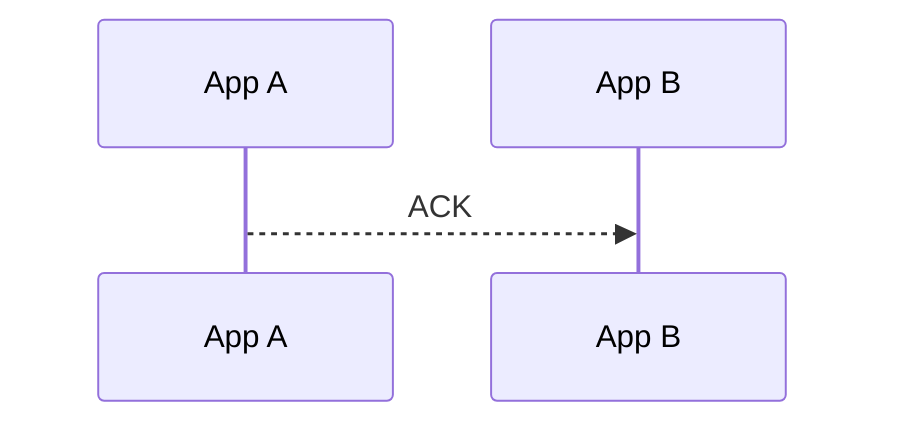

# ack

向目标节点发送一条知晓消息，确认之前的消息已被接收。

:::danger
这个方法完全不需要手动调用，NACP会自己处理ack回复的目标。

此外ack只能代表原先的消息已经被接收，不能代表原先的消息被处理！
:::

```ts
NApp.nacp.ack(to, {
  parentId,
}): Promise<boolean>
```

| 参数       | 说明                       |
| ---------- | -------------------------- |
| `to`       | 被确认消息的发送方 NApp ID |
| `parentId` | 被确认消息的 ID            |

该方法生成 [`AckMessage`](/transport/nacp/message#ackmessage) 并出站。

`parentId` 是被确认消息的 `id`。ACK 没有 `payload`，也不会再期待 ACK 或 Response。

## 返回值



`ack()` 在 ACK 交给目标 NACT Peer 后结算Promise。

ACK 的接收与结算见 [onAck](/transport/nacp/inbound/on-ack)。
