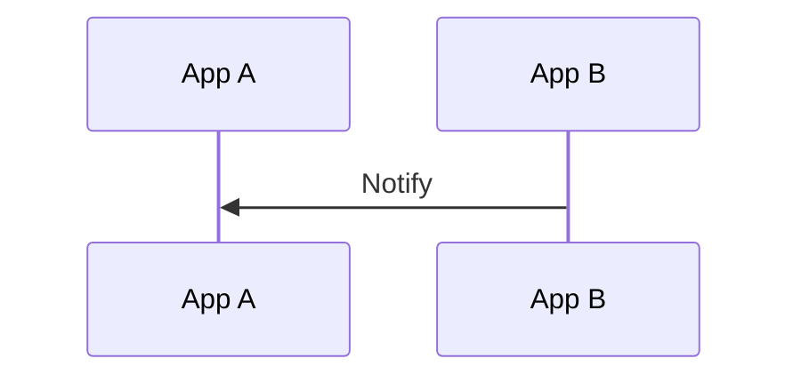

# notify

向目标NApp发送一次通知，将订阅消息推送给订阅方。

```ts
NApp.nacp.notify(to, {
  parentId,
  targetSubName,
  hitSubName,
  payload?,
}): Promise<boolean>
```

| 参数            | 说明                                            |
| --------------- | ----------------------------------------------- |
| `to`            | 订阅方 NApp ID                                  |
| `parentId`      | 显式订阅的 `subId`，或 AutoSubscribe 的 `reqId` |
| `targetSubName` | 原始订阅名                                      |
| `hitSubName`    | 实际命中的 EventBus 事件名                      |
| `payload`       | 要推送的内容                                    |

该方法生成 [`NotifyMessage`](/transport/nacp/message#notifymessage) 并出站。

## 返回值



一个订阅可以产生 `0..N` 条 Notify。Notify 不期待 ACK 或 Response。

`notify()` 在消息交给目标 NACT Peer 后结算Promise。

:::danger
目标离线时 Notify 可以进入积压表，此时会卡住Promise导致无法结算。

但在积压表容量不足时会优先被放弃，详见[生命周期](/transport/nacp/lifecycle)。

此时Promise会被结算为false。
:::

NApp 的手动发送方式见 [`notify()`](/napp/abilities/notify)，接收流程见 [onNotify](/transport/nacp/inbound/on-notify)。
