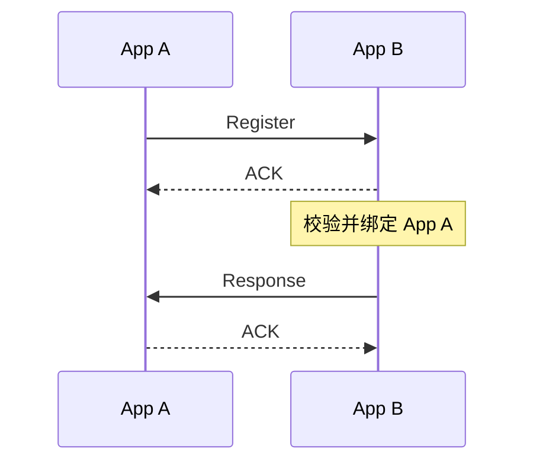

# register

NACT Peer 建立后发送的第一条 NACP 消息，用于交换 App 身份和能力声明。

:::danger
本消息是 [`NApp.connect()`](/napp/advanced/lifecycle) 连接时自动发送的，一般不建议手动重复发送。
:::

```ts
NApp.nacp.register(
  to,
  peer,
): Promise<boolean>
```

| 参数   | 说明                                |
| ------ | ----------------------------------- |
| `to`   | 预期连接到的 NApp ID                |
| `peer` | `NApp.nact.dial()` 建立的 NACT Peer |

:::tip
RegisterMessage 的 `isGateway` 与 `decl` 不需要调用参数提供，而是从当前 NApp 读取。
:::

该方法生成 [`RegisterMessage`](/transport/nacp/message#registermessage) 并出站。

消息中的 `isGateway` 与 `decl` 分别来自当前 NApp 的 Gateway 声明和公开 Event / Ability。

## 返回值



`register(to, peer)` 等待 ACK 和唯一的 Response，并将校验 Response 的 `from` 是否与 `to` 一致。完全一致后才会结算Promise。

Register Response 会对称返回对端的 `{ isGateway, decl, record? }`，接收消息见 [onRegister](/transport/nacp/inbound/on-register)。
