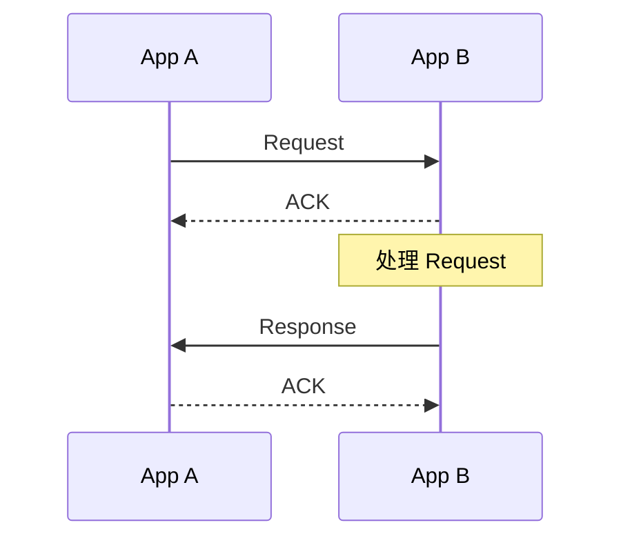

# request

向目标 NApp 发起一次 Event 或 Ability 调用。

```ts
NApp.nacp.request(to, {
  kind,
  target?,
  payload?,
  onProcess?,
  onProcessEnd?,
  onReqId?,
}): Promise<ResponseMessage>
```

| 参数                        | 说明                           |
| --------------------------- | ------------------------------ |
| `to`                        | 目标 NApp ID                   |
| `kind`                      | `"event"` 或 `"ability"`       |
| `target`                    | 要调用的 Event 或 Ability 名称 |
| `payload`                   | 请求载荷                       |
| `onProcess(chunk, message)` | Event 的过程消息回调           |
| `onProcessEnd()`            | Event 过程消息结束时调用       |
| `onReqId(reqId)`            | Request 发送前同步给出消息 ID  |

## kind

| kind      | 含义                      | 过程消息                         |
| --------- | ------------------------- | -------------------------------- |
| `event`   | 具有生命周期的 Event 调用 | `0..N notify`，然后 `1 response` |
| `ability` | 一次 Ability 调用         | `1 response`                     |

只有 Event Request 会建立 [AutoSubscribe](/transport/nacp/auto-subscribe)，用于接收执行期间的 Notify。

## 返回值



`NACP.request()` 默认等待唯一的最终 Response。App A 收到 Response 后会先提交 ACK，再以完整的 `ResponseMessage` 结算 Promise。

NApp 的调用方式见 [`request()`](/napp/abilities/request)，接收流程可见 [onRequest](/transport/nacp/inbound/on-request)。
