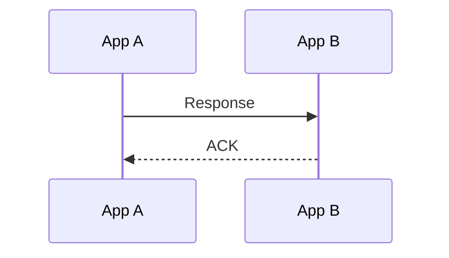

# response

向目标App发送一条请求的最终消息。

Response 可以返回 register、unregister、request、subscribe 或 unsubscribe 的最终结果。

```ts
NApp.nacp.response(to, {
  parentId,
  isOk,
  whyNotOk?,
  kind?,
  payload?,
}): Promise<boolean>
```

| 参数       | 说明                               |
| ---------- | ---------------------------------- |
| `to`       | 原消息的发送方 NApp ID             |
| `parentId` | 被响应消息的 ID                    |
| `isOk`     | 操作是否成功                       |
| `whyNotOk` | 为什么会失败                       |
| `kind`     | 响应 Request 时填写原 Request kind |
| `payload`  | 返回载荷                           |

## payload

| 被响应消息    | payload                                 |
| ------------- | --------------------------------------- |
| `register`    | `{ isGateway, decl, record? }`          |
| `unregister`  | `{}`                                    |
| `subscribe`   | `{ targetSubId }`                       |
| `unsubscribe` | `{}`                                    |
| `request`     | Processor 返回的业务结果，NACP 并不读取 |

## 返回值



一条发起消息只对应一条最终 Response。App A会在接收到ACK消息时才会结算Promise

:::danger
使用本接口发送Response时，同时会结束本方 [AutoSubscribe](/transport/nacp/auto-subscribe) 的半边流程。
:::

接收流程见 [onResponse](/transport/nacp/inbound/on-response)，调用方式可见[NApp.response](/napp/abilities/response)，但通常来讲不建议这么调用。
