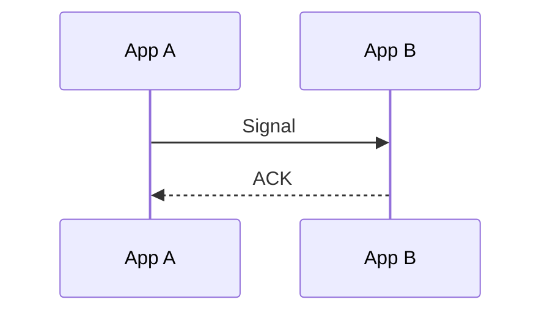

# signal

向另一个 NApp 正在进行中的 Event Request 发送补充或控制信号。

```ts
NApp.nacp.signal(to, {
  parentId,
  kind,
  payload?,
}): Promise<boolean>
```

| 参数       | 说明                                    |
| ---------- | --------------------------------------- |
| `to`       | Event Request 接收方的 NApp ID          |
| `parentId` | 目标 Event Request 的 `reqId`           |
| `kind`     | `normal` / `pause` / `resume` / `abort` |
| `payload`  | 仅 `normal` 可以携带的业务载荷          |

该方法将生成 [`SignalMessage`](/transport/nacp/message#signalmessage) 并出站。

| kind                         | payload                       |
| ---------------------------- | ----------------------------- |
| `normal`                     | 可携带业务载荷；缺省时为 `{}` |
| `pause` / `resume` / `abort` | 不带 `payload` 字段           |

## ID

Signal 有自己的消息 `id`，`meta.parentId` 指向目标 Event Request 的 `reqId`。

## 返回值



App A 发送`NACP.signal()`后需要等待对方ACK信号，才会结算Promise。

NApp 的调用方式见 [`request()`](/napp/abilities/request)，接收流程可见 [onRequest](/transport/nacp/inbound/on-request)。
