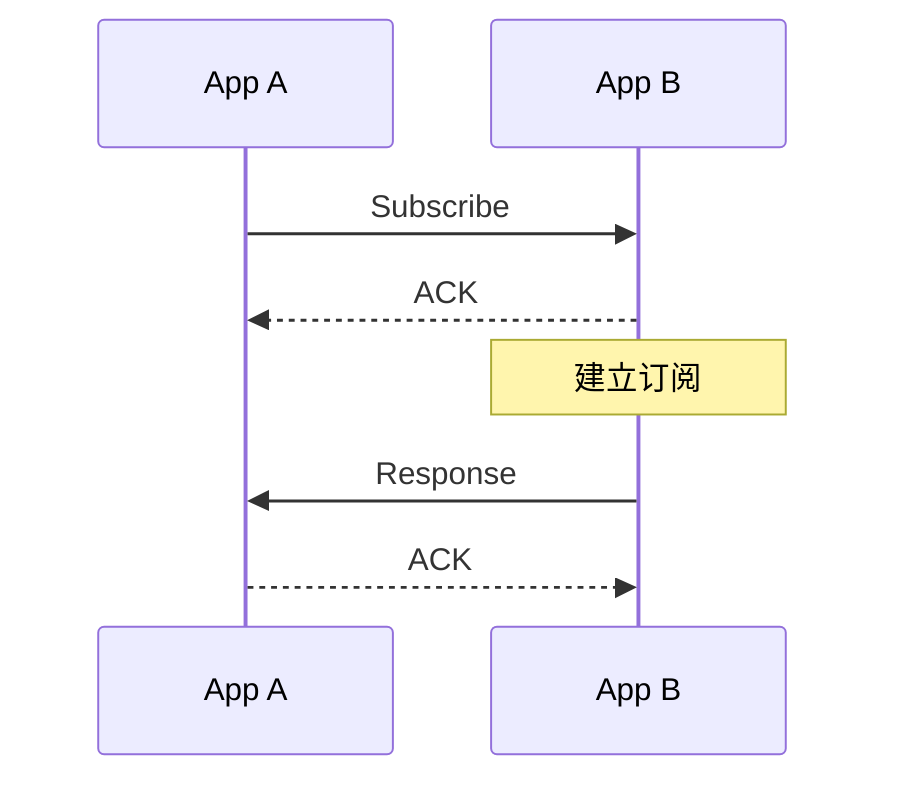

# subscribe

向目标App发送订阅请求，订阅目标 NApp EventBus 上的一个事件。

```ts
NApp.nacp.subscribe(
  to,
  targetSubName,
  targetListener?,
  opt?,
): Promise<ResponseMessage> | void
```

| 参数                               | 说明                                                               |
| ---------------------------------- | ------------------------------------------------------------------ |
| `to`                               | 目标 NApp ID                                                       |
| `targetSubName`                    | 要订阅的 EventBus 事件名                                           |
| `targetListener(payload, message)` | Notify 到达时调用                                                  |
| `opt.subId`                        | 自定义Subscribe ID                                                 |
| `opt.autoSub`                      | 本消息是不是[`Auto-Subscribe`消息](/transport/nacp/auto-subscribe) |
| `opt.onEnd()`                      | 订阅记录被清理时调用                                               |
| `opt.onSubId(subId)`               | 发送前同步给出订阅 ID                                              |

如果 `opt.autoSub` 不为true，则订阅会生成 [`SubscribeMessage`](/transport/nacp/message#subscribemessage) 并出站。

## ID

Subscribe 消息自身的 `id` 就是 `subId`。

NACP 在发送前通过 `opt.onSubId(subId)` 同步给出出该 ID，并建立本地 Notify 接收记录。

## 返回值



显式 `subscribe()` 等待唯一的最终 Response。AppA Response 后表示远端订阅已经建立，并以完整的 `ResponseMessage` 结算 Promise。

:::warning
NACP 内部的 AutoSubscribe 只建立本地记录，不发送 SubscribeMessage，因此返回 `void`。
:::

NApp 的调用方式见 [`subscribe()`](/napp/abilities/subscribe)，接收流程见 [onSubscribe](/transport/nacp/inbound/on-subscribe)。
