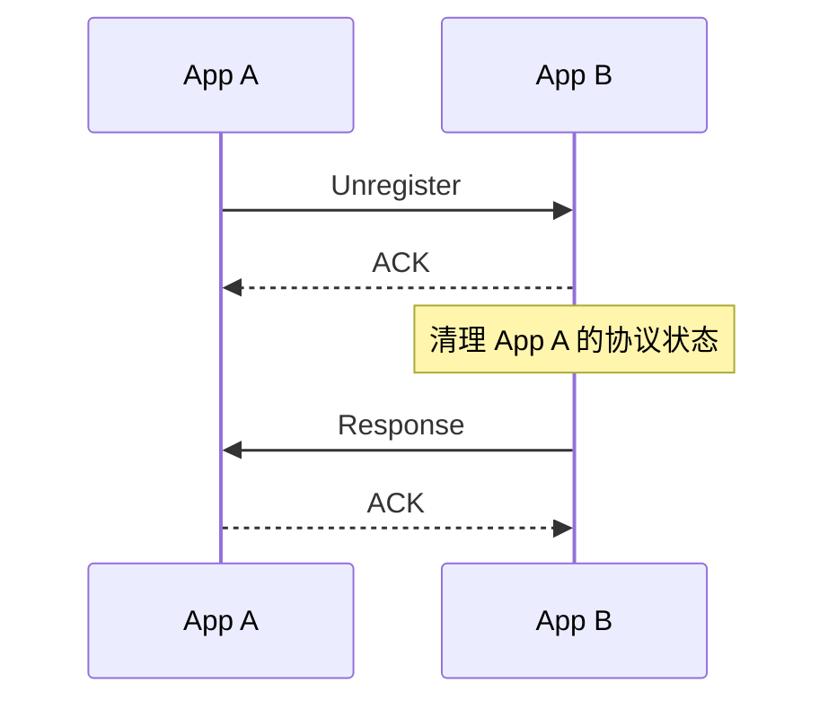

# unregister

NApp断开连接或者自己下线时，向其他NApp发送的注销信息。

:::danger
一般由`NApp.disconnect()` 或 `NApp.terminate()` 发送。

本消息同样不建议手动发送。
:::

```ts
NApp.nacp.unregister(to): Promise<ResponseMessage>
```

| 参数 | 说明                 |
| ---- | -------------------- |
| `to` | 要解除关系的 NApp ID |

该方法生成不携带额外内容的 [`UnregisterMessage`](/transport/nacp/message#unregistermessage)。

## 返回值



`unregister()` 等待 ACK 和唯一的 Response。

收到成功 Response 后，发送方将在发送ACK后关闭对应 NACT Peer，并用ResponseMessage结算Promise。

Unregister 与物理断连不同，收到 Unregister 表示对端明确离开，可以立即清理。NACT Peer 意外断开时则进入离线宽限期，详见[生命周期](/transport/nacp/lifecycle)。

接收流程见 [onUnregister](/transport/nacp/inbound/on-unregister)。
