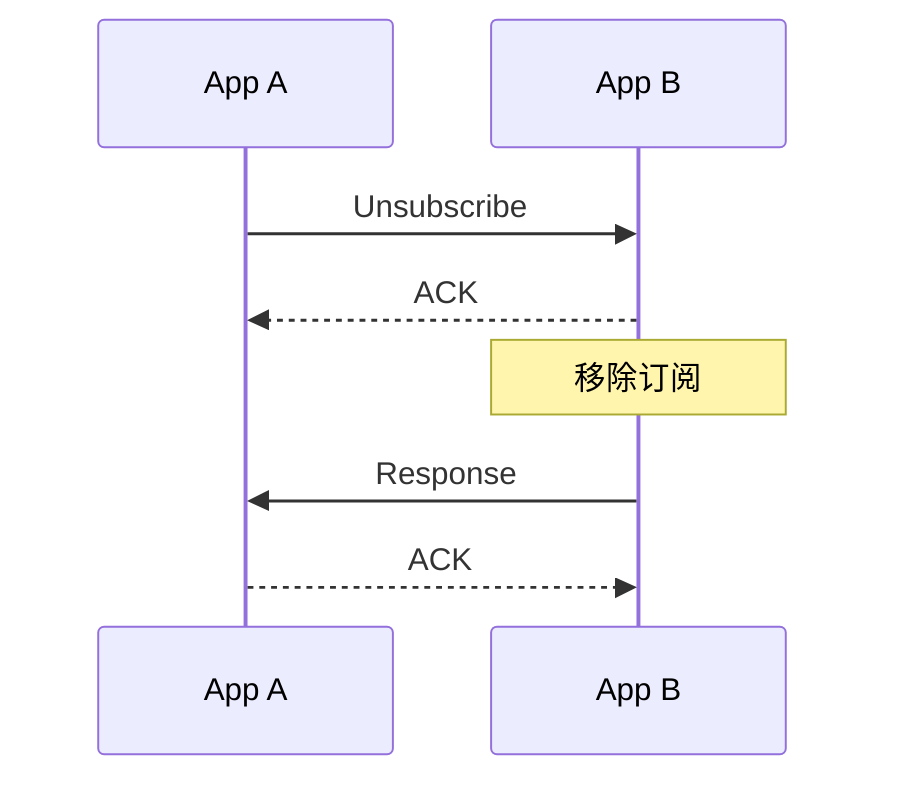

# unsubscribe

向目标App发送取消订阅请求，取消一条已经建立的远程订阅。

```ts
NApp.nacp.unsubscribe(
  to,
  targetSubId,
  opt?
): Promise<ResponseMessage> | void
```

| 参数          | 说明                                                               |
| ------------- | ------------------------------------------------------------------ |
| `to`          | 被订阅方 NApp ID                                                   |
| `targetSubId` | 要取消的订阅 ID                                                    |
| `opt.autoSub` | 本消息是不是[`Auto-Subscribe`消息](/transport/nacp/auto-subscribe) |

若`opt.autoSub`不为true，则退订会生成 [`UnsubscribeMessage`](/transport/nacp/message#unsubscribemessage) 并出站。

## ID

`targetSubId` 是原 SubscribeMessage 的 `id`，也就是订阅的 `subId`。

## 返回值



显式 `unsubscribe()` 等待唯一的最终 Response。收到成功 Response 后表示远端订阅已移除，并以完整的 `ResponseMessage` 结算 Promise。

本地的 Notify 接收记录会在 UnsubscribeMessage 发送前移除。

:::warning
NACP 内部的 AutoSubscribe 关闭操作不发送独立 UnsubscribeMessage，因此返回 `void`。
:::

NApp 的调用方式见 [`unsubscribe()`](/napp/abilities/unsubscribe)，接收流程见 [onUnsubscribe](/transport/nacp/inbound/on-unsubscribe)。
