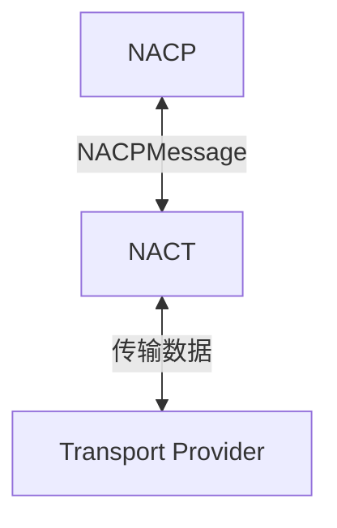
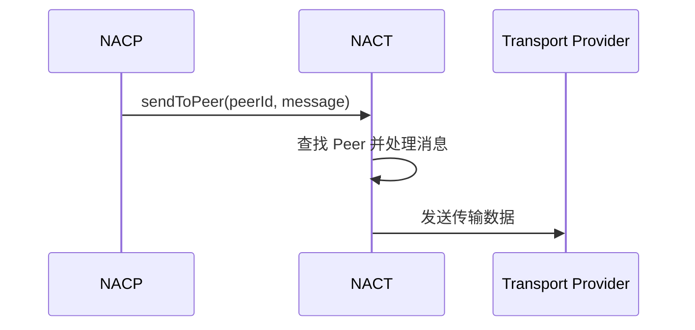
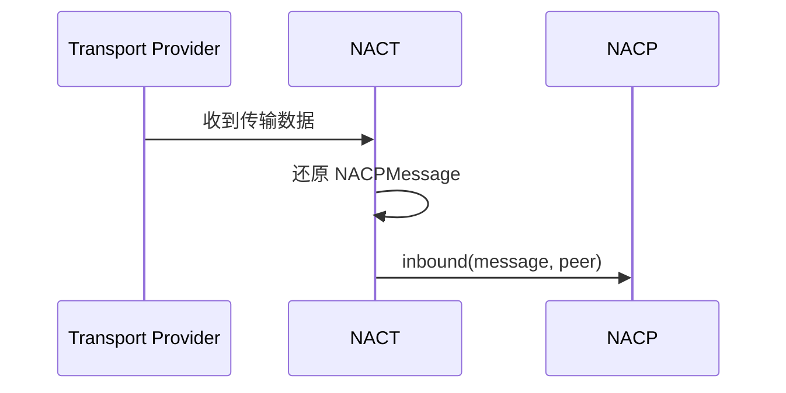

# 入站与出站

NACT 位于 NACP 与 Transport Provider 之间，负责编码、打包与分帧数据。




## 出站

NACP 使用 `sendToPeer()` 将消息交给指定的物理连接：

```ts
nact.sendToPeer(
  peerId: NACTPeerId,
  message: NACPMessage,
): boolean
```

| 参数 | 说明 |
| --- | --- |
| `peerId` | 接收消息的 Peer ID |
| `message` | 需要发送的完整 NACPMessage |

```ts
const sent = app.nact.sendToPeer(peerId, message)
```

返回值含义：

- `true`：Peer 存在，NACT 已将消息交给该 Peer 发送。
- `false`：Peer 不存在，消息没有发送。


:::tip
`true` 不表示对端已经收到或处理消息。

ACK、Response 和重发等协议行为由 NACP 负责。
:::


通常由 `NACP.outbound()` 在完成 App 路由后调用 `sendToPeer()`。



## 入站

Provider 收到数据后交给 NACT，得到完整 `NACPMessage` ：

```ts
nacp.inbound(
  message: NACPMessage,
  peer: Peer,
): void
```

| 参数 | 说明 |
| --- | --- |
| `message` | NACT 从入站数据中得到的完整 NACPMessage |
| `peer` | 收到这条消息的来源 Peer |



:::warning
`nacp.inbound()` 由 NACT 自动调用。普通调用方不应手动调用它。

手动调用等同于伪造一条来自指定 Peer 的入站消息，主要用于 NACT 接入与测试。

如果需要接入自定义Provider，请使用[自定义传输Provider](/transport/nact/provider)
:::

地址检查、ACK、去重、路由和具体消息类型处理由 NACP 接管消息后负责，这些行为见 [NACP 入站](/transport/nacp/inbound)。

## Peer

NACT 使用 Peer 标识一条已经建立的物理连接：

```ts
interface Peer {
  id: NACTPeerId
  send(message: NACPMessage): void
  close(): void
  terminate?(): void
}
```

可以使用以下 API 查询当前连接：

```ts
app.nact.getPeer(peerId): Peer | undefined
app.nact.listPeerId(): NACTPeerId[]
```
