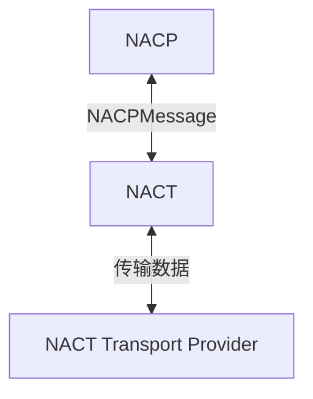
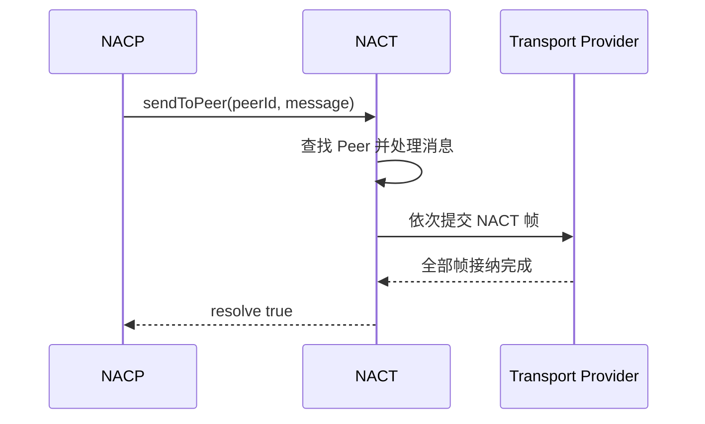
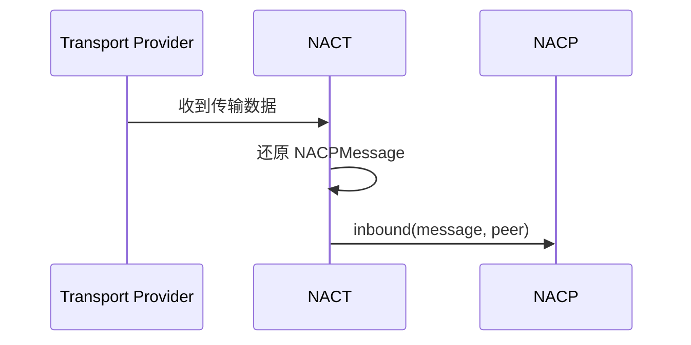

# 入站与出站

NACT 负责编码、打包与分帧NACP数据。




## 出站

NACP 使用 `sendToPeer()` 将消息交给指定的物理连接：

```ts
nact.sendToPeer(
  peerId: NACTPeerId,
  message: NACPMessage,
): Promise<boolean>
```

| 参数 | 说明 |
| --- | --- |
| `peerId` | 接收消息的 Peer ID |
| `message` | 需要发送的完整 NACPMessage |

```ts
const accepted:Boolean = await app.nact.sendToPeer(peerId, message)
```

:::warning
- resolve `true`：本端 Provider 已成功接纳该 NACP 包对应的全部 NACT 帧，并负责后续发送。
- resolve `false`：Peer 不存在，未提交发送。
- reject：编码失败、Provider 拒绝接纳，或接纳完成前连接关闭。

需要注意的是，返回true并不意味着消息已经到达对端，而是指`离开了NACT，进入了对应物理发送渠道队列中`。
:::


通常由 `NACP.outbound()` 在完成 App 路由后调用 `sendToPeer()`。

:::details 出站交接流程

:::

## 入站

Provider 收到数据后交给 NACT，得到完整 `NACPMessage` ：

```ts
nacp.inbound(
  message: NACPMessage,
  peer: Peer,
): void
```

| 参数 | 说明 |
| --- | --- |
| `message` | NACT 从入站数据中得到的完整 NACPMessage |
| `peer` | 收到这条消息的来源 Peer |



:::warning
`nacp.inbound()` 由 NACT 自动调用。普通调用方**不应**手动调用它，手动调用等同于伪造一条来自指定 Peer 的入站消息。

如果需要接入其他物理传输方式或附着到已有的服务器，则应该使用[自定义 Provider](/transport/nact/custom-provider)
:::


## Peer

NACT 使用 Peer 标识一条已经建立的物理连接：

```ts
interface Peer {
  id: NACTPeerId
  send(message: NACPMessage): Promise<void>
  close(): void
  terminate?(): void
}
```

可以使用以下 API 查询当前连接：

```ts
app.nact.getPeer(peerId): Peer | undefined
app.nact.listPeerId(): NACTPeerId[]
```
