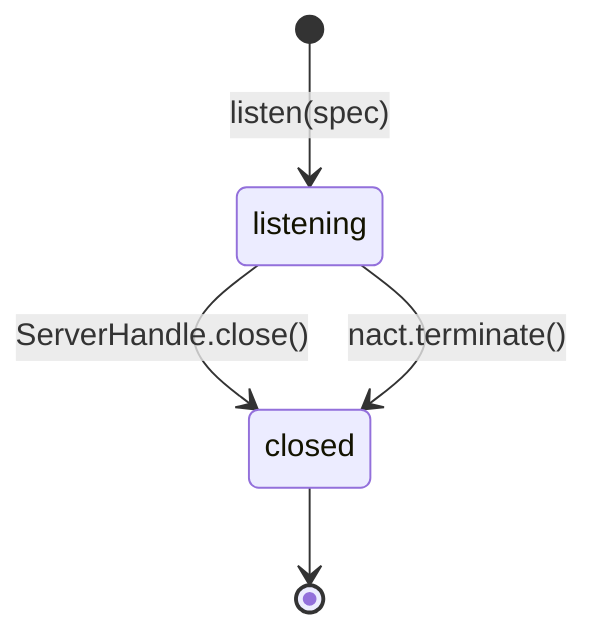
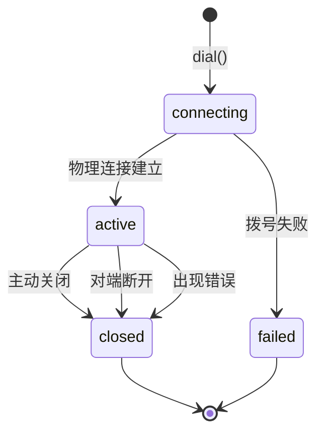
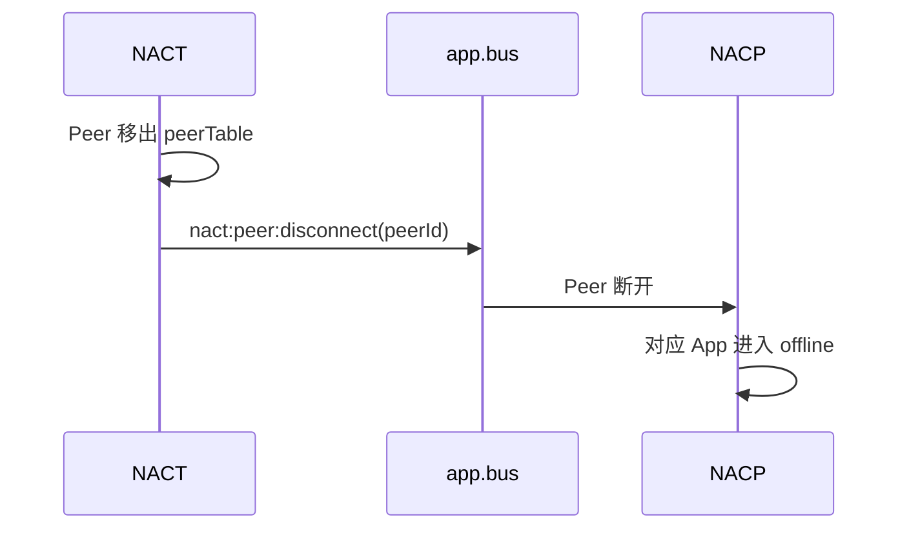

# NACT 生命周期

NACT 生命周期分为`监听入口生命周期`与`Peer 生命周期`。

监听入口负责接收新连接，Peer 负责持有一条物理连接。NACT 不维护 App ID，也没有 NACP 的重连宽限状态。

## 监听入口生命周期



`listen(spec)` 将监听指定端口/路径，创建一个 WebSocket、TCP 或 Unix Socket Server，并返回对应的 `ServerHandle`：

```ts
interface ServerHandle {
  close(): Promise<void>
}
```

每个入口相互独立，调用 `ServerHandle.close()` 只关闭对应入口，已建立的 Peer 由 NACT 继续持有，不随入口关闭。

底层传输与 `TransportSpec` 见[底层传输](/transport/nact/transport)。

## Peer 生命周期



### 建立

主动 `dial()` 成功或监听入口接收连接后，NACT 创建统一的 `Peer`，分配 `peerId` 并写入 `peerTable`，随后宣告`nact:peer:connect`事件。

`dial()` 返回时 Peer 已经入表，可以立即用于 [`sendToPeer()`](/transport/nact/inbound-outbound#出站)。

:::tip
此时只能代表物理连接建立，NACP Register 尚未完成。
:::

### 关闭

Peer 可能因以下原因离开：

- 本端调用 `closePeer(peerId)`。
- 对端主动断开。
- Framing 或 CBOR 解码失败后被 NACT 关闭。
- NApp 终止。

除关闭物理连接外外，Peer 还会统一执行`peerTable.delete(peerId)`，并宣告`nact:peer:disconnect`。

## 与 NACP 的衔接

NACT 的 Peer 断开后不会等待重连，也不会保留物理连接状态。

NACP 会监听 `nact:peer:disconnect`事件，再将该 Peer 对应的 App 标记为 `offline`：



NApp重连宽限、消息回退和补发由 [NACP 生命周期](/transport/nacp/lifecycle) 管理，NACT并不负责这些语义。

## NACT 终止

`nact.terminate()` 会：

1. 关闭全部 Peer。
2. 清空 `peerTable`。
3. 关闭全部监听入口。

终止时连接表会先被清空，随后到达的底层 `close` 不再产生逐个 `nact:peer:disconnect`。

完整的 NApp 停机流程由 [NApp 生命周期](/napp/advanced/lifecycle) 负责，生命周期事件见[可观测](/transport/nact/observability)。
