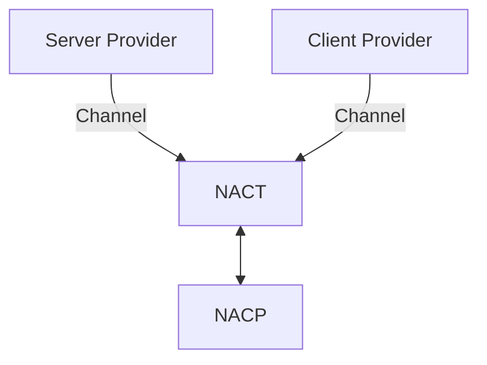

# 传输 Provider

NACT 本身不包含任何物理传输实现，所有物理连接都由传输 Provider 接入。



## 概念

| 名称 | 含义 |
| --- | --- |
| `ProviderAdaptor` | 所有 Provider 符合的基础规范接口|
| `ServerProvider` | `role: 'server'`，通过 `listen()` 提供入口并接受连接 |
| `ClientProvider` | `role: 'client'`，通过 `dial()` 主动发起连接 |
| `附着器` | 通过附着到一个已有的服务器上完成路由NACT监听 |
|`服务器`| 通过新建Server监听指定端口或路径完成NACT监听|
|`客户端`|与NACT服务（无论是服务器还是附着器）完成通讯|


:::tip
需要注意的是这里的Server和Client只区分了谁主动发起连接，当NACT链接建立后，通讯是全双工的，不再做C/S区分。
:::

## 官方 Provider

| 包 | 角色 | 接入方式 | 可用运行时 |
| --- | --- | --- | --- |
| `@nyirusu/nact-websocket-server` | Server | 服务器 / 附着器 | Node.js、Vercel、etc. |
| `@nyirusu/nact-websocket-client` | Client | 客户端  | Web、Node.js、Worker |
| `@nyirusu/nact-streamable-http-server` | Server | 服务器 / 附着器 | Node.js |
| `@nyirusu/nact-streamable-http-client` | Client | 客户端  | Web、Node.js、Worker、etc. |
| `@nyirusu/nact-tcp-server` | Server | 服务器  | Node.js |
| `@nyirusu/nact-tcp-client` | Client | 客户端  | Node.js、Cloudflare Workers |
| `@nyirusu/nact-unix-server` | Server | 服务器  | Node.js/POSIX |
| `@nyirusu/nact-unix-client` | Client | 客户端 | Node.js/POSIX |
| `@nyirusu/nact-websocket-cloudflare-worker-server` | Server | 附着器 | Cloudflare Workers |
| `@nyirusu/nact-websocket-nuxtjs-server` | Server | 附着器 | Nuxt / Nitro WebSocket 路由 |


:::tip
Server Provider 分为自主监听（服务器）和附着器两种接入方式。

附着式由宿主接收请求并交给 Provider，仍属于接受连接的 Server 角色。

其他宿主接入可以参考[自定义Provider](/transport/nact/custom-provider)章节。

只要协议相同，即可完成通讯。例如，`websocket-nuxtjs-server`与`websocket-client`两者通讯是合法的。
:::

:::info

WebSocket 与 Streamable HTTP Server 可使用 `provider.noServer: true` 开启附着模式。

启动后，WebSocket 通过 `attach(server, { path })` 接入宿主 Node HTTP Server。

Streamable HTTP 则需要宿主路由调用 `fetch(request)` 或 `toNodeHandler` 转换Node标准Req/Res HTTP模型。

:::


## 使用官方 Provider

### Server Provider

```bash
npm install @nyirusu/nasdk @nyirusu/nact-websocket-server
```

```ts
import NApp from '@nyirusu/nasdk'
import WebSocketServerProvider, {
  type WebSocketServerTransportSpec,
} from '@nyirusu/nact-websocket-server'

const server: WebSocketServerTransportSpec = {
  type: 'websocket',
  provider: { host: '127.0.0.1', port: 18900, path: '/nacp' },
}

const app = new NApp({ id: 'server', server: [server] })

app.nact.use(new WebSocketServerProvider())
await app.start()
```

### Client Provider

```bash
npm install @nyirusu/nasdk @nyirusu/nact-websocket-client
```

```ts
import NApp from '@nyirusu/nasdk'
import WebSocketClientProvider, {
  type WebSocketClientTransportSpec,
} from '@nyirusu/nact-websocket-client'

const app = new NApp({ id: 'client' })

app.nact.use(new WebSocketClientProvider())
await app.start()

const target: WebSocketClientTransportSpec = {
  type: 'websocket',
  provider: { url: 'wss://example.com/nacp' },
}
await app.connect('server', target)
```

:::tip
同一个 NApp 可以同时监听和主动连接，分别注册两个包即可：

```ts
app.nact.use(new WebSocketServerProvider())
app.nact.use(new WebSocketClientProvider())
```

没有注册对应传输时，`start()` 或 `connect()` 会抛出 `provider-not-found`。
:::
