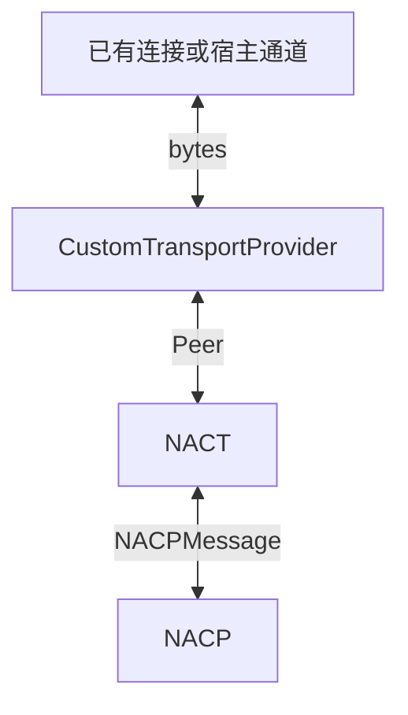
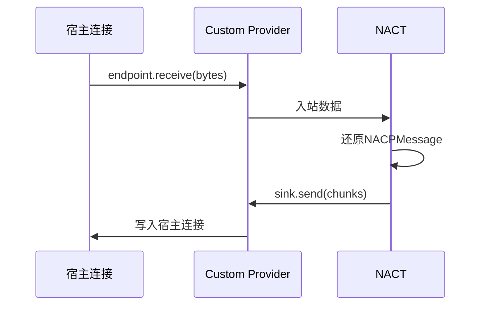

# 自定义传输Provider

`CustomTransportProvider`用于把NACT接入一条由应用自己管理的连接。

正常情况下，`ServerProvider`会尝试启动服务器，监听指定端口或路径来接受消息。`ClientProvider`则会连接到对应的Server，并提供完整的生命周期管理。

但是，一部分使用场景下需要通过特殊途径启用监听服务，另外部分使用场景希望复用已有的链接来提供传输。此外默认的Provider均没有在连接层面实现身份鉴权和风险拦截，因而我们提供了特殊的`CustomTransportProvider`，适用于以下场景：

- 接入已有HTTP或WebSocket Server，比如Express、NextJS、NuxtJS。
- 使用特殊的服务器启动方式，比如Cloudflare Worker的`WebSocketPair`。
- 需要通过单独的出入口来收发信息，比如接入Vercel等平台交付的Request和Response。
- 需要在链接建立前完成授权
- 使用Electron IPC、MessagePort或其他自定义双向通道。



## 注册

`CustomTransportProvider`由NASDK主包提供，不需要安装额外的Provider包。

```ts
import { CustomTransportProvider } from '@chenyfan/nasdk/NACT'

interface ExistingWebSocketConfig {
  path: string
  requireAuth: boolean
}

const custom = new CustomTransportProvider({
  type: 'existing-websocket',
  provider: {
    path: '/nacp',
    requireAuth: true,
  } satisfies ExistingWebSocketConfig,
})
app.nact.use(custom)
```

`type`是这类自定义传输在当前NACT中的名称，不固定为`custom`。`provider`是应用定义的配置，保存在Provider实例上，供接入宿主连接时读取。相同`type`的Custom Provider不能在同一个NACT中重复注册。

## 接入连接

建立宿主连接后，调用`open()`提供NACT出站时使用的三个方法：

```ts
const endpoint = custom.open({
  send: chunks => hostConnection.write(chunks),
  close: () => hostConnection.close(),
  terminate: () => hostConnection.abort(),
})
```

```ts
interface CustomTransportSink {
  send(chunks: readonly Uint8Array[]): void | Promise<void>
  close(): void | Promise<void>
  terminate?(): void | Promise<void>
}
```

| 方法 | 说明 |
| --- | --- |
| `send(chunks)` | NACT有数据需要通过宿主连接发送 |
| `close()` | NACT请求正常关闭宿主连接 |
| `terminate()` | NACT请求立即中止宿主连接，可选 |

`open()`返回当前连接的入站入口：

```ts
interface CustomTransportEndpoint {
  readonly peerId: NACTPeerId
  receive(bytes: Uint8Array): void
  closed(): void
  failed(reason: unknown): void
}
```

宿主收到数据、关闭或发生错误时，需要通知对应的endpoint：

```ts
hostConnection.onData(bytes => endpoint.receive(bytes))
hostConnection.onClose(() => endpoint.closed())
hostConnection.onError(reason => endpoint.failed(reason))
```

| 方法 | 调用时机 |
| --- | --- |
| `receive(bytes)` | 宿主连接收到新的二进制数据 |
| `closed()` | 宿主连接已经正常关闭 |
| `failed(reason)` | 宿主连接发生错误并无法继续使用 |

:::tip
`receive()`接收任意大小的`Uint8Array`，不要求一次传入完整的NACT Frame。

如果宿主把一次发送拆成多个数据块，按原顺序逐次调用`receive()`即可。
:::

## 完整示例

以下示例把一条已有的双向连接交给NACT：

```ts
import { CustomTransportProvider } from '@chenyfan/nasdk/NACT'

interface HostTransportConfig {
  path: string
  requireAuth: boolean
}

const custom = new CustomTransportProvider({
  type: 'host-websocket',
  provider: {
    path: '/nacp',
    requireAuth: true,
  } satisfies HostTransportConfig,
  nact: { chunkSize: 16 * 1024 * 1024 },
})
app.nact.use(custom)

function acceptConnection(connection: HostConnection, request: Request) {
  if (custom.provider.requireAuth && !authorize(request)) {
    connection.abort()
    return
  }

  const endpoint = custom.open({
    send: async chunks => {
      for (const chunk of chunks) await connection.write(chunk)
    },
    close: () => connection.close(),
    terminate: () => connection.abort(),
  })

  connection.onData(bytes => endpoint.receive(bytes))
  connection.onClose(() => endpoint.closed())
  connection.onError(reason => endpoint.failed(reason))

  console.log('NACT peer connected:', endpoint.peerId)
}
```

这条连接建立后会和其他Provider建立的Peer一样参与NACT收发，上层应用不需要知道它来自Custom Provider。每次`open()`使用当前实例构造时给出的`type`、`provider`和`nact.chunkSize`。

## 数据方向



:::warning
Custom Provider设计为简单的收发二进制数据。

强烈不建议在这里解析NACPMessage、修改NACT Header，尽管这是在数据出入站时唯一的修改点。

也尽可能不要把数据转换为JSON、Base64等文本格式，因为这个时候NACT已经完成打包和分片，多次转换可能需要更多的内存和cpu。
:::

## 生命周期

每次`open()`只对应一条逻辑连接和一个Peer。

- 宿主正常关闭时调用一次`closed()`。
- 宿主发生不可恢复错误时调用一次`failed(reason)`。
- NACT调用`sink.close()`后，宿主仍需在实际关闭时调用`closed()`。
- NACT调用`sink.terminate()`后，宿主仍需宣告最终关闭或失败。
- `closed()`或`failed()`之后不能再次调用`receive()`。

:::details

## Provider实现参考

以下接口用于实现独立发布的Server或Client Provider。普通Custom Provider接入不需要实现这些接口。

```ts
type TransportRole = 'server' | 'client' | 'custom'

interface TransportProvider<TType extends string, TOptions> {
  readonly type: TType
  readonly role: TransportRole
  readonly defaultChunkSize: number
}

interface ServerTransportProvider<TType extends string, TOptions>
  extends TransportProvider<TType, TOptions> {
  readonly role: 'server'
  listen(
    options: TOptions,
    accept: (channel: TransportChannel) => void,
  ): Promise<ServerHandle>
}

interface ClientTransportProvider<TType extends string, TOptions>
  extends TransportProvider<TType, TOptions> {
  readonly role: 'client'
  dial(options: TOptions): Promise<TransportChannel>
}
```

```ts
interface TransportChannel extends AsyncIterable<Uint8Array> {
  send(chunks: readonly Uint8Array[]): void | Promise<void>
  onReceive(handler: (bytes: Uint8Array) => void): () => void
  onClose(handler: () => void): () => void
  onError(handler: (reason: unknown) => void): () => void
  close(): void | Promise<void>
  terminate?(): void | Promise<void>
}
```

NACT通过`role + type`查找Provider。重复注册相同组合会宣告`provider-already-registered`失败。

一次`send(chunks)`表示一个完整NACT Frame。Provider必须保持多个chunks及多次`send()`之间的顺序，但不解析NACPMessage，也不生成或修改NACT Header。

Channel同时提供callback和AsyncIterable两种接收方式，第一次读取时锁定模式。之后改用另一种模式会宣告`receive-mode-conflict`失败。

:::
