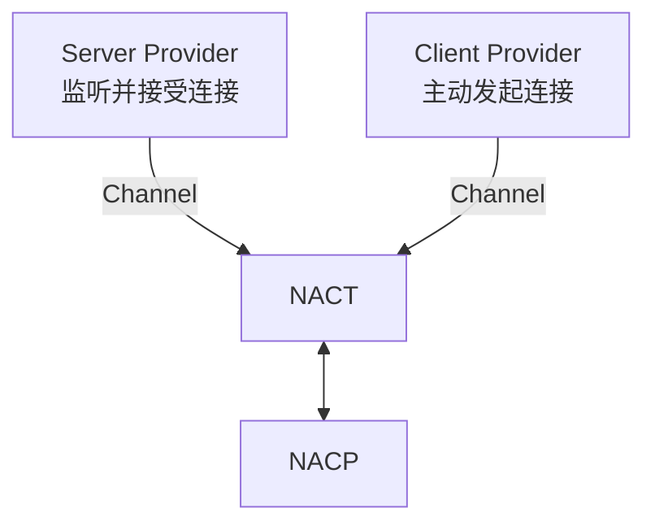
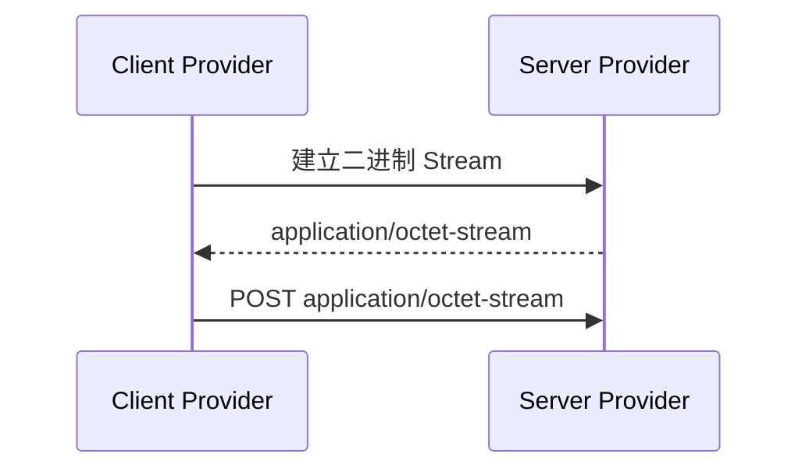

# 底层传输

NACT 本身不包含任何物理传输实现，所有物理连接都通过 Transport Provider 接入。

:::tip
实际开发时，应用只需安装实际使用的传输包。

无论选择哪一种，上层 NACP 的用法完全一致。
:::



## 官方 Provider

| 包 | 角色 | 建连方式 | 推荐运行时 |
| --- | --- | --- | --- |
| `@chenyfan/nact-websocket-server` | Server | 建立 WebSocket Server 并接受连接 | Node.js 或其他允许监听的运行时 |
| `@chenyfan/nact-websocket-client` | Client | 主动连接 WebSocket Server | Web、Node.js、Worker |
| `@chenyfan/nact-tcp-server` | Server | 建立 TCP Server | Node.js |
| `@chenyfan/nact-tcp-client` | Client | 主动连接 TCP Server | Node.js |
| `@chenyfan/nact-unix-server` | Server | 建立 Unix Socket Server | Node.js/POSIX |
| `@chenyfan/nact-unix-client` | Client | 主动连接 Unix Socket Server | Node.js/POSIX |
| `@chenyfan/nact-streamable-http-server` | Server | 建立 HTTP Server 并通过HTTPStream和POST流式下载和上传消息 | Node.js 或其他允许监听的运行时 |
| `@chenyfan/nact-nextjs` | Server | 挂载 Next.js App Router Route Handler | 常驻服务，Node.js runtime |
| `@chenyfan/nact-nuxt` | Server | 挂载 Nuxt/Nitro API route | Nuxt 3/4、Nitro 2、H3 1 |
| `@chenyfan/nact-streamable-http-client` | Client | 使用fetch Stream和POST | Web、Node.js、Worker、etc. |

:::info
**（NASDK v1.0.4）** 物理传输Provider拆分为独立包。

v1.0.3 及更早版本在主包内置 WebSocket、TCP 与 Unix Socket。

Server 与 Client 包在建立后两端均为完整的双向通道，C/S只表示物理信道上谁是链接主动方。
:::

## Server Provider

Server 端只需安装 Server 包，并在 `start()` 前注册：

```bash
bun add @chenyfan/nasdk @chenyfan/nact-websocket-server
```

```ts
import NApp from '@chenyfan/nasdk'
import WebSocketServerProvider, {
  type WebSocketServerTransportSpec,
} from '@chenyfan/nact-websocket-server'

const server: WebSocketServerTransportSpec = {
  type: 'websocket',
  provider: { host: '127.0.0.1', port: 18900, path: '/nacp' },
}

const app = new NApp({
  id: 'server',
  server: [server],
})

app.nact.use(new WebSocketServerProvider())
await app.start()
```

## Client Provider

Client 端只需安装 Client 包：

```bash
bun add @chenyfan/nasdk @chenyfan/nact-websocket-client
```

```ts
import NApp from '@chenyfan/nasdk'
import WebSocketClientProvider, {
  type WebSocketClientTransportSpec,
} from '@chenyfan/nact-websocket-client'

const app = new NApp({ id: 'client' })

app.nact.use(new WebSocketClientProvider())
await app.start()
const target: WebSocketClientTransportSpec = {
  type: 'websocket',
  provider: { url: 'wss://example.com/nacp' },
}
await app.connect('server', target)
```

:::tip
同一个 NApp 可以同时监听和主动连接，分别注册两个包即可：

```ts
app.nact.use(new WebSocketServerProvider())
app.nact.use(new WebSocketClientProvider())
```

没有注册对应传输时，`start()` 或 `connect()` 会宣告 `provider-not-found` 失败。
:::

WebSocket Server/Client 的 `provider.maxBufferedBytes` 默认 128 MiB，用于限制发送排队字节和未消费的接收字节。超限或收到文本帧会使连接失败；此通道只承载二进制 NACT 数据。TCP 的 `provider.keepAlive` 可以设为间隔毫秒数或 `false`，默认 30000；Unix Socket 不设置 TCP keepalive。


:::details

## 连接配置


`TransportSpec` 把物理连接参数和 NACT 参数分开。NACT 根据 `type` 查找 Provider，将 `provider` 原样交给它，自己只读取 `nact`：

```ts
interface TransportSpec<TType extends string = string, TProvider = unknown> {
  type: TType
  provider: TProvider
  nact?: {
    chunkSize?: number
  }
}
```

| 字段 | 说明 |
| --- | --- |
| `type` | 查找对应 Provider，由传输包定义 |
| `provider` | 物理连接参数，原样交给对应 Provider |
| `nact.chunkSize` | 本地发送侧的分片阈值；省略时使用 Provider 默认值 |

每个传输包默认导出用于注册的Provider，并通过命名导出该包自己的完整Transport Spec和Provider配置类型。具体`type`及`provider`形状由子包定义，不由NASDK主包集中定义：

```ts
import WebSocketClientProvider, {
  type WebSocketClientOptions,
  type WebSocketClientTransportSpec,
} from '@chenyfan/nact-websocket-client'
```

`WebSocketClientTransportSpec`用于完整的`connect()`配置，`WebSocketClientOptions`只对应其中的`provider`字段。TCP、Unix Socket以及其他独立Provider分别从自己的包导出对应类型。


## Streamable HTTP

完整配置、线上会话和限制见 [Streamable HTTP](/transport/nact/http-stream)，框架集成见 [Next.js 与 Nuxt](/transport/nact/frameworks)。

Streamable HTTP 把一条逻辑双向连接映射到两个 HTTP 方向：

- Server 到 Client：一个持续的二进制 HTTP Response。
- Client 到 Server：一个或多个二进制 HTTP POST Request。
- Provider 使用 session id 将两个方向绑定为同一个 Peer。

两个方向都使用 `Content-Type: application/octet-stream`，直接传输 NACT 产生的二进制数据。



Provider 不使用 SSE、Base64 或 JSON 转换。CBOR payload 与 NACT Frame 可以包含任意二进制内容，并在 HTTP Stream 中保持原样。

Server 包默认入口拥有并启动 HTTP Server；该包的 `/handler` 子入口只提供 Web Request/Response 会话处理，不创建端口。Next.js 与 Nuxt Provider 复用此子入口。Client 包主动发起 Stream 与 POST。

## Custom Provider

已有 Next.js 或 Nuxt 服务使用对应的框架 Provider；其他 Fetch 路由可挂载 HTTP 包的 `/handler`。已有 WebSocket、IPC 等双向字节连接可以使用 Custom Provider。

详见[自定义传输Provider](/transport/nact/provider)。

:::
