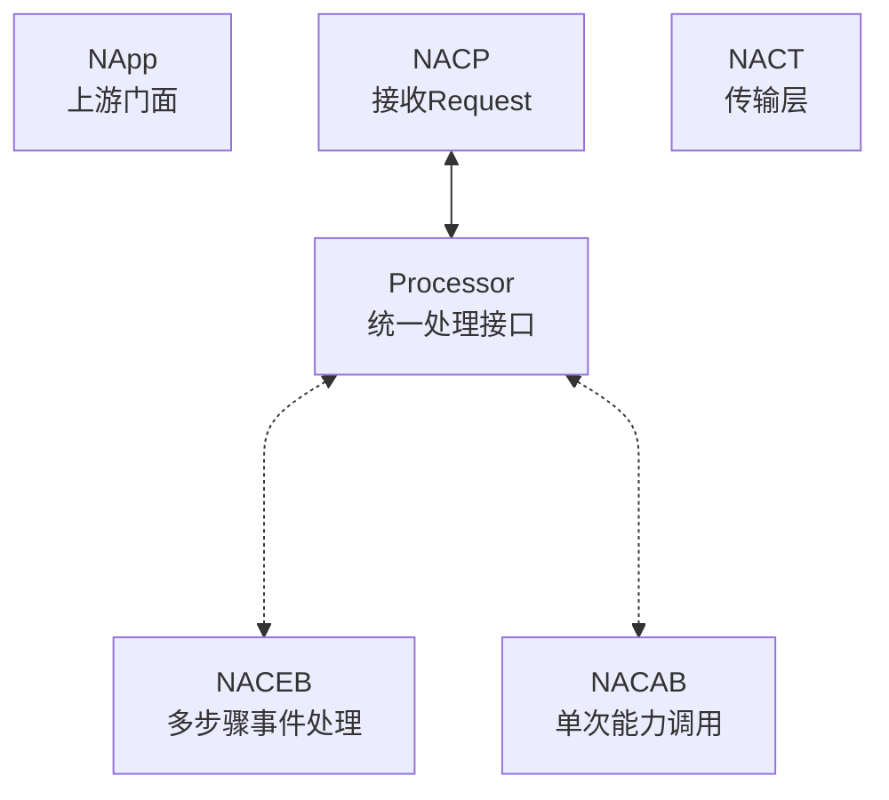

# 任务与流水线

NASDK中当接收到Request时，NACP会将对应事件传递到对应Processor处理。

NASDK Processor分为Event和Ability两类，默认分别由[NACEB](./naceb)和[NACAB](./nacab)承担。

:::tip
只要符合 [NASDK Processor](./processor) 协议的都可以用于NACP请求处理，NACEB和NACAB只是默认项和可选项。
:::

[NACEB](./naceb) 是NASDK内建的事件处理器，通过 Event、Pipeline 与 Task 执行多步骤任务，并协调任务所需的有限资源。

[NACAB](./nacab) 是NASDK内建的能力处理器，执行一次调用、一次返回的独立能力。
