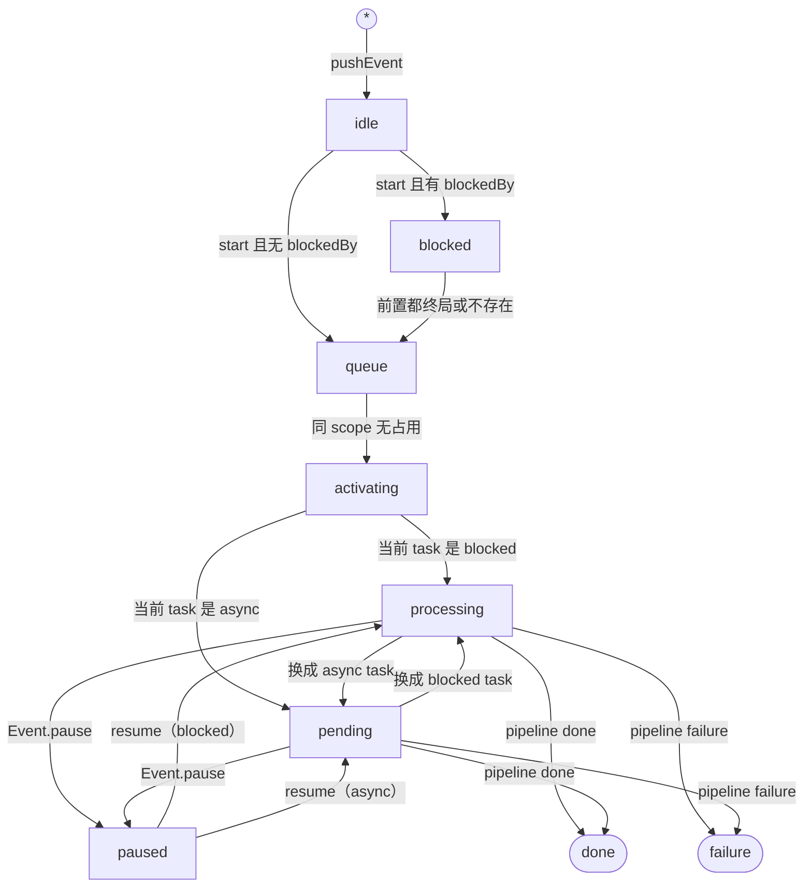
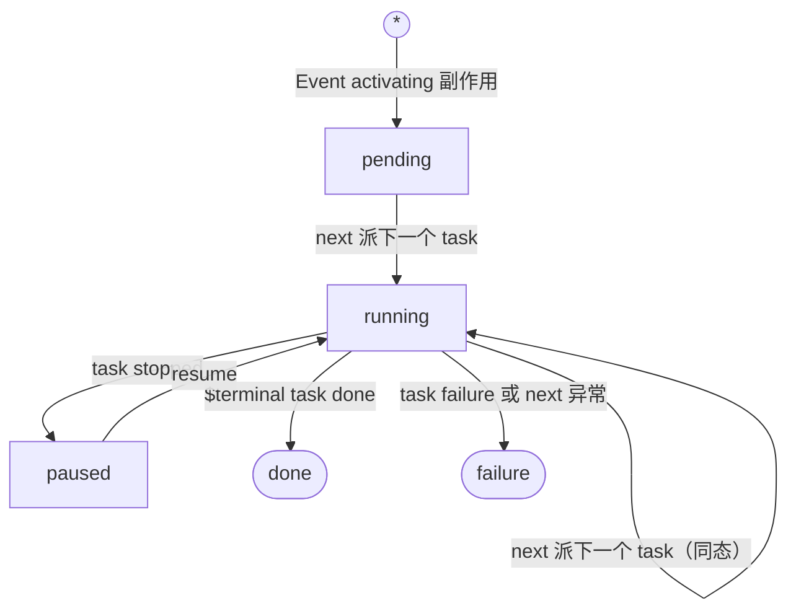
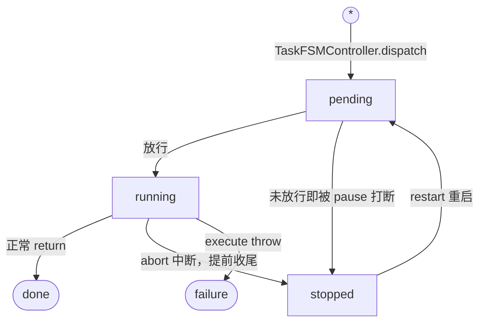
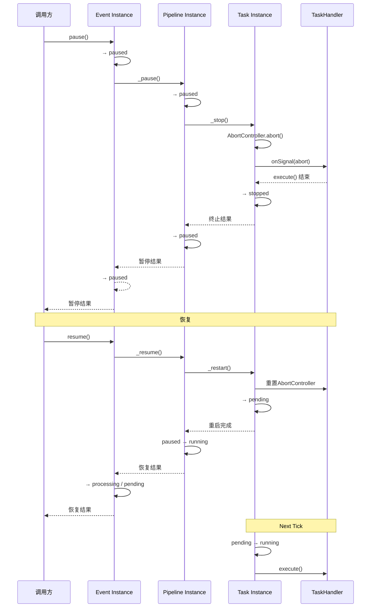

# NACEB 生命周期

NACEB 有三层状态机，每层都具有自己的FSMController。

本章仅用于介绍所有的状态机与迁移状态，具体触发迁移详情请参考事件处理部分。

## Event 层

| 状态名       | 含义                           | 从何而来                                              | 到哪里去                                                  |
| ------------ | ------------------------------ | ----------------------------------------------------- | --------------------------------------------------------- |
| `idle`       | Event 创建时默认状态           | `pushEvent()`                                         | `start()` 后 进入`blocked`/`queue`                    |
| `blocked`    | Event 被前置事件阻塞           | `start()`时带有 `blockedBy` 参数                      | 前置 Event 不再阻塞时 进入`queue`                     |
| `queue`      | Event 已就绪，等待执行         | `start()`后 或`blocked`结束                       | 同 scope 无 Event竞争 进入`activating`                 |
| `activating` | Event 激活中，准备运行         | `queue`结束                                           | 根据第一步任务类型 进入 `processing`或`pending`        |
| `processing` | Pipeline 当前运行 blocked Task | `activating`、`pending`、`paused`                     | 根据下一步进入`pending`、`processing`或`pause`、终态      |
| `pending`    | Pipeline 当前运行 async Task   | `activating`、`pending`、`paused`                     | 根据下一步进入`pending`、`processing`或`pause`、终态      |
| `paused`     | Event 对应 Pipeline 暂停       | 对 Event 调用 `pause()`                               | `resume()` 后根据任务类型 进入 `processing`或`pending` |
| `done`       | Event 正常结束，终态           | `processing` 或 `pending` 对应的 Pipeline 进入 `done` | -                                                         |
| `failure`    | Event 异常结束，终态           | 任意状态发生失败均可直接进入                          | -                                                         |

## Pipeline 层

| 状态名    | 含义                        | 从何而来                       | 到哪里去                                  |
| --------- | --------------------------- | ------------------------------ | ----------------------------------------- |
| `pending` | Pipeline 创建时默认状态     | Event 进入 `activating`        | 派发 Task 后进入 `running`                |
| `running` | Pipeline 当前已有 Task 运行 | `pending`、`running`、`paused` | 根据下一步进入 `running`、`paused` 或终态 |
| `paused`  | Pipeline 暂停               | Task 进入 `stopped`            | `resume()` 后进入 `running`               |
| `done`    | Pipeline 正常结束，终态     | `$terminal` Task 完成          | -                                         |
| `failure` | Pipeline 异常结束，终态     | 任意状态发生失败均可直接进入   | -                                         |

## Task 层

| 状态名    | 含义                    | 从何而来                           | 到哪里去                                                          |
| --------- | ----------------------- | ---------------------------------- | ----------------------------------------------------------------- |
| `pending` | Task 已派发，等待执行   | `dispatch()` 或 `stopped` 重启 | 条件满足后进入 `running` 暂停时进入 `stopped`                 |
| `running` | TaskHandler 执行中      | `pending`                          | 正常结束进入 `done` 暂停进入 `stopped` 异常进入 `failure` |
| `stopped` | Task 已暂停，可重新启动 | `pending` 或 `running` 时暂停      | `restart()` 后进入 `pending`                                      |
| `done`    | Task 正常结束，终态     | TaskHandler 正常返回               | -                                                                 |
| `failure` | Task 异常结束，终态     | 任意状态发生失败均可直接进入       | -                                                                 |

:::info
重启后 Instance 会保留，同时保留所有的 hook 和 state，便于内部重建。
:::

## 消费

所有队列在进入 done 或 failure 后都不会自己被清除。

NACEB 对完成的实例没有「清除」概念，取而代之的是「消费」。

「消费 Consume」的含义是：取走这个实例的结果，并清空结果输出，标记这个结果被「消费掉了」。

:::warning
对非终态 event 进行 `consumeEvent` 将直接抛错，这是为了防止误清还在运行的 event。
:::

## 暂停与恢复

